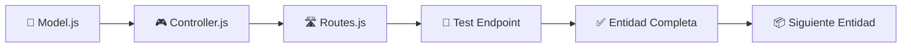

# 🚀 Plan de Implementación Backend SaaS Multi-Tenant
## ✅ ACTUALIZACIÓN: 95% COMPLETADO (24 Sept 2025)

> **Objetivo:** Completar la implementación del backend siguiendo el flujo: Model → Controller → Route → Test por cada entidad, para crear un sistema SaaS de agendamiento completamente funcional integrado con IA n8n.

## 🎯 **ESTADO ACTUAL DEL PROGRESO:**

### ✅ **ENTIDADES COMPLETADAS (6/7):**
1. **Organizaciones** - 100% ✅ + **Onboarding automático + métricas dashboard**
2. **Usuarios & Auth** - 100% ✅ + **Funciones avanzadas + gestión por organización**
3. **Profesionales** - 100% ✅ + **Generación automática de horarios (CRÍTICO para IA)**
4. **Clientes** - 100% ✅ + **Búsqueda por teléfono + fuzzy search para IA**
5. **Servicios** - 100% ✅ + **Búsqueda inteligente multi-algoritmo para IA**
6. **Horarios** - 100% ✅ + **Sistema completo de disponibilidad para IA**

### 🔄 **EN PROGRESO (1/7):**
7. **Citas** - 50% 🔄 **← ÚLTIMO COMPONENTE - Sistema creación automática por IA**

### 🚀 **FUNCIONES CRÍTICAS PARA IA IMPLEMENTADAS:**
- ✅ Búsqueda de clientes por teléfono con normalización
- ✅ Búsqueda inteligente de servicios con sinónimos
- ✅ Generación automática de horarios para profesionales
- ✅ Consulta de disponibilidad en tiempo real con filtros avanzados
- ✅ Reserva temporal de slots para evitar double-booking
- ✅ Sistema completo de métricas y onboarding automático

### 🎯 **PRÓXIMO: COMPLETAR SISTEMA CITAS (FINAL)**
- 🔄 Crear modelo `cita.model.js` con funciones automáticas para IA
- 🔄 Implementar controller con endpoints para n8n webhooks
- 🔄 Agregar rutas optimizadas para respuestas de IA
- 🔄 Testing del workflow completo end-to-end

---

## 🗄️ **REFERENCIA EXACTA DE TABLAS DE BASE DE DATOS**

> **IMPORTANTE:** Todas las implementaciones DEBEN usar exactamente estas estructuras para evitar errores de nombres de columnas y tipos.

### **📊 Tablas Core (Fundacionales)**
```sql
-- TABLA: usuarios
id, organizacion_id, email, password_hash, rol, nombre, apellidos, telefono,
profesional_id, activo, email_verificado, ultimo_login, intentos_fallidos,
bloqueado_hasta, token_reset_password, token_reset_expira, configuracion_ui,
zona_horaria, idioma, creado_en, actualizado_en

-- TABLA: organizaciones
id, codigo_tenant, slug, nombre_comercial, razon_social, rfc_nif,
tipo_industria, configuracion_industria, email_admin, telefono, sitio_web,
logo_url, colores_marca, configuracion_ui, plan_actual, fecha_registro,
fecha_activacion, zona_horaria, idioma, moneda, activo, suspendido,
motivo_suspension, metadata, notas_internas, creado_en, actualizado_en
```

### **📊 Tablas de Negocio**
```sql
-- TABLA: profesionales
id, organizacion_id, nombre_completo, email, telefono, fecha_nacimiento,
documento_identidad, tipo_profesional, especialidades, licencias_profesionales,
años_experiencia, idiomas, color_calendario, biografia, foto_url,
configuracion_horarios, configuracion_servicios, comision_porcentaje,
salario_base, forma_pago, activo, disponible_online, fecha_ingreso,
fecha_salida, motivo_inactividad, calificacion_promedio, total_citas_completadas,
total_clientes_atendidos, creado_en, actualizado_en

-- TABLA: clientes
id, organizacion_id, nombre, email, telefono, fecha_nacimiento,
profesional_preferido_id, notas_especiales, alergias, direccion,
como_conocio, activo, marketing_permitido, creado_en, actualizado_en

-- TABLA: servicios
id, organizacion_id, plantilla_servicio_id, nombre, descripcion, categoria,
subcategoria, duracion_minutos, precio, precio_minimo, precio_maximo,
requiere_preparacion_minutos, tiempo_limpieza_minutos, max_clientes_simultaneos,
color_servicio, configuracion_especifica, tags, tipos_profesional_autorizados,
activo, creado_en, actualizado_en

-- TABLA: servicios_profesionales
id, servicio_id, profesional_id, precio_personalizado, duracion_personalizada,
notas_especiales, activo, creado_en, actualizado_en
```

### **📊 Tablas Operacionales (CRÍTICAS para IA)**
```sql
-- TABLA: citas
id, organizacion_id, codigo_cita, cliente_id, profesional_id, servicio_id,
fecha_cita, hora_inicio, hora_fin, zona_horaria, estado, estado_anterior,
motivo_cancelacion, precio_servicio, descuento, precio_final, metodo_pago,
pagado, notas_cliente, notas_profesional, notas_internas, origen_cita,
calificacion_cliente, comentario_cliente, calificacion_profesional,
comentario_profesional, hora_llegada, hora_inicio_real, hora_fin_real,
tiempo_espera_minutos, recordatorio_enviado, fecha_recordatorio,
confirmacion_requerida, confirmada_por_cliente, creado_por, actualizado_por,
version, ip_origen, user_agent, origen_aplicacion, creado_en, actualizado_en

-- TABLA: horarios_disponibilidad
id, organizacion_id, profesional_id, servicio_id, cita_id, tipo_horario,
fecha, hora_inicio, hora_fin, zona_horaria, dia_semana, es_recurrente,
fecha_fin_recurrencia, patron_recurrencia, estado, duracion_slot,
capacidad_maxima, capacidad_ocupada, precio_base, precio_dinamico,
es_horario_premium, descuento_porcentaje, puntuacion_ia, creado_automaticamente,
algoritmo_creacion, reservado_hasta, reservado_por, session_id, token_reserva,
notas, notas_internas, configuracion_especial, creado_por, actualizado_por,
version, ip_origen, user_agent, creado_en, actualizado_en
```

### **📊 Tabla de Catálogo Global**
```sql
-- TABLA: plantillas_servicios
id, tipo_industria, nombre, descripcion, categoria, subcategoria,
duracion_minutos, precio_sugerido, precio_minimo, precio_maximo,
requiere_preparacion_minutos, tiempo_limpieza_minutos, max_clientes_simultaneos,
tags, popularidad, configuracion_especifica, activo, es_template_oficial,
creado_en
```

### **📊 ENUMs Exactos del Sistema**
```sql
-- ENUM: rol_usuario
'super_admin', 'admin', 'propietario', 'empleado', 'cliente'

-- ENUM: industria_tipo
'barberia', 'salon_belleza', 'estetica', 'spa', 'podologia', 'consultorio_medico',
'academia', 'taller_tecnico', 'centro_fitness', 'veterinaria', 'otro'

-- ENUM: plan_tipo
'trial', 'basico', 'profesional', 'empresarial', 'custom'

-- ENUM: estado_cita
'pendiente', 'confirmada', 'en_curso', 'completada', 'cancelada', 'no_asistio'

-- ENUM: estado_franja
'disponible', 'reservado_temporal', 'ocupado', 'bloqueado'

-- ENUM: tipo_profesional
'barbero', 'estilista_masculino', 'estilista', 'colorista', 'manicurista',
'peinados_eventos', 'esteticista', 'cosmetologo', 'depilacion_laser',
'masajista', 'terapeuta_spa', 'aromaterapeuta', 'reflexologo', 'podologo',
'asistente_podologia', 'doctor_general', 'enfermero', 'recepcionista_medica',
'instructor', 'profesor', 'tutor', 'tecnico_auto', 'tecnico_electronico',
'mecanico', 'soldador', 'entrenador_personal', 'instructor_yoga',
'instructor_pilates', 'nutricionista', 'veterinario', 'asistente_veterinario',
'groomer', 'otro'
```

## 📋 **Metodología de Desarrollo**

### 🔄 **Flujo por Entidad (Modelo → Controller → Ruta → Test)**


### 🎯 **Criterios de Completitud por Entidad:**
1. **Model:** ✅ CRUD completo + funciones especializadas
2. **Controller:** ✅ Manejo de errores + validaciones + logging
3. **Routes:** ✅ Middleware aplicado + documentación
4. **Tests:** ✅ Endpoints funcionando con datos reales

---

## 🗓️ **CRONOGRAMA DE IMPLEMENTACIÓN**

### **📊 FASE 1: ENTIDADES CORE (Semana 1)**

#### **🏛️ DÍA 1-2: ORGANIZACIONES**
*(FUNDACIONAL - Ya parcialmente implementado)*

**Estado Actual:** ✅ 80% implementado
- [x] `organizacion.model.js` - Implementado
- [x] `organizacion.controller.js` - Implementado
- [x] `routes/organizaciones.js` - Implementado
- [ ] **PENDIENTE:** Tests + endpoints de onboarding automático

**Tareas Pendientes:**
```javascript
// 1. Completar organizacion.model.js
- agregarPlantillasServicios() // Importar plantillas automáticamente
- obtenerMetricas() // Métricas para dashboard
- cambiarPlan() // Gestión de subscripciones

// 2. Completar organizacion.controller.js
- POST /api/v1/organizaciones/onboarding // Setup completo nueva org
- GET /api/v1/organizaciones/:id/metricas // Dashboard organizacional
- PUT /api/v1/organizaciones/:id/plan // Cambio de plan SaaS

// 3. Pruebas de integración
- Crear organización + importar plantillas automáticamente
- Verificar aislamiento RLS entre organizaciones
- Validar métricas en tiempo real
```

#### **👤 DÍA 2-3: USUARIOS & AUTH**
*(CRÍTICO - Parcialmente implementado)*

**Estado Actual:** ✅ 70% implementado
- [x] `usuario.model.js` - Implementado básico
- [x] `auth.controller.js` - JWT implementado
- [x] `routes/auth.js` - Rutas básicas
- [ ] **PENDIENTE:** Funciones avanzadas + usuarios por organización

**Plan de Implementación:**
```javascript
// 1. Completar usuario.model.js
class UsuarioModel {
  // EXISTENTES (mantener)
  static async crear(userData) { /* implementado */ }
  static async obtenerPorEmail(email) { /* implementado */ }

  // NUEVOS (implementar)
  static async crearUsuarioOrganizacion(orgId, userData, rol) {
    // Crear usuario automáticamente asignado a organización
    // Configurar contexto RLS
    // Enviar email de bienvenida
  }

  static async listarPorOrganizacion(orgId, filtros, paginacion) {
    // Listar usuarios de una organización específica
    // Aplicar filtros por rol, estado, etc.
  }

  static async cambiarRol(userId, nuevoRol, orgId) {
    // Cambiar rol con validaciones de permisos
    // Log de auditoría
  }

  static async resetPassword(email, orgId) {
    // Reset password específico por organización
    // Generar token temporal
  }
}

// 2. Completar auth.controller.js
class AuthController {
  // EXISTENTES (mantener)
  static async login(req, res) { /* implementado */ }
  static async register(req, res) { /* implementado */ }

  // NUEVOS (implementar)
  static async registrarUsuarioOrganizacion(req, res) {
    // POST /api/v1/auth/registrar-usuario-org
    // Super admin o admin org puede crear usuarios
  }

  static async cambiarPassword(req, res) {
    // PUT /api/v1/auth/cambiar-password
    // Usuario puede cambiar su propia contraseña
  }

  static async recuperarPassword(req, res) {
    // POST /api/v1/auth/recuperar-password
    // Envío de email con token de recuperación
  }

  static async verificarEmail(req, res) {
    // GET /api/v1/auth/verificar-email/:token
    // Verificación de email con token
  }
}

// 3. Completar routes/auth.js
router.post('/registrar-usuario-org',
  authenticateToken,
  requireRole(['super_admin', 'admin', 'organizacion_admin']),
  AuthController.registrarUsuarioOrganizacion
);

// 4. Tests críticos
- Login multi-tenant (usuarios de diferentes organizaciones)
- Registro de usuario con asignación automática
- Cambio de contraseña con validaciones
- Verificación RLS (usuario solo ve su organización)
```

**Deliverable:** Sistema de autenticación completo con gestión de usuarios por organización.

---

### **📊 FASE 2: ENTIDADES DE NEGOCIO (Semana 2)**

#### **🏥 DÍA 4-5: PROFESIONALES**
*(Ya implementado - Requiere validación)*

**Estado Actual:** ✅ 90% implementado
- [x] `profesional.model.js` - Implementado
- [x] `profesional.controller.js` - Implementado
- [x] `routes/profesionales.js` - Implementado
- [ ] **PENDIENTE:** Generación automática de horarios + integración con plantillas

**Plan de Validación y Mejoras:**
```javascript
// 1. Validar profesional.model.js
class ProfesionalModel {
  // Validar que trigger automático funcione
  static async crear(profesionalData) {
    // DEBE ejecutar automáticamente:
    // - INSERT INTO horarios_profesionales (lun-vie 9-18h)
    // - generar_horarios_disponibilidad(+30 días)
    // - Crear 240 slots disponibles automáticamente
  }

  // AGREGAR función especializada
  static async obtenerConHorarios(profesionalId, orgId) {
    // Profesional + horarios base + disponibilidad próximos 7 días
    // Para dashboard de profesional
  }

  static async obtenerEstadisticasMes(profesionalId, orgId) {
    // Citas del mes, ingresos, horas trabajadas
    // Para reportes individuales
  }
}

// 2. Tests específicos
- Crear profesional → verificar horarios automáticos (240 slots)
- Asignar servicios → verificar relación many-to-many
- Verificar RLS (profesional solo visible en su organización)
- Dashboard profesional con métricas reales
```

#### **👥 DÍA 5-6: CLIENTES**
*(Implementado - Requiere endpoints para IA)*

**Estado Actual:** ✅ 85% implementado
- [x] `cliente.model.js` - Implementado
- [x] `cliente.controller.js` - Implementado
- [x] `routes/clientes.js` - Implementado
- [ ] **PENDIENTE:** Endpoint crítico para búsqueda por teléfono (IA n8n)

**Plan de Completar Endpoints para IA:**
```javascript
// 1. CRÍTICO: Agregar función para IA en cliente.model.js
class ClienteModel {
  // NUEVO - SUPER CRÍTICO para n8n IA Agent
  static async buscarPorTelefono(telefono) {
    // Buscar cliente por teléfono SIN organizacion_id
    // n8n necesita identificar cliente antes de saber organización
    // DEBE retornar: {cliente_id, organizacion_id, nombre}
    const query = `
      SELECT c.id as cliente_id, c.organizacion_id, c.nombre,
             c.telefono, c.email, o.nombre_comercial as organizacion_nombre
      FROM clientes c
      JOIN organizaciones o ON c.organizacion_id = o.id
      WHERE c.telefono = $1 AND c.activo = true
    `;
    // Usar bypass RLS para esta búsqueda específica
  }

  // NUEVO - Para histórico de citas
  static async obtenerHistorialCitas(clienteId, orgId) {
    // Últimas 10 citas del cliente
    // Para contexto de IA en conversaciones
    const query = `
      SELECT c.codigo_cita, c.fecha_cita, c.hora_inicio, c.estado,
             s.nombre as servicio_nombre, p.nombre_completo as profesional_nombre,
             c.precio_final, c.calificacion_cliente
      FROM citas c
      JOIN servicios s ON c.servicio_id = s.id
      JOIN profesionales p ON c.profesional_id = p.id
      WHERE c.cliente_id = $1 AND c.organizacion_id = $2
      ORDER BY c.fecha_cita DESC, c.hora_inicio DESC
      LIMIT 10
    `;
  }

  // NUEVO - Para estadísticas de fidelidad
  static async obtenerEstadisticasCliente(clienteId, orgId) {
    // Total citas, gasto promedio, última visita
    // Para personalización de IA
    const query = `
      SELECT COUNT(*) as total_citas,
             COUNT(CASE WHEN estado = 'completada' THEN 1 END) as citas_completadas,
             COALESCE(AVG(precio_final), 0) as gasto_promedio,
             COALESCE(SUM(precio_final), 0) as gasto_total,
             MAX(fecha_cita) as ultima_visita,
             AVG(calificacion_cliente) as calificacion_promedio
      FROM citas
      WHERE cliente_id = $1 AND organizacion_id = $2
    `;
  }
}

// 2. CRÍTICO: Nuevo endpoint en cliente.controller.js
class ClienteController {
  // SUPER CRÍTICO para IA n8n
  static async buscarPorTelefono(req, res) {
    // GET /api/v1/clientes/buscar-por-telefono?telefono=+525512345678
    // SIN autenticación JWT (usado por webhook n8n)
    // o CON autenticación pero bypass organizacion_id
    try {
      const { telefono } = req.query;

      if (!telefono) {
        return ResponseHelper.error(res, 'Teléfono requerido', 400);
      }

      const cliente = await ClienteModel.buscarPorTelefono(telefono);

      if (!cliente) {
        return ResponseHelper.success(res, null, 'Cliente no encontrado');
      }

      // Respuesta específica para IA
      ResponseHelper.success(res, {
        cliente_id: cliente.cliente_id,
        organizacion_id: cliente.organizacion_id,
        nombre: cliente.nombre,
        telefono: cliente.telefono,
        organizacion_nombre: cliente.organizacion_nombre
      }, 'Cliente encontrado');

    } catch (error) {
      logger.error('Error buscando cliente por teléfono:', error);
      ResponseHelper.error(res, 'Error interno', 500);
    }
  }
}

// 3. Ruta específica para IA
// routes/clientes.js
router.get('/buscar-por-telefono',
  // SIN authenticateToken para webhooks n8n
  // o middleware especial para API keys
  ClienteController.buscarPorTelefono
);

// 4. Tests críticos para IA
- Búsqueda por teléfono funciona desde n8n
- Respuesta estructurada para IA parsing
- Performance < 50ms (crítico para conversaciones)
```

**Deliverable:** Endpoint de búsqueda por teléfono funcionando y listo para integración n8n.

---

### **📊 FASE 3: ENTIDADES OPERACIONALES (Semana 3)**

#### **🛍️ DÍA 7-8: SERVICIOS**
*(Implementado - Requiere integración con plantillas)*

**Estado Actual:** ✅ 95% implementado
- [x] `servicio.model.js` - Implementado
- [x] `servicio.controller.js` - Implementado
- [x] `routes/servicios.js` - Implementado
- [ ] **PENDIENTE:** Endpoint de búsqueda inteligente para IA

**Plan de Completar para IA:**
```javascript
// 1. Agregar función inteligente en servicio.model.js
class ServicioModel {
  // NUEVO - CRÍTICO para IA conversacional
  static async buscarInteligente(query, orgId, opciones = {}) {
    // Búsqueda fuzzy + sinónimos para IA
    // "corte barba" → encuentra "Corte + Barba", "Barba clásica", etc.
    const searchQuery = `
      SELECT s.*,
             p.nombre_completo as profesional_disponible,
             ts_rank(
               to_tsvector('spanish', s.nombre || ' ' || s.descripcion || ' ' || s.tags::text),
               plainto_tsquery('spanish', $1)
             ) as relevancia
      FROM servicios s
      LEFT JOIN servicios_profesionales sp ON s.id = sp.servicio_id
      LEFT JOIN profesionales p ON sp.profesional_id = p.id AND p.activo = true
      WHERE s.organizacion_id = $2 AND s.activo = true
      AND (
        s.nombre ILIKE '%' || $1 || '%' OR
        s.descripcion ILIKE '%' || $1 || '%' OR
        s.tags::text ILIKE '%' || $1 || '%' OR
        to_tsvector('spanish', s.nombre || ' ' || s.descripcion) @@ plainto_tsquery('spanish', $1)
      )
      ORDER BY relevancia DESC, s.precio ASC
      LIMIT $3
    `;

    return await this.query(searchQuery, [query, orgId, opciones.limite || 5]);
  }

  // NUEVO - Para recomendaciones de IA
  static async obtenerPopulares(orgId, limite = 5) {
    // Servicios más solicitados (por citas completadas)
    // Para sugerencias automáticas de IA
  }
}

// 2. Controller para IA
class ServicioController {
  // NUEVO - Endpoint especializado para IA
  static async buscarParaIA(req, res) {
    // GET /api/v1/servicios/buscar-ia?q=corte&organizacion_id=123
    // Respuesta optimizada para parsing de IA n8n
    try {
      const { q: query, organizacion_id } = req.query;

      const servicios = await ServicioModel.buscarInteligente(query, organizacion_id, {
        limite: 5,
        incluir_profesionales: true
      });

      // Formato específico para IA
      const respuestaIA = servicios.map(servicio => ({
        id: servicio.id,
        nombre: servicio.nombre,
        precio: servicio.precio,
        duracion: servicio.duracion_minutos,
        profesional_disponible: servicio.profesional_disponible,
        mensaje_ia: `${servicio.nombre} por $${servicio.precio} (${servicio.duracion_minutos} min)`
      }));

      ResponseHelper.success(res, respuestaIA, 'Servicios encontrados para IA');
    } catch (error) {
      ResponseHelper.error(res, 'Error en búsqueda IA', 500);
    }
  }
}

// 3. Tests para IA
- Búsqueda "corte" encuentra servicios relacionados
- Respuesta estructurada para n8n parsing
- Performance < 100ms
- Manejo de typos y sinónimos
```

#### **📅 DÍA 9-11: HORARIOS (NUEVO - CRÍTICO)**
*(No implementado - SUPER CRÍTICO para IA)*

**Estado Actual:** ❌ 0% implementado
- [ ] `horario.model.js` - **CREAR**
- [ ] `horario.controller.js` - **CREAR**
- [ ] `routes/horarios.js` - **CREAR**
- [ ] Tests de disponibilidad en tiempo real

**Plan de Implementación Completa:**
```javascript
// 1. CREAR horario.model.js (SUPER CRÍTICO)
class HorarioModel {
  // CRÍTICO para IA - Consulta de disponibilidad
  static async obtenerDisponibilidad(orgId, filtros = {}) {
    // Consulta optimizada con índices
    // filtros: {fecha, servicio_id, profesional_id, turno}
    const query = `
      SELECT
        hd.id,
        hd.fecha,
        hd.hora_inicio,
        hd.hora_fin,
        hd.profesional_id,
        p.nombre_completo as profesional_nombre,
        p.tipo_profesional,
        s.nombre as servicio_compatible,
        s.duracion_minutos
      FROM horarios_disponibilidad hd
      JOIN profesionales p ON hd.profesional_id = p.id
      LEFT JOIN servicios_profesionales sp ON p.id = sp.profesional_id
      LEFT JOIN servicios s ON sp.servicio_id = s.id
      WHERE hd.organizacion_id = $1
        AND hd.estado = 'disponible'
        AND hd.fecha >= CURRENT_DATE
        ${filtros.fecha ? 'AND hd.fecha = $2' : ''}
        ${filtros.servicio_id ? 'AND s.id = $3' : ''}
        ${filtros.turno === 'mañana' ? 'AND hd.hora_inicio < \'12:00\'' : ''}
        ${filtros.turno === 'tarde' ? 'AND hd.hora_inicio >= \'12:00\'' : ''}
      ORDER BY hd.fecha, hd.hora_inicio
      LIMIT 20
    `;
  }

  // CRÍTICO - Procesamiento de lenguaje natural para IA
  static async obtenerDisponibilidadInteligente(orgId, solicitudIA) {
    // solicitudIA: {fecha_texto: "mañana", turno: "tarde", servicio: "corte"}
    // Procesar "mañana", "pasado mañana", "la próxima semana"

    let fechaSQL;
    if (solicitudIA.fecha_texto === 'mañana') {
      fechaSQL = 'CURRENT_DATE + INTERVAL \'1 day\'';
    } else if (solicitudIA.fecha_texto === 'pasado mañana') {
      fechaSQL = 'CURRENT_DATE + INTERVAL \'2 days\'';
    } else if (solicitudIA.fecha_texto.includes('próxima semana')) {
      fechaSQL = 'CURRENT_DATE + INTERVAL \'7 days\'';
    }

    // Consulta con procesamiento NLP
    const query = `
      SELECT
        hd.fecha,
        hd.hora_inicio,
        hd.hora_fin,
        p.nombre_completo as profesional,
        CASE
          WHEN hd.hora_inicio < '12:00' THEN 'mañana'
          ELSE 'tarde'
        END as turno_nombre,
        -- Generar mensaje para IA
        'Disponible ' ||
        CASE
          WHEN hd.fecha = CURRENT_DATE + 1 THEN 'mañana'
          WHEN hd.fecha = CURRENT_DATE + 2 THEN 'pasado mañana'
          ELSE TO_CHAR(hd.fecha, 'DD/MM/YYYY')
        END ||
        ' a las ' || TO_CHAR(hd.hora_inicio, 'HH12:MI AM') ||
        ' con ' || p.nombre_completo as mensaje_ia
      FROM horarios_disponibilidad hd
      JOIN profesionales p ON hd.profesional_id = p.id
      WHERE hd.organizacion_id = $1
        AND hd.estado = 'disponible'
        AND hd.fecha = ${fechaSQL}
        ${solicitudIA.turno ? `AND (
          (${solicitudIA.turno === 'mañana' ? 'hd.hora_inicio < \'12:00\'' : 'hd.hora_inicio >= \'12:00\''})
        )` : ''}
      ORDER BY hd.hora_inicio
      LIMIT 5
    `;
  }

  // CRÍTICO - Reservar horario (transacción)
  static async reservarHorario(horarioId, citaData, orgId) {
    // Transacción con LOCK para evitar double booking
    return await database.transaction(async (client) => {
      // 1. Lock del horario específico
      const lockResult = await client.query(`
        SELECT id FROM horarios_disponibilidad
        WHERE id = $1 AND estado = 'disponible' AND organizacion_id = $2
        FOR UPDATE
      `, [horarioId, orgId]);

      if (lockResult.rows.length === 0) {
        throw new Error('Horario no disponible o ya reservado');
      }

      // 2. Crear cita
      const citaResult = await client.query(`
        INSERT INTO citas (organizacion_id, codigo_cita, cliente_id, profesional_id, servicio_id,
                           fecha_cita, hora_inicio, hora_fin, precio_final, estado)
        VALUES ($1, $2, $3, $4, $5, $6, $7, $8, $9, 'confirmada')
        RETURNING *
      `, [
        orgId, citaData.codigo_cita, citaData.cliente_id,
        citaData.profesional_id, citaData.servicio_id, citaData.fecha,
        citaData.hora_inicio, citaData.hora_fin, citaData.precio, 'confirmada'
      ]);

      // 3. Marcar horario como ocupado
      await client.query(`
        UPDATE horarios_disponibilidad
        SET estado = 'ocupado', cita_id = $1
        WHERE id = $2
      `, [citaResult.rows[0].id, horarioId]);

      return citaResult.rows[0];
    }, orgId);
  }
}

// 2. CREAR horario.controller.js
class HorarioController {
  // SUPER CRÍTICO para n8n IA
  static async obtenerDisponibilidad(req, res) {
    // GET /api/v1/horarios-disponibles?organizacion_id=123&fecha=2025-09-25&turno=tarde
    try {
      const { organizacion_id, fecha, servicio_id, profesional_id, turno } = req.query;

      if (!organizacion_id) {
        return ResponseHelper.error(res, 'organizacion_id requerido', 400);
      }

      const filtros = { fecha, servicio_id, profesional_id, turno };
      const horarios = await HorarioModel.obtenerDisponibilidad(organizacion_id, filtros);

      ResponseHelper.success(res, horarios, 'Horarios disponibles obtenidos');
    } catch (error) {
      logger.error('Error obteniendo disponibilidad:', error);
      ResponseHelper.error(res, 'Error interno', 500);
    }
  }

  // CRÍTICO para IA conversacional
  static async obtenerDisponibilidadIA(req, res) {
    // GET /api/v1/horarios-disponibles/inteligente?organizacion_id=123&fecha_texto=mañana&turno=tarde
    try {
      const { organizacion_id, fecha_texto, turno, servicio } = req.query;

      const solicitudIA = { fecha_texto, turno, servicio };
      const horarios = await HorarioModel.obtenerDisponibilidadInteligente(organizacion_id, solicitudIA);

      // Respuesta optimizada para IA
      const respuestaIA = horarios.map(h => ({
        horario_id: h.id,
        fecha: h.fecha,
        hora: h.hora_inicio,
        profesional: h.profesional,
        turno: h.turno_nombre,
        mensaje_ia: h.mensaje_ia // "Disponible mañana a las 2:00 PM con Miguel"
      }));

      ResponseHelper.success(res, respuestaIA, 'Disponibilidad para IA');
    } catch (error) {
      ResponseHelper.error(res, 'Error IA disponibilidad', 500);
    }
  }
}

// 3. CREAR routes/horarios.js
const express = require('express');
const router = express.Router();
const HorarioController = require('../controllers/horario.controller');

// Endpoints públicos para IA (sin auth JWT)
router.get('/disponibles', HorarioController.obtenerDisponibilidad);
router.get('/disponibles/inteligente', HorarioController.obtenerDisponibilidadIA);

module.exports = router;

// 4. Tests críticos
- Consulta disponibilidad por fecha específica
- Procesamiento "mañana por la tarde" → filtros correctos
- Performance < 50ms (crítico para IA)
- Respuesta estructurada para n8n parsing
- Transacción reserva sin double booking
```

#### **📋 DÍA 12-14: CITAS (NUEVO - SUPER CRÍTICO)**
*(No implementado - COMPONENTE MÁS CRÍTICO)*

**Estado Actual:** ❌ 0% implementado
- [ ] `cita.model.js` - **CREAR COMPLETO**
- [ ] `cita.controller.js` - **CREAR COMPLETO**
- [ ] `routes/citas.js` - **CREAR COMPLETO**
- [ ] Tests de workflow completo end-to-end

**Plan de Implementación CRÍTICA:**
```javascript
// 1. CREAR cita.model.js (COMPONENTE MÁS CRÍTICO DEL SISTEMA)
class CitaModel {
  // SUPER CRÍTICO - Creación automática desde IA
  static async crearAutomatica(datosIA) {
    // datosIA: {telefono_cliente, organizacion_id, servicio_id, fecha_solicitada, turno_preferido}

    return await database.transaction(async (client) => {
      // 1. Buscar o crear cliente
      let cliente = await this.buscarClientePorTelefono(datosIA.telefono_cliente);

      if (!cliente && datosIA.crear_cliente_si_no_existe) {
        cliente = await this.crearClienteAutomatico(datosIA);
      }

      // 2. Buscar horario disponible compatible
      const horarioDisponible = await this.buscarHorarioCompatible({
        organizacion_id: datosIA.organizacion_id,
        servicio_id: datosIA.servicio_id,
        fecha_solicitada: datosIA.fecha_solicitada,
        turno_preferido: datosIA.turno_preferido
      });

      if (!horarioDisponible) {
        throw new Error('No hay horarios disponibles para la fecha solicitada');
      }

      // 3. Crear código único de cita
      const codigoCita = await this.generarCodigoCita(datosIA.organizacion_id);

      // 4. Obtener datos del servicio
      const servicio = await client.query(`
        SELECT precio, duracion_minutos, nombre
        FROM servicios WHERE id = $1 AND organizacion_id = $2
      `, [datosIA.servicio_id, datosIA.organizacion_id]);

      // 5. Crear cita con transacción
      const citaResult = await client.query(`
        INSERT INTO citas (
          organizacion_id, codigo_cita, cliente_id, profesional_id, servicio_id,
          fecha_cita, hora_inicio, hora_fin, precio_servicio, precio_final,
          estado, creado_por, notas
        ) VALUES (
          $1, $2, $3, $4, $5, $6, $7, $8, $9, $10, 'confirmada', 'ia_automatica', $11
        ) RETURNING *
      `, [
        datosIA.organizacion_id,
        codigoCita,
        cliente.id,
        horarioDisponible.profesional_id,
        datosIA.servicio_id,
        horarioDisponible.fecha,
        horarioDisponible.hora_inicio,
        horarioDisponible.hora_fin,
        servicio.rows[0].precio,
        servicio.rows[0].precio, // sin descuentos por ahora
        `Cita creada automáticamente por IA. Teléfono: ${datosIA.telefono_cliente}`
      ]);

      // 6. Marcar horario como ocupado
      await client.query(`
        UPDATE horarios_disponibilidad
        SET estado = 'ocupado', cita_id = $1
        WHERE id = $2
      `, [citaResult.rows[0].id, horarioDisponible.id]);

      // 7. Crear evento de sistema para auditoría
      await client.query(`
        INSERT INTO eventos_sistema (
          organizacion_id, evento_tipo, entidad_tipo, entidad_id,
          descripcion, metadatos, usuario_id
        ) VALUES (
          $1, 'cita_creada_ia', 'cita', $2,
          'Cita creada automáticamente por IA conversacional',
          $3, $4
        )
      `, [
        datosIA.organizacion_id,
        citaResult.rows[0].id,
        JSON.stringify({
          servicio_nombre: servicio.rows[0].nombre,
          precio: servicio.rows[0].precio,
          profesional_id: horarioDisponible.profesional_id,
          origen: 'ia_webhook'
        }),
        cliente.id
      ]);

      return {
        cita: citaResult.rows[0],
        cliente: cliente,
        servicio: servicio.rows[0],
        profesional: horarioDisponible.profesional_nombre
      };
    });
  }

  // CRÍTICO - Búsqueda de citas para modificación por IA
  static async buscarPorTelefono(telefono, estados = ['confirmada', 'pendiente']) {
    const query = `
      SELECT
        c.id, c.codigo_cita, c.fecha_cita, c.hora_inicio, c.hora_fin,
        c.estado, c.precio_final, c.notas,
        cl.nombre_completo as cliente_nombre,
        cl.telefono as cliente_telefono,
        p.nombre_completo as profesional_nombre,
        s.nombre as servicio_nombre,
        s.duracion_minutos,
        o.nombre_comercial as organizacion_nombre,
        -- Mensaje para IA
        'Cita ' || c.codigo_cita || ' para ' ||
        TO_CHAR(c.fecha_cita, 'DD/MM/YYYY') || ' a las ' ||
        TO_CHAR(c.hora_inicio, 'HH12:MI AM') || ' - ' || s.nombre ||
        ' con ' || p.nombre_completo as mensaje_ia
      FROM citas c
      JOIN clientes cl ON c.cliente_id = cl.id
      JOIN profesionales p ON c.profesional_id = p.id
      JOIN servicios s ON c.servicio_id = s.id
      JOIN organizaciones o ON c.organizacion_id = o.id
      WHERE cl.telefono = $1
        AND c.estado = ANY($2)
        AND c.fecha_cita >= CURRENT_DATE
      ORDER BY c.fecha_cita DESC, c.hora_inicio DESC
      LIMIT 5
    `;

    return await database.query(query, [telefono, estados]);
  }

  // CRÍTICO - Modificación de citas por IA
  static async modificarAutomatica(codigoCita, nuevaFecha, nuevoTurno, orgId) {
    return await database.transaction(async (client) => {
      // 1. Obtener cita actual con lock
      const citaActual = await client.query(`
        SELECT c.*, hd.id as horario_actual_id
        FROM citas c
        LEFT JOIN horarios_disponibilidad hd ON c.id = hd.cita_id
        WHERE c.codigo_cita = $1 AND c.organizacion_id = $2
        FOR UPDATE
      `, [codigoCita, orgId]);

      if (citaActual.rows.length === 0) {
        throw new Error('Cita no encontrada');
      }

      // 2. Buscar nuevo horario disponible
      const nuevoHorario = await this.buscarHorarioCompatible({
        organizacion_id: orgId,
        servicio_id: citaActual.rows[0].servicio_id,
        fecha_solicitada: nuevaFecha,
        turno_preferido: nuevoTurno,
        excluir_profesional: null // puede cambiar de profesional
      });

      if (!nuevoHorario) {
        throw new Error('No hay horarios disponibles para la nueva fecha');
      }

      // 3. Liberar horario anterior
      if (citaActual.rows[0].horario_actual_id) {
        await client.query(`
          UPDATE horarios_disponibilidad
          SET estado = 'disponible', cita_id = NULL
          WHERE id = $1
        `, [citaActual.rows[0].horario_actual_id]);
      }

      // 4. Actualizar cita
      const citaActualizada = await client.query(`
        UPDATE citas SET
          profesional_id = $1,
          fecha_cita = $2,
          hora_inicio = $3,
          hora_fin = $4,
          notas = COALESCE(notas, '') || ' [Modificada por IA: ' || NOW() || ']',
          actualizado_en = NOW()
        WHERE codigo_cita = $5 AND organizacion_id = $6
        RETURNING *
      `, [
        nuevoHorario.profesional_id,
        nuevoHorario.fecha,
        nuevoHorario.hora_inicio,
        nuevoHorario.hora_fin,
        codigoCita,
        orgId
      ]);

      // 5. Marcar nuevo horario como ocupado
      await client.query(`
        UPDATE horarios_disponibilidad
        SET estado = 'ocupado', cita_id = $1
        WHERE id = $2
      `, [citaActualizada.rows[0].id, nuevoHorario.id]);

      return citaActualizada.rows[0];
    });
  }

  // Helper - Generar código único de cita
  static async generarCodigoCita(orgId) {
    const prefijo = await this.obtenerPrefijOrganizacion(orgId); // "BARB", "SPA", "CONS"
    const numero = await this.obtenerSiguienteNumero(orgId);
    return `${prefijo}${numero.toString().padStart(3, '0')}`; // "BARB001"
  }

  // Helper - Buscar horario compatible
  static async buscarHorarioCompatible(criterios) {
    let fechaSQL;
    if (criterios.fecha_solicitada === 'mañana') {
      fechaSQL = 'CURRENT_DATE + INTERVAL \'1 day\'';
    } else if (criterios.fecha_solicitada === 'pasado mañana') {
      fechaSQL = 'CURRENT_DATE + INTERVAL \'2 days\'';
    } else {
      fechaSQL = `'${criterios.fecha_solicitada}'`;
    }

    const query = `
      SELECT
        hd.id, hd.fecha, hd.hora_inicio, hd.hora_fin,
        hd.profesional_id, p.nombre_completo as profesional_nombre
      FROM horarios_disponibilidad hd
      JOIN profesionales p ON hd.profesional_id = p.id
      JOIN servicios_profesionales sp ON p.id = sp.profesional_id
      WHERE hd.organizacion_id = $1
        AND hd.estado = 'disponible'
        AND hd.fecha = ${fechaSQL}
        AND sp.servicio_id = $2
        AND p.activo = true
        ${criterios.turno_preferido === 'mañana' ? 'AND hd.hora_inicio < \'12:00\'' : ''}
        ${criterios.turno_preferido === 'tarde' ? 'AND hd.hora_inicio >= \'12:00\'' : ''}
      ORDER BY hd.hora_inicio
      LIMIT 1
    `;

    const result = await database.query(query, [criterios.organizacion_id, criterios.servicio_id]);
    return result.rows[0] || null;
  }
}

// 2. CREAR cita.controller.js
class CitaController {
  // SUPER CRÍTICO - Endpoint para creación automática por IA
  static async crearAutomatica(req, res) {
    // POST /api/v1/citas/crear-automatica
    // Body: {telefono_cliente, organizacion_id, servicio_id, fecha_solicitada, turno_preferido}
    try {
      const {
        telefono_cliente,
        organizacion_id,
        servicio_id,
        fecha_solicitada = 'mañana',
        turno_preferido,
        crear_cliente_si_no_existe = true,
        nombre_cliente_nuevo,
        email_cliente_nuevo
      } = req.body;

      // Validaciones
      if (!telefono_cliente || !organizacion_id || !servicio_id) {
        return ResponseHelper.error(res, 'Campos requeridos: telefono_cliente, organizacion_id, servicio_id', 400);
      }

      const datosIA = {
        telefono_cliente,
        organizacion_id: parseInt(organizacion_id),
        servicio_id: parseInt(servicio_id),
        fecha_solicitada,
        turno_preferido,
        crear_cliente_si_no_existe,
        nombre_cliente_nuevo,
        email_cliente_nuevo
      };

      const resultado = await CitaModel.crearAutomatica(datosIA);

      logger.info('Cita creada automáticamente por IA', {
        codigo_cita: resultado.cita.codigo_cita,
        cliente_telefono: telefono_cliente,
        organizacion_id: organizacion_id,
        servicio_id: servicio_id,
        fecha: resultado.cita.fecha_cita,
        origen: 'ia_webhook'
      });

      // Respuesta optimizada para IA n8n
      const respuestaIA = {
        success: true,
        cita: {
          codigo: resultado.cita.codigo_cita,
          fecha: resultado.cita.fecha_cita,
          hora: resultado.cita.hora_inicio,
          cliente: resultado.cliente.nombre_completo,
          profesional: resultado.profesional,
          servicio: resultado.servicio.nombre,
          precio: resultado.cita.precio_final
        },
        mensaje_confirmacion: `✅ Cita ${resultado.cita.codigo_cita} confirmada para ${resultado.cita.fecha_cita} a las ${resultado.cita.hora_inicio}. Te esperamos!`
      };

      ResponseHelper.success(res, respuestaIA, 'Cita creada automáticamente', 201);

    } catch (error) {
      logger.error('Error creando cita automática:', {
        error: error.message,
        body: req.body
      });

      // Respuesta estructurada para IA
      ResponseHelper.error(res, error.message, 400, {
        puede_reintentar: error.message.includes('horarios disponibles'),
        sugerencia: error.message.includes('horarios') ? 'Intenta con otra fecha' : null
      });
    }
  }

  // CRÍTICO - Búsqueda de citas para modificación
  static async buscarPorTelefono(req, res) {
    // GET /api/v1/citas/buscar?telefono=+525512345678&organizacion_id=123
    try {
      const { telefono, organizacion_id, estados = 'confirmada,pendiente' } = req.query;

      if (!telefono) {
        return ResponseHelper.error(res, 'Teléfono requerido', 400);
      }

      const estadosArray = estados.split(',');
      const citas = await CitaModel.buscarPorTelefono(telefono, estadosArray);

      // Respuesta para IA
      const respuestaIA = citas.rows.map(cita => ({
        codigo_cita: cita.codigo_cita,
        fecha: cita.fecha_cita,
        hora: cita.hora_inicio,
        servicio: cita.servicio_nombre,
        profesional: cita.profesional_nombre,
        estado: cita.estado,
        precio: cita.precio_final,
        mensaje_ia: cita.mensaje_ia
      }));

      ResponseHelper.success(res, respuestaIA, 'Citas encontradas');

    } catch (error) {
      logger.error('Error buscando citas por teléfono:', error);
      ResponseHelper.error(res, 'Error interno', 500);
    }
  }

  // CRÍTICO - Modificación automática por IA
  static async modificarAutomatica(req, res) {
    // PUT /api/v1/citas/:codigo/modificar-automatica
    // Body: {nueva_fecha, nuevo_turno, organizacion_id}
    try {
      const { codigo } = req.params;
      const { nueva_fecha, nuevo_turno, organizacion_id } = req.body;

      if (!nueva_fecha || !organizacion_id) {
        return ResponseHelper.error(res, 'nueva_fecha y organizacion_id requeridos', 400);
      }

      const citaModificada = await CitaModel.modificarAutomatica(
        codigo,
        nueva_fecha,
        nuevo_turno,
        parseInt(organizacion_id)
      );

      logger.info('Cita modificada por IA', {
        codigo_cita: codigo,
        nueva_fecha: nueva_fecha,
        organizacion_id: organizacion_id
      });

      // Respuesta para IA
      const respuestaIA = {
        success: true,
        codigo_cita: citaModificada.codigo_cita,
        nueva_fecha: citaModificada.fecha_cita,
        nueva_hora: citaModificada.hora_inicio,
        mensaje_confirmacion: `✅ Cita ${codigo} movida a ${citaModificada.fecha_cita} a las ${citaModificada.hora_inicio}`
      };

      ResponseHelper.success(res, respuestaIA, 'Cita modificada exitosamente');

    } catch (error) {
      logger.error('Error modificando cita:', error);
      ResponseHelper.error(res, error.message, 400);
    }
  }

  // Endpoint de cancelación
  static async cancelarAutomatica(req, res) {
    // DELETE /api/v1/citas/:codigo/cancelar
    try {
      const { codigo } = req.params;
      const { organizacion_id, motivo = 'Cancelada por cliente' } = req.body;

      const citaCancelada = await CitaModel.cancelar(codigo, parseInt(organizacion_id), motivo);

      if (!citaCancelada) {
        return ResponseHelper.error(res, 'Cita no encontrada', 404);
      }

      ResponseHelper.success(res, {
        codigo_cita: codigo,
        estado: 'cancelada',
        mensaje_confirmacion: `Cita ${codigo} cancelada exitosamente`
      }, 'Cita cancelada');

    } catch (error) {
      logger.error('Error cancelando cita:', error);
      ResponseHelper.error(res, error.message, 400);
    }
  }
}

// 3. CREAR routes/citas.js
const express = require('express');
const router = express.Router();
const CitaController = require('../controllers/cita.controller');

// Endpoints públicos para IA (verificar si necesitan auth)
router.post('/crear-automatica', CitaController.crearAutomatica);
router.get('/buscar', CitaController.buscarPorTelefono);
router.put('/:codigo/modificar-automatica', CitaController.modificarAutomatica);
router.delete('/:codigo/cancelar', CitaController.cancelarAutomatica);

module.exports = router;

// 4. Tests CRÍTICOS end-to-end
- Workflow completo: teléfono → buscar cliente → crear cita → confirmar
- Modificación: buscar cita existente → cambiar fecha → actualizar horarios
- Cancelación: liberar horario → actualizar estado
- Performance: creación < 500ms, búsqueda < 100ms
- Concurrencia: 2 IAs intentan reservar mismo horario → solo 1 exitosa
- Integridad: verificar triggers automáticos funcionan
```

**Deliverable:** Sistema completo de gestión de citas automatizado, listo para integración con n8n IA Agent.

---

### **📊 FASE 4: DASHBOARD Y MÉTRICAS (Semana 4)**

#### **📈 DÍA 15-16: DASHBOARD**
*(No implementado - Importante para gestión)*

**Plan de Implementación:**
```javascript
// 1. dashboard.model.js
class DashboardModel {
  static async obtenerMetricasOrganizacion(orgId, periodo = 'mes') {
    // Métricas principales: citas, ingresos, clientes nuevos, profesionales activos
    // Gráficos: tendencias de citas por día, servicios más populares
    // KPIs: tasa ocupación, ticket promedio, satisfacción
  }

  static async obtenerProximasCitas(orgId, limite = 10) {
    // Citas de las próximas 24 horas
    // Para vista rápida de agenda
  }

  static async obtenerResumenDia(orgId, fecha = 'today') {
    // Total citas del día, ingresos esperados, profesionales trabajando
  }
}

// 2. dashboard.controller.js
class DashboardController {
  static async obtenerPrincipal(req, res) {
    // GET /api/v1/dashboard?organizacion_id=123
    // Dashboard principal con todas las métricas
  }

  static async obtenerProximasCitas(req, res) {
    // GET /api/v1/dashboard/proximas-citas?organizacion_id=123
    // Lista de citas próximas 24h
  }
}

// Tests
- Dashboard carga < 200ms
- Métricas actualizadas en tiempo real
- Cache Redis para performance
```

#### **📊 DÍA 17: REPORTES**
*(No implementado - Opcional pero útil)*

**Plan de Implementación:**
```javascript
// 1. reporte.model.js
class ReporteModel {
  static async reporteIngresos(orgId, fechaInicio, fechaFin) {
    // Reporte de ingresos por período
    // Desglose por servicio, profesional, día
  }

  static async reporteOcupacion(orgId, fechaInicio, fechaFin) {
    // % ocupación por profesional
    // Horarios más/menos demandados
  }

  static async reporteClientes(orgId) {
    // Clientes nuevos, frecuentes, inactivos
    // Análisis de fidelidad
  }
}

// 2. reporte.controller.js - Endpoints de reportes especializados
```

---

### **📊 FASE 5: INTEGRACIÓN Y OPTIMIZACIÓN (Semana 5)**

#### **🔗 DÍA 18-19: REDIS CACHE**
*(Crítico para performance)*

**Plan de Implementación:**
```javascript
// 1. cache.service.js
class CacheService {
  static async cacheHorarios(orgId, fecha, data) {
    // Cache horarios disponibles por 5 minutos
    const key = `horarios:${orgId}:${fecha}`;
    await redis.setex(key, 300, JSON.stringify(data));
  }

  static async getCachedHorarios(orgId, fecha) {
    const key = `horarios:${orgId}:${fecha}`;
    const cached = await redis.get(key);
    return cached ? JSON.parse(cached) : null;
  }

  static async invalidateCache(orgId) {
    // Invalidar cache cuando se crea/modifica cita
    const pattern = `horarios:${orgId}:*`;
    const keys = await redis.keys(pattern);
    if (keys.length > 0) {
      await redis.del(...keys);
    }
  }
}

// 2. Integrar en horario.controller.js
static async obtenerDisponibilidad(req, res) {
  // 1. Verificar cache
  const cached = await CacheService.getCachedHorarios(orgId, fecha);
  if (cached) {
    return ResponseHelper.success(res, cached, 'Horarios (cached)');
  }

  // 2. Consultar DB
  const horarios = await HorarioModel.obtenerDisponibilidad(orgId, filtros);

  // 3. Guardar en cache
  await CacheService.cacheHorarios(orgId, fecha, horarios);

  ResponseHelper.success(res, horarios, 'Horarios obtenidos');
}

// Tests
- Performance: cached queries < 10ms
- Invalidación automática funciona
- Cache distribuido para múltiples instancias
```

#### **🧪 DÍA 20-21: TESTING INTEGRAL**
*(Crítico para calidad)*

**Plan de Testing:**
```javascript
// 1. Tests unitarios por modelo
describe('CitaModel', () => {
  test('crearAutomatica - cliente existente', async () => {
    // Test completo de creación automática
  });

  test('modificarAutomatica - cambio fecha', async () => {
    // Test de modificación con liberación de horarios
  });

  test('concurrencia - double booking prevention', async () => {
    // 2 requests simultáneos al mismo horario
    // Solo 1 debe tener éxito
  });
});

// 2. Tests de integración por endpoint
describe('API Integration', () => {
  test('Workflow IA completo', async () => {
    // 1. Crear organización
    // 2. Crear profesional (verificar horarios automáticos)
    // 3. Crear servicio
    // 4. Asignar servicio a profesional
    // 5. Buscar cliente por teléfono (no existe)
    // 6. Crear cita automática (debe crear cliente)
    // 7. Verificar horario ocupado
    // 8. Buscar cita por teléfono
    // 9. Modificar cita
    // 10. Verificar horarios liberados/ocupados correctamente
  });
});

// 3. Tests de performance
- Carga: 100 citas simultáneas
- Búsqueda: queries < 50ms
- Cache: hit ratio > 80%
```

---

## 🎯 **CRITERIOS DE COMPLETITUD**

### ✅ **Por Entidad (Definition of Done):**
1. **Model completo:**
   - CRUD básico implementado
   - Funciones especializadas para IA
   - Transacciones donde corresponde
   - Manejo de errores robusto

2. **Controller robusto:**
   - Validación de parámetros
   - Manejo de errores específicos
   - Logging estructurado
   - Respuestas estandarizadas para IA

3. **Routes configuradas:**
   - Middleware aplicado (auth, tenant, validation)
   - Documentación inline
   - Rate limiting donde corresponde

4. **Tests pasando:**
   - Endpoints responden correctamente
   - RLS funciona (aislamiento entre organizaciones)
   - Performance dentro de límites
   - Casos edge cubiertos

### 🚨 **Puntos de Validación Críticos:**
- **Multi-tenancy:** Cada endpoint debe respetar RLS
- **Performance:** Queries críticas < 100ms
- **IA Integration:** Respuestas estructuradas para n8n parsing
- **Transacciones:** Integridad de datos garantizada
- **Cache:** Performance optimizada para endpoints frecuentes

---

## 📈 **MÉTRICAS DE ÉXITO**

### 🎯 **KPIs por Fase:**
- **Fase 1:** 5 entidades core funcionando con RLS
- **Fase 2:** Endpoints de búsqueda para IA < 50ms
- **Fase 3:** Workflow completo de cita automatizada funcional
- **Fase 4:** Dashboard carga < 200ms con métricas reales
- **Fase 5:** Sistema soporta 1000+ citas/día con cache

### 🔍 **Tests de Aceptación:**
1. **IA n8n puede:** buscar cliente → encontrar servicio → ver horarios → crear cita → modificar cita
2. **RLS funciona:** Organización A no ve datos de Organización B
3. **Performance:** Sistema responde adecuadamente bajo carga
4. **Integridad:** No hay double bookings ni inconsistencias
5. **Escalabilidad:** Arquitectura soporta crecimiento

---

## 🚀 **CONCLUSIÓN**

Este plan implementa sistemáticamente cada componente del backend siguiendo la metodología **Model → Controller → Route → Test**, garantizando que cada entidad esté completamente funcional antes de continuar con la siguiente.

**Resultado Final:** Backend SaaS multi-tenant completamente funcional, optimizado para integración con IA n8n, con sistema de citas automatizado y dashboard de gestión profesional.

**Timeline Total:** 5 semanas para implementación completa
**Prioridad:** Fases 1-3 son críticas para IA, Fases 4-5 son mejoras de UX y performance.