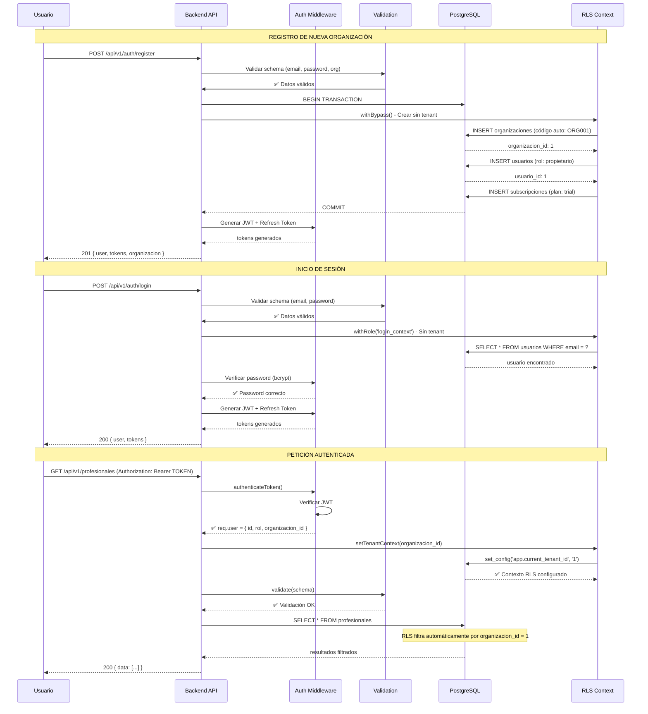
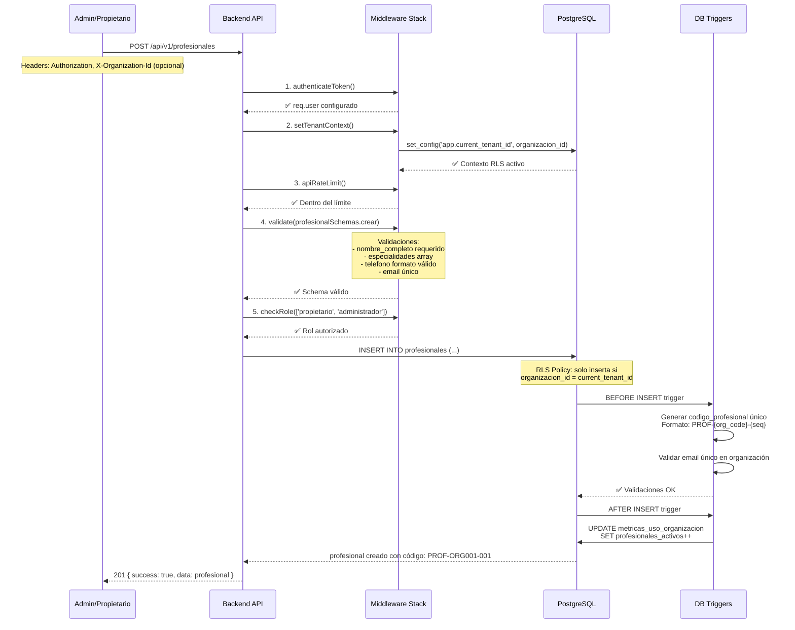
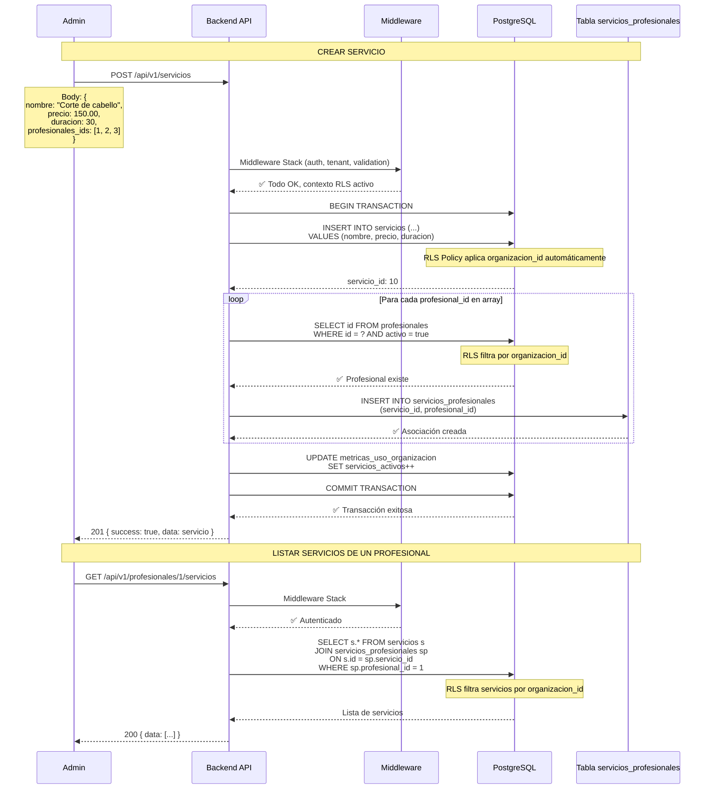
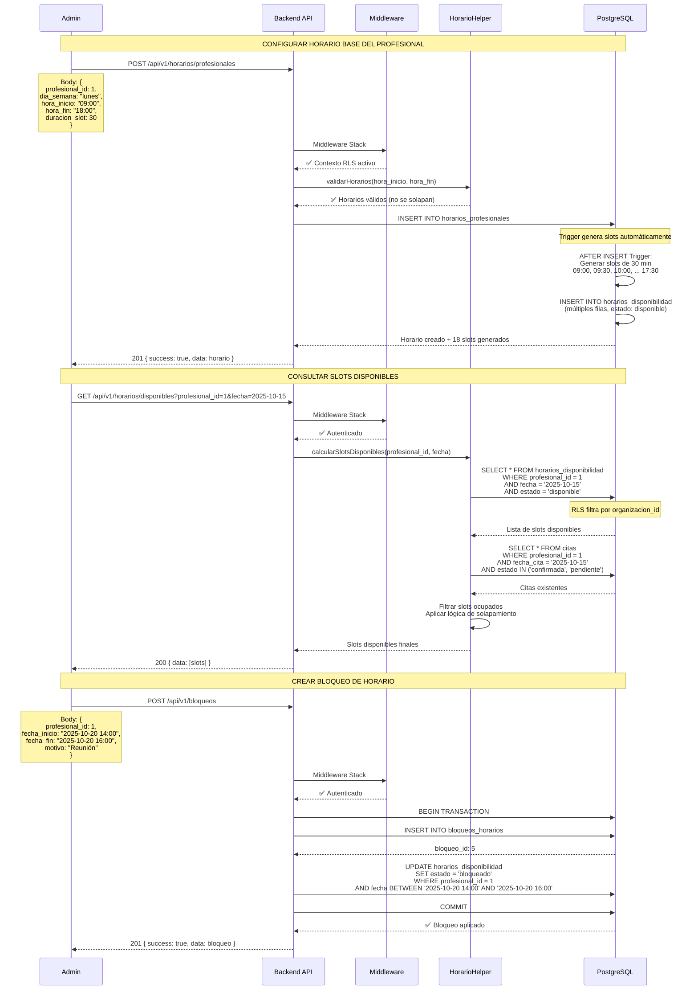
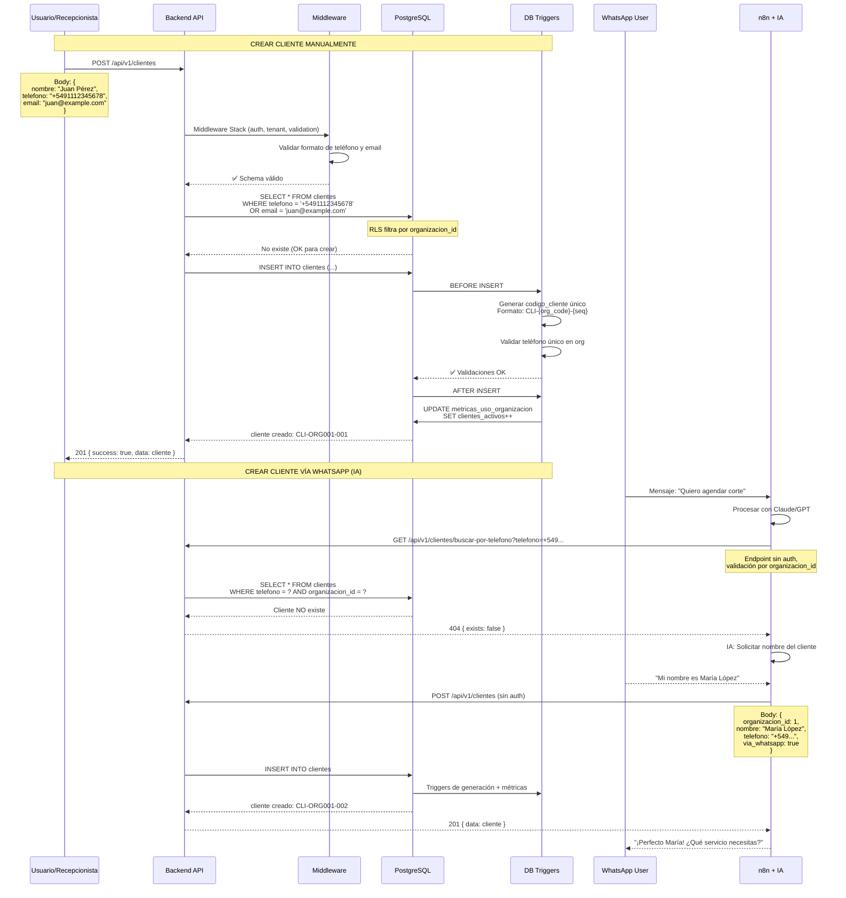
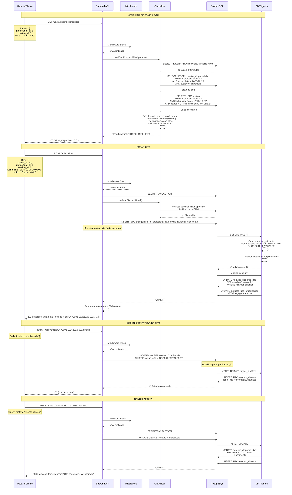
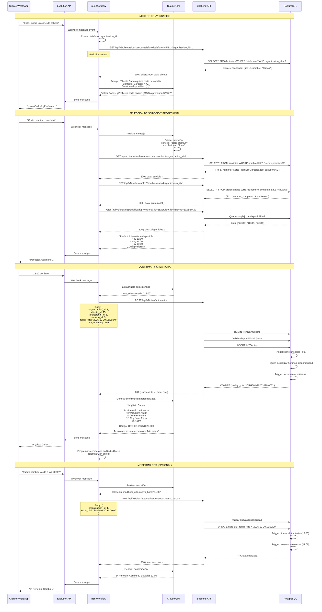
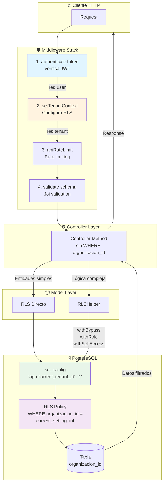
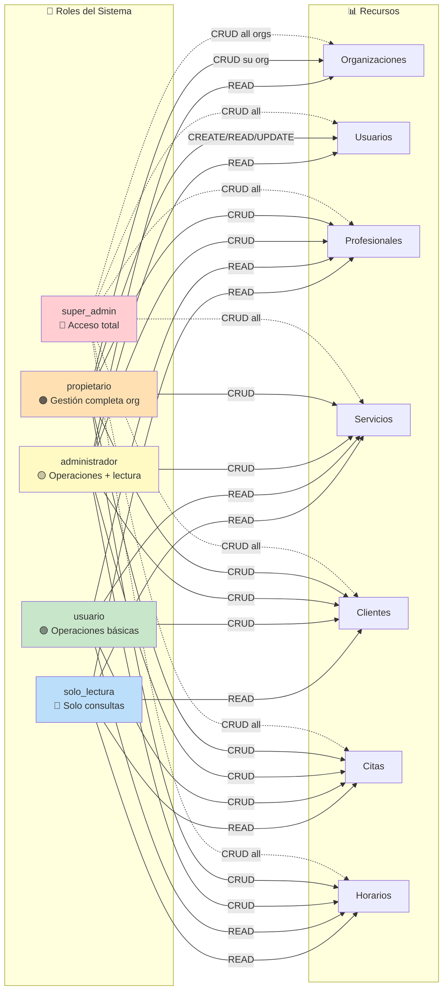

# Backend API - Plataforma SaaS Multi-Tenant de Agendamiento


Backend API REST para plataforma SaaS multi-tenant de automatización de agendamiento empresarial con IA conversacional integrada (WhatsApp).

---

## 📋 Tabla de Contenidos

- [Descripción General](#-descripción-general)
- [Stack Técnico](#-stack-técnico)
- [Arquitectura](#-arquitectura)
- [Workflows del Sistema](#-workflows-del-sistema)
  - [1. Registro e Inicio de Sesión](#1-flujo-de-registro-e-inicio-de-sesión)
  - [2. Creación de Profesionales](#2-flujo-de-creación-de-profesionales)
  - [3. Creación de Servicios](#3-flujo-de-creación-de-servicios-y-asociación-con-profesionales)
  - [4. Establecimiento de Horarios](#4-flujo-de-establecimiento-de-horarios)
  - [5. Creación de Clientes](#5-flujo-de-creación-de-clientes)
  - [6. Agendamiento de Citas](#6-flujo-completo-de-agendamiento-de-citas)
  - [7. IA Conversacional (WhatsApp)](#7-flujo-de-ia-conversacional-whatsapp)
  - [8. Arquitectura Multi-Tenant](#8-arquitectura-multi-tenant-con-rls)
  - [9. RBAC - Matriz de Permisos](#9-rbac---matriz-de-permisos)
- [Comandos Esenciales](#-comandos-esenciales)
- [Estructura del Proyecto](#-estructura-del-proyecto)
- [Seguridad Multi-Tenant](#-seguridad-multi-tenant)
- [Variables de Entorno](#-variables-de-entorno)
- [Testing](#-testing)
- [Reglas Críticas de Desarrollo](#-reglas-críticas-de-desarrollo)
- [Performance](#-performance)
- [Troubleshooting](#-troubleshooting)
- [Documentación Adicional](#-documentación-adicional)

---

## 🎯 Descripción General

Plataforma SaaS Multi-Tenant para automatización de agendamiento empresarial con las siguientes características:

- **Multi-Tenancy Seguro**: Row Level Security (RLS) en PostgreSQL con aislamiento total de datos
- **Autenticación JWT**: Sistema de tokens con refresh tokens automáticos
- **RBAC Completo**: 5 roles con permisos granulares (super_admin, propietario, administrador, usuario, solo_lectura)
- **IA Conversacional**: Integración con WhatsApp vía n8n + Evolution API
- **Auto-generación**: Códigos únicos para organizaciones, clientes, profesionales y citas
- **Testing Completo**: 464/464 tests pasando (100% de cobertura)

### Estado del Proyecto (Actualizado: 08 Oct 2025)

| Componente | Estado | Métricas |
|------------|--------|----------|
| **Backend API** | ✅ **100%** | 2,040 LoC controllers, RLS activo |
| **Base de Datos** | ✅ **100%** | 17 tablas, 17 RLS policies, 40 funciones |
| **Suite Tests** | ✅ **464/464 (100%)** | 21 test suites, ~53s ejecución |
| **Sistema IA** | ✅ **Operativo** | n8n + Evolution API (WhatsApp) |

---

## 🛠 Stack Técnico

### Backend
- **Runtime**: Node.js + Express.js
- **Autenticación**: JWT con refresh tokens
- **Validación**: Joi schemas modulares
- **Testing**: Jest + Supertest
- **Logs**: Winston (JSON structured)

### Base de Datos
- **PostgreSQL 17 Alpine**
- **Multi-Tenant**: Row Level Security (RLS)
- **Performance**: 152 índices (covering, GIN, GIST)
- **Auto-generación**: Códigos únicos con triggers

### IA Conversacional
- **Orquestación**: n8n (stable) + Redis Queue
- **WhatsApp**: Evolution API
- **NLP**: Claude/GPT vía n8n workflows

---

## 📐 Arquitectura

### Módulos Principales

| Módulo | Routes | Controller | Model | Schemas | Total LoC | Patrón RLS |
|--------|--------|------------|-------|---------|-----------|------------|
| **Auth** | 42 | 230 | 1,072* | 355 | 1,699 | RLSHelper |
| **Usuarios** | 73 | 144 | 1,072* | 162 | 1,451 | RLSHelper |
| **Organizaciones** | 107 | 261 | 718 | 291 | 1,377 | RLSHelper |
| **Profesionales** | 101 | 168 | 489 | 310 | 1,068 | RLS Directo |
| **Servicios** | 123 | 199 | 574 | 204 | 1,100 | RLS Directo |
| **Clientes** | 91 | 158 | 525 | 305 | 1,079 | RLS Directo |
| **Horarios** | 92 | 148 | 754 | 168 | 1,162 | RLS Directo |
| **Citas** | 213 | 529 | 1,916 | 450 | 3,108 | RLS Directo |
| **Bloqueos** | 16 | 74 | 366 | 190 | 646 | RLS Directo |

*Comparten `usuario.model.js`

**Total**: ~12,690 líneas de código backend

### Middleware Stack

| Middleware | LoC | Función |
|------------|-----|---------|
| `asyncHandler.js` | 96 | Manejo automático de errores async |
| `auth.js` | 352 | JWT authentication + refresh tokens |
| `tenant.js` | 407 | Configuración RLS multi-tenant |
| `rateLimiting.js` | 529 | Rate limiting por IP + endpoint |
| `validation.js` | 393 | Validación Joi con contexto de usuario |

### Helpers/Utils

| Helper | LoC | Función |
|--------|-----|---------|
| `helpers.js` | 520 | ResponseHelper, OrganizacionHelper |
| `rlsHelper.js` | 151 | Contextos RLS reutilizables |
| `passwordHelper.js` | 108 | Hash y validación de contraseñas |
| `horarioHelpers.js` | 266 | Lógica de horarios y slots |
| `logger.js` | 273 | Winston structured logging |

### Base de Datos PostgreSQL

**17 Tablas Principales**:
```
Core (3):           organizaciones, usuarios, planes_subscripcion
Catálogo (2):       plantillas_servicios, profesionales
Negocio (4):        servicios, clientes, horarios_profesionales, horarios_disponibilidad
Operaciones (3):    citas, bloqueos_horarios, servicios_profesionales
Subscripciones (3): subscripciones, historial_subscripciones, metricas_uso_organizacion
Sistema (2):        eventos_sistema, eventos_sistema_archivo
```

**Seguridad y Performance**:
- **17 Políticas RLS** (multi-tenant + anti SQL-injection con REGEX `^[0-9]+$`)
- **27 Triggers** (auto-generación de códigos, capacidad, timestamps)
- **40 Funciones PL/pgSQL** (validaciones, generación automática)
- **152 Índices** (covering, GIN full-text, GIST temporal)

**ENUMs de Dominio (7)**:
```sql
rol_usuario:         super_admin, propietario, administrador, usuario, solo_lectura
estado_cita:         pendiente, confirmada, en_curso, completada, cancelada, no_asistio
industria_tipo:      barberia, salon_belleza, estetica, spa, consultorio_medico, etc.
tipo_profesional:    barbero, estilista, esteticista, masajista, doctor_general, etc.
plan_type:           trial, basico, profesional, empresarial, personalizado
estado_horario:      disponible, reservado, bloqueado
estado_subscripcion: activa, cancelada, suspendida, expirada
```

---

## 🔄 Workflows del Sistema

### 1. Flujo de Registro e Inicio de Sesión



### 2. Flujo de Creación de Profesionales



### 3. Flujo de Creación de Servicios y Asociación con Profesionales



### 4. Flujo de Establecimiento de Horarios



### 5. Flujo de Creación de Clientes



### 6. Flujo Completo de Agendamiento de Citas



### 7. Flujo de IA Conversacional (WhatsApp)



### 8. Arquitectura Multi-Tenant con RLS



### 9. RBAC - Matriz de Permisos



---

## 🚀 Comandos Esenciales

### Tests Backend

```bash
# Suite completa (SIEMPRE usar "npm test")
docker exec back npm test                                    # 464 tests

# Test específico
docker exec back npm test -- __tests__/endpoints/auth.test.js

# Con watch mode
docker exec back npm test -- --watch

# ❌ NO USAR: docker exec back npx jest ...
# Razón: No establece NODE_ENV=test correctamente
```

### Docker

```bash
# Iniciar servicios
npm run start            # docker compose up -d

# Detener servicios
npm run stop             # docker compose down

# Reiniciar
npm run restart

# Ver logs
docker logs -f back
docker logs -f postgres_db

# Estado de contenedores
docker ps | grep -E "(back|postgres|n8n)"
```

### Base de Datos

```bash
# Consola PostgreSQL
docker exec postgres_db psql -U admin -d postgres

# Ver tablas
docker exec postgres_db psql -U admin -d postgres -c "\dt"

# Ver políticas RLS de una tabla
docker exec postgres_db psql -U admin -d postgres -c "\d clientes"

# Ejecutar query
docker exec postgres_db psql -U admin -d postgres -c "SELECT * FROM organizaciones LIMIT 5;"
```

---

## 📁 Estructura del Proyecto

```
backend/
├── app/
│   ├── controllers/      # Lógica de negocio (asyncHandler)
│   │   ├── auth.controller.js
│   │   ├── usuario.controller.js
│   │   ├── organizacion.controller.js
│   │   ├── profesional.controller.js
│   │   ├── servicio.controller.js
│   │   ├── cliente.controller.js
│   │   ├── horario.controller.js
│   │   ├── cita.controller.js
│   │   └── bloqueo.controller.js
│   │
│   ├── database/         # Models con RLS
│   │   └── models/
│   │       ├── auth.model.js
│   │       ├── usuario.model.js
│   │       ├── organizacion.model.js
│   │       ├── profesional.model.js
│   │       ├── servicio.model.js
│   │       ├── cliente.model.js
│   │       ├── horario.model.js
│   │       ├── cita.model.js
│   │       └── bloqueo.model.js
│   │
│   ├── middleware/       # Stack de seguridad
│   │   ├── asyncHandler.js      # Manejo automático errores
│   │   ├── auth.js              # JWT authentication
│   │   ├── tenant.js            # RLS multi-tenant
│   │   ├── rateLimiting.js      # Rate limiting
│   │   └── validation.js        # Joi validation
│   │
│   ├── routes/api/v1/    # Definición de endpoints
│   │   ├── auth.js
│   │   ├── usuarios.js
│   │   ├── organizaciones.js
│   │   ├── profesionales.js
│   │   ├── servicios.js
│   │   ├── clientes.js
│   │   ├── horarios.js
│   │   ├── citas.js
│   │   └── bloqueos.js
│   │
│   ├── schemas/          # Validaciones Joi modulares
│   │   ├── common.schemas.js
│   │   ├── auth.schemas.js
│   │   ├── usuario.schemas.js
│   │   ├── organizacion.schemas.js
│   │   ├── profesional.schemas.js
│   │   ├── servicio.schemas.js
│   │   ├── cliente.schemas.js
│   │   ├── horario.schemas.js
│   │   ├── cita.schemas.js
│   │   └── bloqueo.schemas.js
│   │
│   ├── utils/            # Helpers reutilizables
│   │   ├── helpers.js           # ResponseHelper, OrganizacionHelper
│   │   ├── rlsHelper.js         # Contextos RLS
│   │   ├── passwordHelper.js    # Hash y validación
│   │   ├── horarioHelpers.js    # Lógica de slots
│   │   └── logger.js            # Winston structured logs
│   │
│   └── __tests__/        # Suite completa de testing
│       ├── endpoints/           # 216 tests de API
│       ├── integration/         # 64 tests de integración
│       ├── middleware/          # 15 tests de middleware
│       ├── rbac/               # 33 tests de permisos
│       ├── business-logic/     # 9 tests de lógica
│       ├── concurrency/        # 7 tests de concurrencia
│       ├── e2e/                # 120 tests end-to-end
│       └── helpers/
│           └── db-helper.js    # Helpers de testing
│
├── config/               # Configuración
│   ├── database.js
│   ├── jwt.js
│   └── logger.js
│
└── logs/                 # Winston logs (JSON structured)
```

---

## 🔒 Seguridad Multi-Tenant

### Patrón de Middleware (OBLIGATORIO)

Todas las rutas protegidas deben seguir este orden:

```javascript
router.post('/endpoint',
    auth.authenticateToken,      // 1. JWT
    tenant.setTenantContext,     // 2. RLS ⚡ CRÍTICO
    rateLimiting.apiRateLimit,   // 3. Rate limit
    validation.validate(schema), // 4. Validación
    Controller.metodo            // 5. Controller
);
```

### RLS en Models

**Patrón 1: RLS Directo** (módulos de entidades)

```javascript
const db = await getDb();
try {
    await db.query('SELECT set_config($1, $2, false)',
        ['app.current_tenant_id', organizacion_id.toString()]);

    const query = `INSERT INTO profesionales (...) VALUES (...) RETURNING *`;
    const result = await db.query(query, values);
    return result.rows[0];
} finally {
    db.release();
}
```

**Patrón 2: RLSHelper** (lógica compleja)

```javascript
const RLSHelper = require('../utils/rlsHelper');

// Bypass RLS (solo super_admin)
return await RLSHelper.withBypass(db, async (db) => {
    return await db.query('SELECT * FROM usuarios');
});

// Contexto de login (sin tenant)
return await RLSHelper.withRole(db, 'login_context', async (db) => {
    return await db.query('SELECT * FROM usuarios WHERE email = $1', [email]);
});

// Self-access (usuario accediendo sus propios datos)
return await RLSHelper.withSelfAccess(db, userId, async (db) => {
    return await db.query('UPDATE usuarios SET nombre = $1 WHERE id = $2', [nombre, userId]);
});
```

### Validaciones con Joi Schemas

**Schemas Modulares** (ubicación: `backend/app/schemas/`):

```javascript
// schemas/servicio.schemas.js
const crear = {
    body: Joi.object({
        nombre: Joi.string().trim().min(1).max(100).required(),
        precio: commonSchemas.price.required(),
        // organizacion_id con validación condicional
        organizacion_id: Joi.when('$userRole', {
            is: 'super_admin',
            then: commonSchemas.id.optional(),
            otherwise: Joi.forbidden()
        })
    })
};

// routes/servicios.js
router.post('/',
    auth.authenticateToken,
    tenant.setTenantContext,
    validation.validate(servicioSchemas.crear),  // ✅ Schema modular
    ServicioController.crear
);
```

### Patrón organizacion_id (Header Enterprise)

**Migración**: 2025-10-06 - Header `X-Organization-Id` como estándar

**SUPER_ADMIN** (Prioridad descendente):
1. **Header X-Organization-Id** (✅ RECOMENDADO)
2. Query param `organizacion_id` (⚠️ DEPRECATED)
3. Body `organizacion_id` (⚠️ DEPRECATED)

**USUARIOS REGULARES**:
- Siempre usa `req.tenant.organizacionId` del JWT
- Schemas **prohíben** pasar `organizacion_id` (validación condicional)

```bash
# ✅ RECOMENDADO (super_admin)
curl -H "Authorization: Bearer TOKEN" \
     -H "X-Organization-Id: 123" \
     GET /api/v1/citas

# ⚠️ DEPRECATED (mantener por compatibilidad)
curl -H "Authorization: Bearer TOKEN" \
     GET /api/v1/citas?organizacion_id=123
```

---

## 🌍 Variables de Entorno

```env
NODE_ENV=development
PORT=3000

# Database
DB_HOST=postgres_db
DB_PORT=5432
DB_USER=admin
DB_PASSWORD=admin123
DB_NAME=postgres

# JWT
JWT_SECRET=your-secret-key
JWT_REFRESH_SECRET=your-refresh-secret
JWT_EXPIRES_IN=15m
JWT_REFRESH_EXPIRES_IN=7d

# Logging
LOG_LEVEL=info

# Rate Limiting
RATE_LIMIT_WINDOW_MS=900000
RATE_LIMIT_MAX_REQUESTS=100
```

---

## 🧪 Testing

### Estado de Tests

**Backend (Jest + Supertest)**: 464/464 tests pasando (100%)

| Suite | Tests | Descripción |
|-------|-------|-------------|
| **Endpoints** | 216 | Tests de API REST (auth, usuarios, org, prof, serv, citas, etc.) |
| **Integration** | 64 | RLS, auto-generación, triggers, CRUD |
| **Middleware** | 15 | Auth JWT, Tenant Context |
| **RBAC** | 33 | Control de acceso granular |
| **Business Logic** | 9 | Métricas organizaciones |
| **Concurrency** | 7 | Prevención double-booking |
| **E2E** | 120 | Flujos completos de negocio |

### Ejecutar Tests

```bash
# Backend completo (~53s)
docker exec back npm test

# Suite específica
docker exec back npm test -- __tests__/endpoints/auth.test.js

# Con coverage
docker exec back npm test -- --coverage

# Watch mode
docker exec back npm test -- --watch
```

### Helpers de Testing

**Archivo**: `backend/app/__tests__/helpers/db-helper.js`

```javascript
const {
    createTestOrganizacion,    // Crea org con RLS bypass
    createTestUsuario,          // Genera token JWT automático
    createTestProfesional,
    createTestServicio,         // Asocia con profesionales automáticamente
    createTestCita,             // NO enviar codigo_cita (auto-generado)
    cleanAllTables              // Limpia en orden correcto (evita FK violations)
} = require('../helpers/db-helper');

// Setup típico
beforeAll(async () => {
    client = await global.testPool.connect();
    await cleanAllTables(client);

    testOrg = await createTestOrganizacion(client);
    testUsuario = await createTestUsuario(client, testOrg.id, { rol: 'propietario' });
    testProfesional = await createTestProfesional(client, testOrg.id);
    testServicio = await createTestServicio(client, testOrg.id, {
        nombre: 'Test',
        precio: 100.00
    }, [testProfesional.id]);
});
```

---

## ⚠️ Reglas Críticas de Desarrollo

### 1. Arquitectura Multi-Tenant

**Controllers confían en RLS** - NO usar `WHERE organizacion_id` manual:

```javascript
// ✅ CORRECTO (RLS filtra automáticamente)
const query = `SELECT * FROM profesionales WHERE activo = true`;

// ❌ INCORRECTO (redundante, RLS ya filtra)
const query = `SELECT * FROM profesionales WHERE organizacion_id = $1 AND activo = true`;
```

**Backend NO envía `codigo_cita`** - Auto-generado por trigger:

```javascript
// ✅ CORRECTO
const cita = await CitaModel.crear({
    cliente_id: 1,
    profesional_id: 2,
    servicio_id: 3,
    fecha_cita: '2025-10-10',
    // NO enviar codigo_cita
});
// cita.codigo_cita = "ORG001-20251010-001" (auto-generado)

// ❌ INCORRECTO
const cita = await CitaModel.crear({
    codigo_cita: 'manual',  // ❌ Error: trigger sobreescribe
    cliente_id: 1,
    ...
});
```

### 2. Schemas de BD vs Código (Consistencia)

**CRÍTICO**: Nombres de columnas deben coincidir:

```javascript
// ✅ CORRECTO (nombres exactos de BD)
SELECT nombre_comercial FROM organizaciones;
SELECT nombre_completo, especialidades FROM profesionales;
UPDATE horarios_disponibilidad SET estado = 'disponible';
UPDATE citas SET estado = 'en_curso';

// ❌ INCORRECTO
SELECT nombre FROM organizaciones;              // ❌ No existe
SELECT nombre, especialidad FROM profesionales;  // ❌ No existe
UPDATE horarios SET disponible = true;          // ❌ columna incorrecta
UPDATE citas SET estado = 'en_proceso';         // ❌ ENUM inválido
```

### 3. Checklist para Nuevos Módulos

Al crear/refactorizar un módulo:

**Routes** (`routes/api/v1/[modulo].js`):
- [ ] 1 línea por endpoint (sin comentarios JSDoc redundantes)
- [ ] Middleware en orden: auth → tenant → rateLimit → validation → controller
- [ ] Agrupación lógica (públicas vs privadas)

**Controller** (`controllers/[modulo].controller.js`):
- [ ] Todos los métodos usan `asyncHandler`
- [ ] Sin try/catch manual (asyncHandler lo maneja)
- [ ] Usa `ResponseHelper` para respuestas
- [ ] Sin logs de éxito (solo errores críticos)

**Model** (`database/[modulo].model.js`):
- [ ] Usa RLS apropiado según complejidad:
  - RLS directo para entidades (Profesionales, Servicios, Citas)
  - RLSHelper para lógica compleja (Auth, Usuarios)
- [ ] `db.release()` en bloque finally

**Schemas** (`schemas/[modulo].schemas.js`):
- [ ] Constantes de validación centralizadas
- [ ] Reutiliza `commonSchemas` cuando sea posible
- [ ] Validación condicional para `organizacion_id`

**Tests** (`__tests__/endpoints/[modulo].test.js`):
- [ ] Usa helpers de `db-helper`
- [ ] Limpieza en beforeAll/afterAll
- [ ] Cobertura: happy path + edge cases
- [ ] 100% de tests pasando

---

## ⚡ Performance

- **152 índices** en BD (covering, GIN full-text, GIST temporal)
- **Rate limiting** por IP + endpoint
- **Queries optimizadas** (<100ms)
- **Auto-generación** de códigos únicos con triggers
- **RLS policies** con anti SQL-injection (REGEX `^[0-9]+$`)
- **Connection pooling** para PostgreSQL

### Métricas de Performance

| Operación | Tiempo Promedio |
|-----------|-----------------|
| Autenticación JWT | <10ms |
| Query con RLS | <50ms |
| Creación de cita | <100ms |
| Búsqueda full-text | <30ms |

---

## 🔧 Troubleshooting

### Error: Tests con timeout o "NODE_ENV debe ser test"

**Síntomas**:
```
Error: Command timed out after 1m 0s
❌ NODE_ENV debe ser "test" para ejecutar tests
```

**✅ SOLUCIÓN - Usar SIEMPRE `npm test`**:
```bash
docker exec back npm test                                    # ✅
docker exec back npm test -- __tests__/endpoints/auth.test.js  # ✅

# ❌ NO USAR: docker exec back npx jest ...
```

**Por qué**: El script `npm test` establece `NODE_ENV=test` y configura el pool correctamente.

### Error: "column does not exist"

```javascript
// ❌ INCORRECTO
SELECT nombre FROM organizaciones               // Error: column "nombre" does not exist
SELECT p.nombre, p.especialidad FROM profesionales  // Error: column "especialidad" does not exist

// ✅ CORRECTO
SELECT nombre_comercial FROM organizaciones
SELECT p.nombre_completo, p.especialidades FROM profesionales
```

### Error: "El profesional no está autorizado para realizar este servicio"

**Causa**: Falta asociación en `servicios_profesionales`

**Solución**: Usar helper que asocia automáticamente
```javascript
testServicio = await createTestServicio(client, testOrg.id, {
    nombre: 'Test',
    precio: 100.00
}, [profesionalId]);  // ✅ Array de profesionales autorizados
```

### Error: "RLS context not set"

**Causa**: Falta middleware `tenant.setTenantContext`

**Solución**:
```javascript
// ✅ CORRECTO
router.get('/',
    auth.authenticateToken,
    tenant.setTenantContext,  // ⚡ CRÍTICO
    Controller.listar
);
```

---

## 📚 Documentación Adicional

| Archivo | Descripción |
|---------|-------------|
| [`/CLAUDE.md`](../CLAUDE.md) | Guía completa del proyecto |
| [`/sql/README.md`](../sql/README.md) | Documentación de base de datos (RLS, triggers, funciones) |
| [`/backend/app/__tests__/README.md`](./__tests__/README.md) | Plan de testing completo |
| [`/PROMPT_AGENTE_N8N.md`](../PROMPT_AGENTE_N8N.md) | Configuración de agente IA para n8n |

---

## 🤝 Contribución

### Patrones Implementados

- ✅ 100% controllers usan `asyncHandler` (manejo automático de errores)
- ✅ 100% endpoints usan schemas Joi modulares
- ✅ 100% responses usan `ResponseHelper` (formato consistente)
- ✅ Módulos de entidades usan RLS directo (más simple)
- ✅ Módulos con lógica compleja usan `RLSHelper` (Auth, Usuarios, Organizaciones)

### Próximos Pasos

1. **Módulo Clientes**: Aplicar patrón asyncHandler + RLS directo
2. **Módulo Horarios**: Optimizar controller (148 LoC actualmente)
3. **Consolidar helpers**: Unificar helpers comunes entre módulos
4. **Documentación API**: Generar OpenAPI/Swagger automático

---

## 📄 Licencia

Este proyecto es propietario y confidencial.

---

**Estado**: ✅ Production Ready | 464/464 tests pasando
**Versión**: 1.0
**Última actualización**: 08 Octubre 2025
**Mantenido por**: Equipo de Desarrollo
