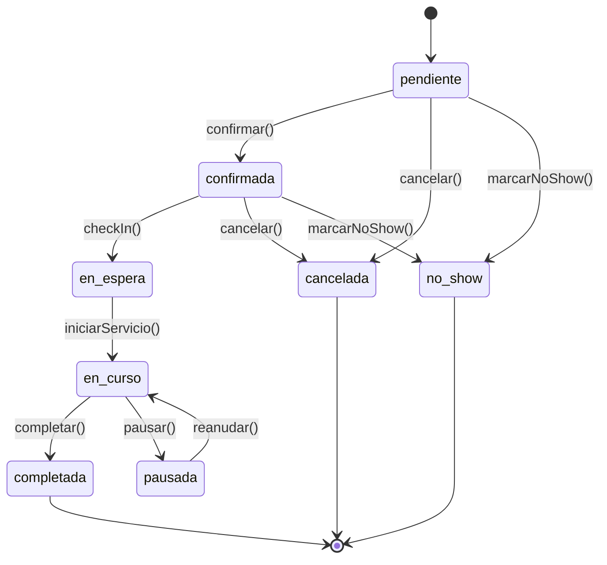
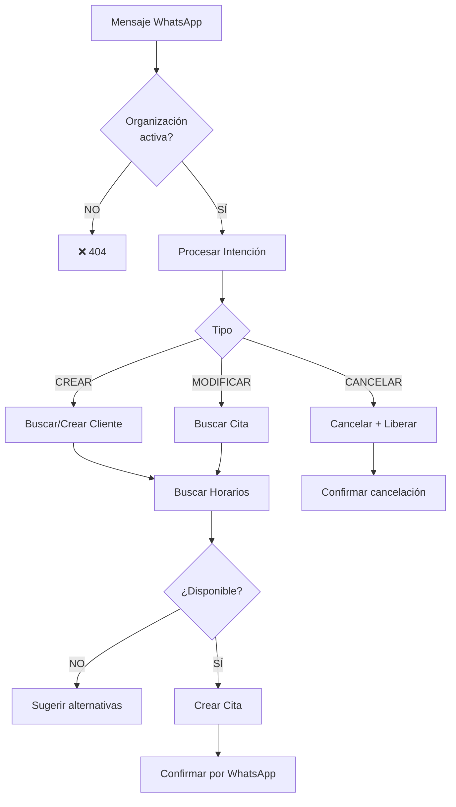
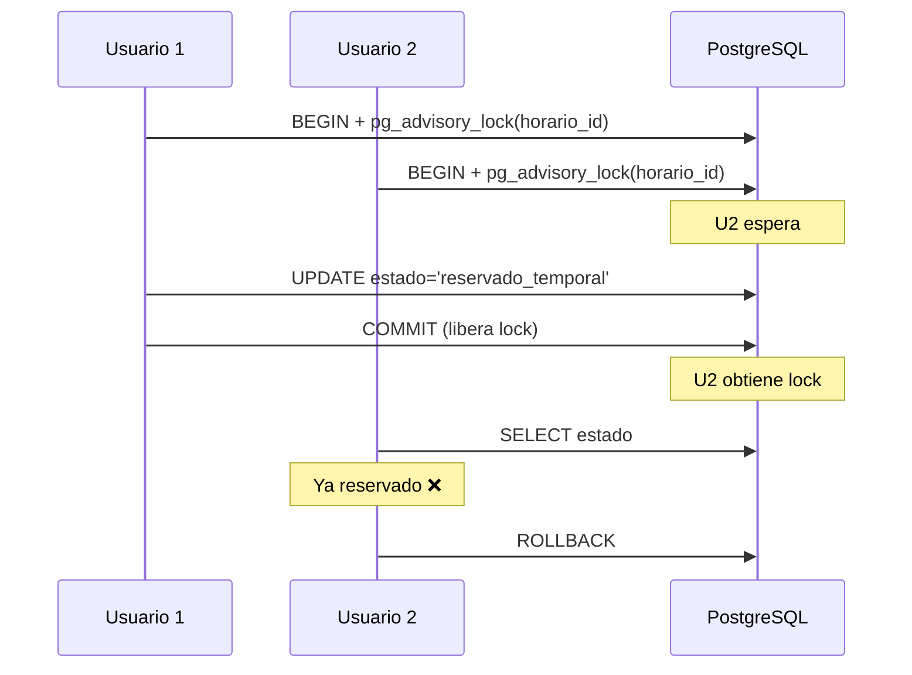
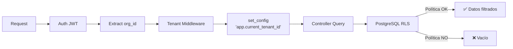

# 🧪 Suite de Tests - Sistema SaaS Multi-Tenant

## 📊 Estado Actual

**464 tests pasando (100%)** | 21 suites | ~63 segundos | ✅ Zero flaky tests

| Módulo | Tests | Descripción |
|--------|-------|-------------|
| **Endpoints REST** | 178 | API completa (Auth, Usuarios, Citas, Horarios, Servicios, etc.) |
| **RLS Multi-Tenant** | 21 | Aislamiento de datos por organización |
| **RBAC** | 33 | Control granular de permisos por rol |
| **Integración BD** | 64 | Triggers, auto-generación códigos, CRUD |
| **Lógica de Negocio** | 16 | Máquina de estados de citas |
| **Middleware** | 15 | Auth JWT, Tenant Context |
| **Concurrencia** | 9 | Prevención doble booking, race conditions |

---

## 🏗️ Estructura

```
__tests__/
├── endpoints/          # Tests API REST
├── integration/        # RLS, triggers, auto-generación
├── rbac/              # Permisos por rol
├── business-logic/    # Máquina de estados
├── concurrency/       # Tests de concurrencia
├── middleware/        # Auth, tenant context
└── helpers/
    └── db-helper.js   # Utilidades reutilizables
```

---

## 📋 Flujos de Negocio Críticos

### 1. Máquina de Estados de Citas



**Tests**: `business-logic/citas-estado-transitions.test.js`

**Transiciones bloqueadas**:
- ❌ `completada/cancelada/no_show` → cualquier estado (finales)
- ❌ `pendiente` → `en_curso` (debe pasar por `confirmada`)
- ❌ `confirmada` → `completada` (debe pasar por `en_curso`)

---

### 2. IA Conversacional WhatsApp



**Tests**: `endpoints/citas-ia.test.js`

**Capacidades**:
- Auto-creación de clientes nuevos
- Búsqueda inteligente de horarios
- Modificación y cancelación por código/teléfono
- Consulta de próximas citas

---

### 3. Prevención de Doble Booking



**Tests**: `concurrency/horarios-concurrency.test.js`

**Mecanismos**:
1. **Advisory Locks**: Previenen race conditions
2. **EXCLUSION Constraint**: Previenen solapamiento de horarios
3. **Reservas Temporales**: Expiran en 15 minutos

---

### 4. RLS Multi-Tenant



**26 políticas RLS** aplicadas en todas las tablas

**Tests**: `integration/rls-multi-tenant.test.js` + tests RLS en cada endpoint

---

### 5. Sistema RBAC

**Jerarquía de Roles**: `super_admin` > `propietario` > `admin` > `empleado/recepcionista`

**Matriz de Permisos (Resumen)**:

| Recurso | super_admin | propietario | admin | empleado |
|---------|:-----------:|:-----------:|:-----:|:--------:|
| **Organizaciones** |
| Crear/Suspender | ✅ | ❌ | ❌ | ❌ |
| Ver propia | ✅ | ✅ | ✅ | ❌ |
| **Profesionales/Servicios** |
| Crear/Editar/Eliminar | ✅ | ✅ | ✅ | ❌ |
| Ver | ✅ | ✅ | ✅ | ✅ |
| **Usuarios** |
| Crear | ✅ | ✅ | ✅ | ❌ |
| Cambiar rol | ✅ | ✅ | ❌ | ❌ |
| **Clientes** |
| Crear/Ver/Editar | ✅ | ✅ | ✅ | ✅ |
| Estadísticas | ✅ | ✅ | ✅ | ❌ |
| Eliminar | ✅ | ✅ | ✅ | ❌ |

**Tests**: `rbac/permissions.test.js` (33 tests)

---

## 🛠️ Helpers Reutilizables

**Archivo**: `helpers/db-helper.js`

```javascript
// Configuración RLS
await setRLSContext(client, organizacionId);
await bypassRLS(client);

// Limpieza
await cleanAllTables(client);

// Creación de entidades (con datos únicos automáticos)
const org = await createTestOrganizacion(client, { nombre: 'Test Org' });
const usuario = await createTestUsuario(client, org.id, { rol: 'admin' });
const profesional = await createTestProfesional(client, org.id, { ... });
const servicio = await createTestServicio(client, org.id, data, [profesional.id]);
const cliente = await createTestCliente(client, org.id, { ... });
const cita = await createTestCita(client, org.id, { ... }); // NO enviar codigo_cita

// IDs únicos para evitar conflictos
const uniqueId = getUniqueTestId();
```

---

## ✅ Mejores Prácticas Aplicadas

| Práctica | Estado | Ejemplo |
|----------|--------|---------|
| **Naming descriptivo** | ✅ | `test('❌ CRÍTICO: Usuario de otra org NO puede ver cita')` |
| **Estructura AAA** | ✅ | Arrange → Act → Assert claramente separado |
| **Aislamiento de tests** | ✅ | `cleanAllTables()` en beforeAll/afterAll |
| **Helpers reutilizables** | ✅ | `db-helper.js` con 15+ funciones |
| **Happy path + Error cases** | ✅ | Cobertura completa en todos los endpoints |
| **Tests de seguridad** | ✅ | RLS + RBAC explícitamente validados |
| **Tests de concurrencia** | ✅ | 100 requests simultáneos, advisory locks |
| **Zero hardcoded values** | ⚠️ | Mejora: Crear constantes para status codes |

---

## 🚀 Ejecutar Tests

```bash
# Suite completa (RECOMENDADO)
docker exec back npm test

# Test específico
docker exec back npm test -- __tests__/endpoints/citas.test.js

# Con watch mode
docker exec back npm test -- --watch

# ❌ NO USAR: npx jest (no establece NODE_ENV=test)
```

---

## 🔧 Troubleshooting

### Error: Timeout / Cannot read properties of undefined

**Causa**: No se estableció `NODE_ENV=test`

**Solución**: Usar siempre `npm test` en lugar de `npx jest`

### Error: "column does not exist"

**Causa**: Mismatch entre nombres de columnas

**Solución**: Verificar esquema BD

```javascript
// ❌ INCORRECTO
SELECT nombre FROM organizaciones

// ✅ CORRECTO
SELECT nombre_comercial FROM organizaciones
```

### Tests Flaky

**Causa**: Race conditions o datos compartidos

**Solución**:
- Usar fechas fijas: `const fecha = '2030-12-31'`
- Limpiar estado: `await cleanAllTables(client)`
- IDs únicos: `const uniqueId = getUniqueTestId()`

---

## 📈 Mejoras Sugeridas (Priorizadas)

### Prioridad ALTA (2-4 horas)

1. **Constantes para HTTP status codes**
   ```javascript
   const HTTP = { OK: 200, CREATED: 201, BAD_REQUEST: 400, ... };
   .expect(HTTP.CREATED)
   ```

2. **Helper para fechas futuras**
   ```javascript
   function getFutureDate(daysAhead = 1) { ... }
   const fecha = getFutureDate(7);
   ```

### Prioridad MEDIA (3-8 horas)

3. **Tests de performance/response time**
   - Validar que endpoints respondan en < 200ms
   - Detectar regresiones de rendimiento

4. **Separar tests con lógica condicional**
   - ~5 tests tienen `if/else` en assertions
   - Convertir en tests independientes

### Prioridad BAJA (8-16 horas)

5. **Tests de carga con k6/Artillery**
   - 1000 usuarios concurrentes
   - Identificar bottlenecks

6. **Tests E2E con Evolution API**
   - Integración real con WhatsApp
   - Flujo completo IA conversacional

---

## 📚 Referencias Clave

- `backend/TESTING_PLAN.md` - Plan de testing completo
- `sql/README.md` - Documentación de BD (26 RLS policies, 34 funciones)
- `CLAUDE.md` - Convenciones del proyecto
- `backend/app/schemas/*.schemas.js` - Validaciones Joi

---

## 🎯 Resumen Ejecutivo

**Fortalezas**:
- ✅ 464/464 tests pasando (100%)
- ✅ Cobertura completa: RLS, RBAC, Concurrencia, IA
- ✅ Suite rápida: 63 segundos
- ✅ Zero flaky tests
- ✅ Arquitectura limpia y mantenible

**Áreas de Excelencia**:
- Tests de seguridad RLS multi-tenant (21 tests dedicados)
- Sistema RBAC granular (33 tests, 6 módulos)
- Prevención doble booking con advisory locks
- IA conversacional WhatsApp (flujo completo)

**Próximos Pasos**:
1. Añadir constantes HTTP status
2. Crear helpers de fechas
3. Tests de performance (opcional)

---

**Última actualización**: 08 Octubre 2025 | **Estado**: ✅ 100% Operacional
