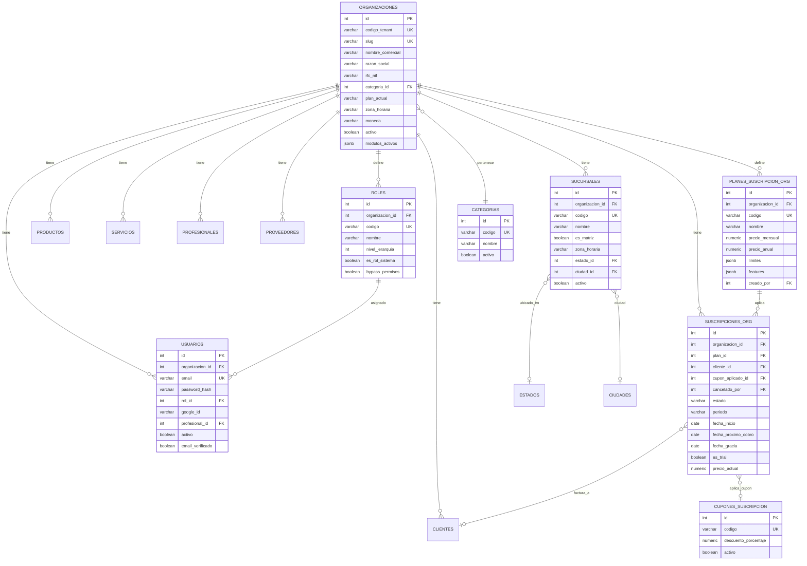
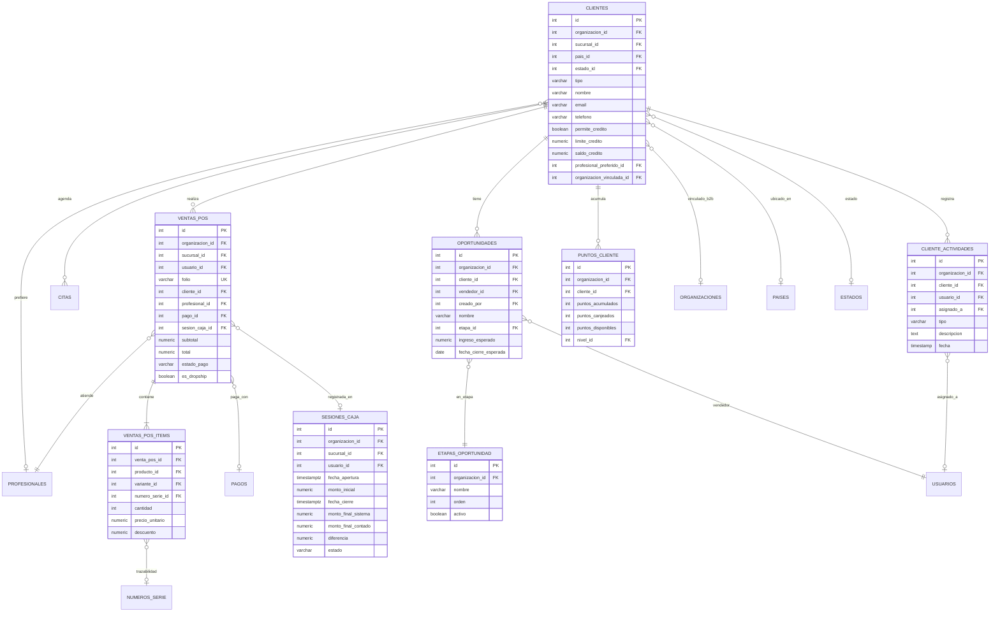
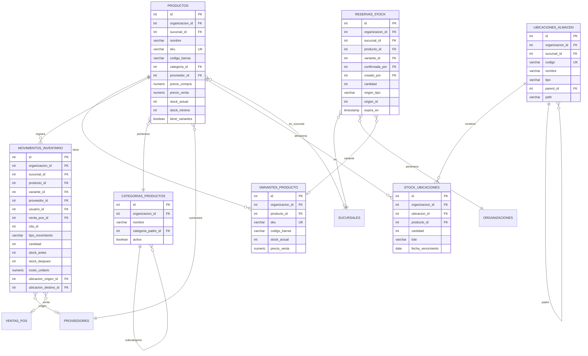
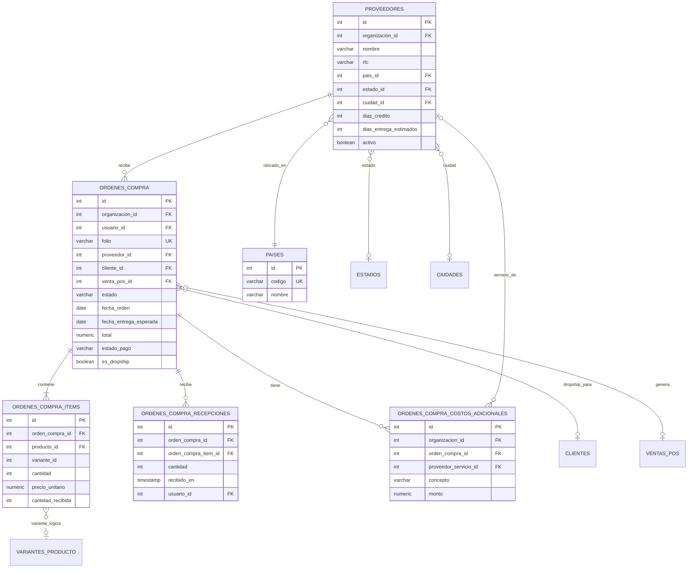
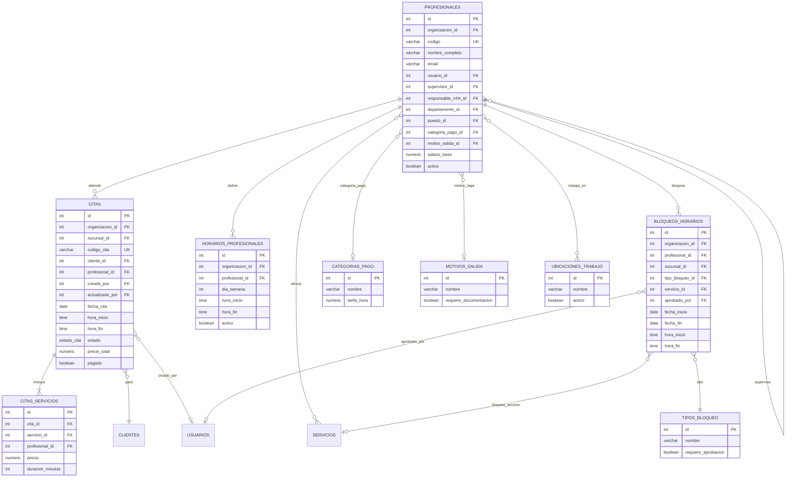
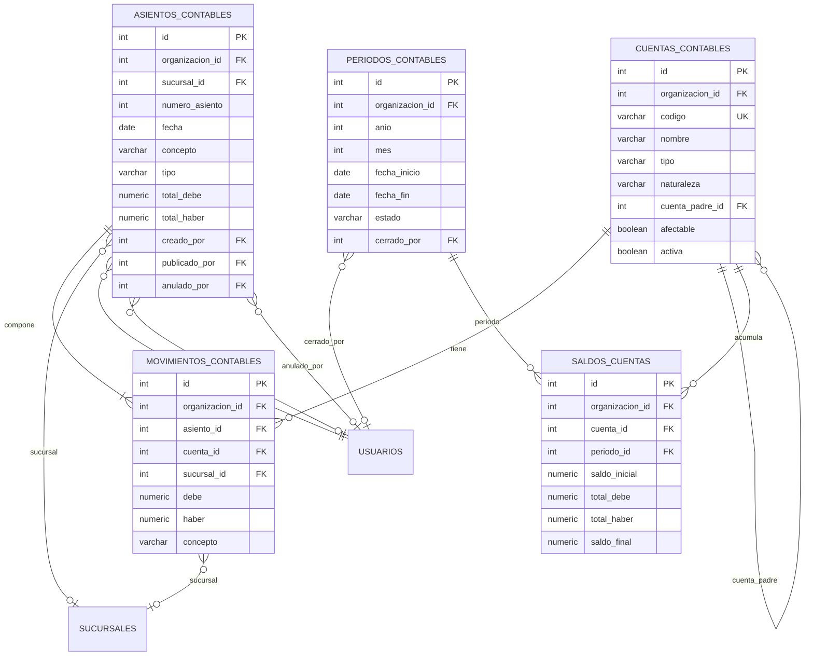

# Base de Datos Nexo - Documentación Completa

Sistema de gestión empresarial multi-tenant con PostgreSQL 17, RLS (Row Level Security) y pg_cron.

## Estadísticas Generales

| Métrica | Cantidad |
|---------|----------|
| **Tablas** | 224 |
| **Vistas** | 32 |
| **Funciones** | 771 |
| **Triggers** | 174 |
| **Jobs pg_cron** | 13 |
| **Tipos ENUM** | 14 |
| **Archivos SQL** | 289 |
| **Líneas de código SQL** | ~55,465 |

## Arquitectura Multi-Tenant

El sistema implementa aislamiento de datos mediante:
- **RLS (Row Level Security)**: Políticas automáticas por `organizacion_id`
- **Context Variables**: `app.current_org_id` para el tenant activo
- **Bypass para Super Admin**: Nivel jerárquico >= 100

## Módulos del Sistema

### 1. Núcleo (Core)
Tablas fundamentales del sistema multi-tenant.

| Tabla | Descripción |
|-------|-------------|
| `organizaciones` | Tenants/empresas del sistema |
| `usuarios` | Usuarios con autenticación JWT |
| `roles` | Roles con niveles jerárquicos (5-100) |
| `sucursales` | Puntos de operación por organización |
| `permisos_catalogo` | Catálogo de permisos del sistema |
| `permisos_rol` | Asignación de permisos a roles |

### 2. Clientes (CRM)
Gestión de clientes y oportunidades comerciales.

| Tabla | Descripción |
|-------|-------------|
| `clientes` | Clientes con crédito y datos de contacto |
| `cliente_etiquetas` | Sistema de etiquetado |
| `cliente_actividades` | Historial de interacciones |
| `cliente_documentos` | Documentos adjuntos |
| `oportunidades` | Pipeline de ventas |
| `etapas_oportunidad` | Configuración del pipeline |
| `puntos_cliente` | Programa de lealtad |
| `movimientos_credito_cliente` | Control de fiado/crédito |

### 3. Profesionales (RRHH)
Gestión de empleados y recursos humanos.

| Tabla | Descripción |
|-------|-------------|
| `profesionales` | Empleados/profesionales |
| `horarios_profesionales` | Disponibilidad semanal |
| `categorias_profesional` | Especialidades |
| `documentos_empleado` | Documentos de RRHH |
| `cuentas_bancarias_empleado` | Datos bancarios |
| `incapacidades` | Registro de incapacidades |
| `solicitudes_vacaciones` | Gestión de vacaciones |
| `saldos_vacaciones` | Días disponibles |

### 4. Agendamiento y Citas
Sistema de reservas y calendario.

| Tabla | Descripción |
|-------|-------------|
| `citas` | Citas con estado y pagos (particionada) |
| `citas_servicios` | Servicios por cita |
| `bloqueos_horarios` | Bloqueos de agenda |
| `tipos_bloqueo` | Catálogo de tipos de bloqueo |

### 5. Servicios
Catálogo de servicios ofrecidos.

| Tabla | Descripción |
|-------|-------------|
| `servicios` | Catálogo de servicios |
| `servicios_profesionales` | Qué profesional ofrece qué servicio |
| `servicios_sucursales` | Disponibilidad por sucursal |

### 6. Inventario
Sistema completo de gestión de inventario.

| Tabla | Descripción |
|-------|-------------|
| `productos` | Catálogo de productos |
| `variantes_producto` | SKUs con variantes (talla, color) |
| `atributos_producto` | Definición de atributos |
| `valores_atributo` | Valores posibles por atributo |
| `movimientos_inventario` | Historial de movimientos (particionada) |
| `stock_ubicaciones` | Stock por ubicación de almacén |
| `ubicaciones_almacen` | Estructura de almacén (jerárquica) |
| `reservas_stock` | Reservas temporales de stock |
| `transferencias_stock` | Movimientos entre sucursales |
| `alertas_inventario` | Alertas de stock mínimo |
| `numeros_serie` | Trazabilidad por número de serie |
| `conteos_inventario` | Inventarios físicos |
| `ajustes_masivos` | Ajustes de inventario en lote |

### 7. Órdenes de Compra
Gestión de compras a proveedores.

| Tabla | Descripción |
|-------|-------------|
| `proveedores` | Catálogo de proveedores |
| `ordenes_compra` | Órdenes de compra |
| `ordenes_compra_items` | Líneas de la orden |
| `ordenes_compra_recepciones` | Recepciones parciales |
| `ordenes_compra_costos_adicionales` | Landed costs |

### 8. POS (Punto de Venta)
Sistema de ventas y caja.

| Tabla | Descripción |
|-------|-------------|
| `ventas_pos` | Transacciones de venta |
| `ventas_pos_items` | Líneas de venta |
| `ventas_pos_items_modificadores` | Modificadores aplicados |
| `sesiones_caja` | Apertura/cierre de caja |
| `movimientos_caja` | Entradas/salidas de efectivo |
| `desglose_billetes` | Arqueo de caja |
| `venta_pagos` | Pagos parciales |
| `cupones` | Cupones de descuento |
| `promociones` | Promociones automáticas |

### 9. Contabilidad
Sistema contable integrado.

| Tabla | Descripción |
|-------|-------------|
| `cuentas_contables` | Plan de cuentas (SAT México) |
| `periodos_contables` | Períodos fiscales |
| `asientos_contables` | Asientos contables (particionada) |
| `movimientos_contables` | Líneas de asientos |
| `saldos_cuentas` | Saldos por período |
| `config_contabilidad` | Configuración contable |

### 10. Suscripciones
Sistema SaaS de facturación recurrente.

| Tabla | Descripción |
|-------|-------------|
| `planes_suscripcion_org` | Planes disponibles |
| `suscripciones_org` | Suscripciones activas |
| `pagos_suscripcion` | Historial de pagos |
| `conectores_pago_org` | Credenciales MercadoPago |
| `checkout_tokens` | Tokens de checkout |
| `webhooks_procesados` | Idempotencia de webhooks |

### 11. Auditoría
Sistema de logging y auditoría.

| Tabla | Descripción |
|-------|-------------|
| `eventos_sistema` | Log de eventos (particionada) |
| `eventos_sistema_archivo` | Archivo histórico |

### 12. Notificaciones
Sistema de notificaciones multicanal.

| Tabla | Descripción |
|-------|-------------|
| `notificaciones` | Notificaciones por usuario |
| `notificaciones_tipos` | Tipos de notificación |
| `notificaciones_plantillas` | Templates por tipo |
| `notificaciones_preferencias` | Preferencias de usuario |
| `configuracion_recordatorios` | Configuración de recordatorios |

### 13. Website Builder
Constructor de sitios web.

| Tabla | Descripción |
|-------|-------------|
| `website_config` | Configuración del sitio |
| `website_paginas` | Páginas del sitio |
| `website_bloques` | Bloques de contenido |
| `website_versiones` | Versionado de páginas |
| `website_analytics` | Analytics de visitas |
| `website_contactos` | Formularios de contacto |
| `website_chat_*` | Sistema de chat en vivo |

### 14. Marketplace
Perfiles públicos y reseñas.

| Tabla | Descripción |
|-------|-------------|
| `marketplace_perfiles` | Perfiles de negocios |
| `marketplace_categorias` | Categorías del marketplace |
| `marketplace_reseñas` | Reseñas de clientes |
| `marketplace_analytics` | Métricas de perfiles |

### 15. Workflows
Motor de workflows y aprobaciones.

| Tabla | Descripción |
|-------|-------------|
| `workflow_definiciones` | Definición de workflows |
| `workflow_pasos` | Pasos del workflow |
| `workflow_transiciones` | Transiciones entre pasos |
| `workflow_instancias` | Instancias en ejecución |
| `workflow_historial` | Historial de acciones |

---

## Diagrama de Base de Datos (Mermaid)

### Diagrama Principal - Entidades Core



### Diagrama CRM - Clientes y Ventas



### Diagrama Inventario



### Diagrama Órdenes de Compra



### Diagrama Agendamiento



### Diagrama Contabilidad



---

## Jobs de pg_cron

| Job | Schedule | Descripción |
|-----|----------|-------------|
| `crear-particiones-movimientos` | `0 0 1 * *` | Crea partición mensual de movimientos |
| `evaluar-reglas-reorden` | `0 6 * * *` | Evalúa reglas de reabastecimiento |
| `expirar-reservas-stock` | `*/5 * * * *` | Libera reservas vencidas (cada 5 min) |
| `generar-alertas-sin-movimiento` | `0 2 * * 0` | Alertas de productos sin movimiento |
| `generar-snapshots-inventario` | `5 0 * * *` | Snapshot diario de inventario |
| `limpiar-particiones-antiguas` | `30 0 1 * *` | Limpia particiones > 12 meses |
| `limpiar-snapshots-antiguos` | `0 3 1-7 * 0` | Limpia snapshots > 365 días |
| `procesar_recordatorios` | `*/5 * * * *` | Procesa recordatorios pendientes |
| `refresh-mv-stock-disponible` | `* * * * *` | Refresca vista materializada |
| `suscripciones-grace-period` | `0 1 * * *` | Activa período de gracia |
| `suscripciones-suspender` | `0 2 * * *` | Suspende suscripciones morosas |
| `suscripciones-trials-expirados` | `0 3 * * *` | Procesa trials vencidos |
| `validar-sincronizacion-stock` | `0 4 * * *` | Valida consistencia de stock |

---

## Tipos ENUM

| Tipo | Valores |
|------|---------|
| `estado_cita` | pendiente, confirmada, en_curso, completada, cancelada, no_asistio |
| `estado_laboral` | activo, vacaciones, incapacidad, suspendido, baja |
| `estado_transferencia` | borrador, enviado, recibido, cancelado |
| `estado_franja` | disponible, reservado_temporal, ocupado, bloqueado |
| `estado_invitacion` | pendiente, aceptada, expirada, cancelada, reenviada |
| `genero` | masculino, femenino, otro, no_especificado |
| `tipo_contratacion` | tiempo_completo, medio_tiempo, temporal, contrato, freelance |
| `tipo_documento_empleado` | identificacion, pasaporte, contrato, visa, certificado, etc. |
| `tipo_evento_sistema` | login_success, login_failed, cita_creada, pago_exitoso, etc. |
| `nivel_educacion` | basica, preparatoria, licenciatura, maestria, doctorado |
| `nivel_habilidad` | basico, intermedio, avanzado, experto |
| `categoria_habilidad` | tecnica, blanda, idioma, herramienta, sector |
| `plataforma_chatbot` | telegram, whatsapp, messenger, instagram, slack |
| `responsable_tarea_onboarding` | empleado, supervisor, rrhh |

---

## Tablas Particionadas

El sistema usa particionamiento por rango de fechas para tablas de alto volumen:

| Tabla Base | Particiones | Criterio |
|------------|-------------|----------|
| `citas` | `citas_2026_01`, `citas_2026_02`, ... | Por mes (fecha_cita) |
| `movimientos_inventario` | `movimientos_inventario_2026_01`, ... | Por mes (creado_en) |
| `asientos_contables` | `asientos_contables_2026_01`, ... | Por mes (fecha) |
| `eventos_sistema` | `eventos_sistema_2026_01`, ... | Por mes (creado_en) |

---

## Vistas Principales

| Vista | Descripción |
|-------|-------------|
| `v_stock_consolidado` | Stock total por producto/variante/sucursal |
| `v_stock_disponible_tiempo_real` | Stock menos reservas activas |
| `v_alertas_con_stock_proyectado` | Alertas con proyección de stock |
| `v_ordenes_compra_con_costos` | OC con landed costs calculados |
| `v_usuarios_con_rol` | Usuarios con información de rol |
| `v_modulos_por_plan` | Módulos disponibles por plan |
| `v_progreso_onboarding_resumen` | Progreso de onboarding por empleado |
| `v_recordatorios_pendientes` | Recordatorios por enviar |
| `vw_website_analytics_resumen` | Métricas de website agregadas |

---

## Funciones Principales

### Inventario
- `calcular_stock_proyectado()` - Proyección de stock con demanda
- `generar_snapshots_todas_organizaciones()` - Snapshot de inventario
- `evaluar_reglas_reorden()` - Evaluación de reabastecimiento
- `expirar_reservas_vencidas()` - Liberación de reservas
- `calcular_valor_inventario()` - Valoración FIFO/AVCO

### POS
- `calcular_totales_venta_pos()` - Cálculo de totales
- `aplicar_cupon()` - Aplicación de descuentos
- `aplicar_promocion()` - Aplicación de promociones
- `calcular_puntos_venta()` - Cálculo de puntos de lealtad

### Suscripciones
- `calcular_mrr()` - Monthly Recurring Revenue
- `calcular_arr()` - Annual Recurring Revenue
- `calcular_churn_rate()` - Tasa de cancelación
- `calcular_ltv()` - Lifetime Value

### Contabilidad
- `crear_asiento_venta_pos()` - Asiento automático de venta
- `crear_asiento_compra()` - Asiento automático de compra
- `calcular_utilidad_periodo()` - Utilidad del período

---

## Convenciones de Nomenclatura

- **Tablas**: snake_case en español (`ventas_pos`, `movimientos_inventario`)
- **Columnas FK**: `{tabla_singular}_id` (`organizacion_id`, `cliente_id`)
- **Timestamps**: `creado_en`, `actualizado_en`, `eliminado_en`
- **Soft delete**: `eliminado_en`, `eliminado_por`
- **Triggers**: `trg_{accion}_{tabla}` o `trigger_{descripcion}`
- **Funciones**: verbos en español (`calcular_`, `crear_`, `actualizar_`)
- **Vistas**: `v_` o `vw_` como prefijo

---

## Evaluación Arquitectónica

### Calificación General

| Aspecto | Puntuación | Notas |
|---------|------------|-------|
| Multi-tenant (RLS) | ⭐⭐⭐⭐⭐ | Implementación ejemplar con bypass controlado |
| Escalabilidad | ⭐⭐⭐⭐⭐ | Particionamiento dinámico + vistas materializadas |
| Seguridad | ⭐⭐⭐⭐⭐ | FORCE RLS en todas las tablas críticas |
| Automatización | ⭐⭐⭐⭐⭐ | pg_cron + triggers bien implementados |
| Normalización | ⭐⭐⭐⭐ | Balanceada, JSONB justificado |
| Soft Delete | ⭐⭐⭐ | Inconsistente en tablas transaccionales |
| Índices Avanzados | ⭐⭐⭐⭐ | GIN/trigramas presentes, faltan BRIN |

### Fortalezas Validadas

#### 1. Consolidación de Stock (Enero 2026)
- **Fuente única de verdad**: `stock_ubicaciones` con detalle por ubicación/lote
- **Denormalización controlada**: `productos.stock_actual` sincronizado via trigger
- **Validación automática**: Job diario `validar-sincronizacion-stock` (04:00 AM)
- **Función centralizada**: `registrar_movimiento_con_ubicacion()` usada en todos los módulos

#### 2. Sistema RLS Multi-tenant
- Políticas consistentes en 80+ tablas
- Bypass controlado via `app.bypass_rls`
- `FORCE ROW LEVEL SECURITY` previene escalación

#### 3. Particionamiento Dinámico
- 4 tablas particionadas: `citas`, `movimientos_inventario`, `asientos_contables`, `eventos_sistema`
- Creación automática de particiones sin hardcodear fechas
- Mantenimiento por partición (VACUUM, backup selectivo)

### Áreas de Mejora Identificadas

#### 1. Soft Delete Inconsistente

**Tablas críticas SIN soft delete:**

| Tabla | Impacto | Prioridad |
|-------|---------|-----------|
| `ventas_pos` | Pérdida datos financieros | 🔴 Crítica |
| `asientos_contables` | Registros fiscales | 🔴 Crítica |
| `citas` | Historial perdido | 🔴 Crítica |
| `comisiones_profesionales` | Datos compensación | 🔴 Crítica |

**Nota**: Tablas particionadas pueden requerir diseño especial para soft delete.

#### 2. Índices Faltantes

| Índice Recomendado | Tabla | Beneficio |
|--------------------|-------|-----------|
| `idx_productos_nombre_trgm` | productos | Búsqueda fuzzy por nombre |
| `idx_*_brin` | Tablas particionadas | Reducción 90% tamaño índice |

```sql
-- Ejemplo: Trigrama para productos
CREATE INDEX idx_productos_nombre_trgm
    ON productos USING GIN(nombre gin_trgm_ops);

-- Ejemplo: BRIN para tablas particionadas
CREATE INDEX idx_eventos_sistema_creado_brin
    ON eventos_sistema USING BRIN(creado_en);
```

#### 3. FKs en Tablas Particionadas

Algunas FKs no especifican `ON DELETE`:
- `movimientos_inventario.proveedor_id` → default RESTRICT
- `movimientos_inventario.usuario_id` → default RESTRICT

### Recomendaciones por Prioridad

#### Corto Plazo (1-2 semanas)
- [ ] Agregar índice trigrama a `productos.nombre`
- [ ] Documentar política de soft delete por módulo
- [ ] Explicitar ON DELETE en FKs de `movimientos_inventario`

#### Mediano Plazo (1-2 meses)
- [ ] Implementar BRIN en tablas particionadas
- [ ] Evaluar soft delete en `ventas_pos` (considerar implicaciones fiscales)
- [ ] Agregar `pg_partman` para gestión automática de particiones

#### Largo Plazo (3-6 meses)
- [ ] Read replicas para reportes pesados
- [ ] Evaluar TimescaleDB para `eventos_sistema`

### Arquitectura de Stock - Flujo de Sincronización

```
OPERACIÓN EN BACKEND
    ↓
registrar_movimiento_con_ubicacion()
    ↓
├─ INSERT movimientos_inventario
├─ INSERT/UPDATE stock_ubicaciones
│   ↓
│   TRIGGER trg_sincronizar_stock
│       ↓
│       sincronizar_stock_producto()
│           ↓
│           UPDATE productos.stock_actual = SUM(stock_ubicaciones)
│
└─ Si variante: UPDATE variantes_producto.stock_actual

VALIDACIÓN DIARIA (04:00 AM)
    ↓
validar_sincronizacion_stock()
    ↓
├─ Detecta discrepancias
├─ Registra en auditoria_sincronizacion_stock
└─ Auto-corrige diferencias
```

---

## Conexión a la Base de Datos

```bash
# Desde Docker
docker exec -it postgres_db psql -U admin -d postgres

# Conexión directa
psql -h localhost -p 5432 -U admin -d postgres
```

**Credenciales de desarrollo:**
- Host: `localhost` / `postgres` (en Docker)
- Puerto: `5432`
- Base de datos: `postgres`
- Usuario: `admin`
- Password: Ver archivo `.env`

---

## Estructura de Archivos SQL

```
sql/
├── setup/              # Inicialización (bases, usuarios, permisos)
├── core/               # Extensiones, tipos, funciones base
├── nucleo/             # Tablas core (usuarios, roles, permisos)
├── inventario/         # 34 archivos de inventario
├── pos/                # Punto de venta
├── clientes/           # CRM
├── profesionales/      # RRHH
├── agendamiento/       # Sistema de citas
├── contabilidad/       # Sistema contable
├── suscripciones-negocio/  # SaaS billing
├── website/            # Website builder
├── marketplace/        # Perfiles públicos
├── auditoria/          # Logging
├── notificaciones/     # Sistema de notificaciones
├── workflows/          # Motor de workflows
└── tests/              # Scripts de validación
```

---

*Documentación generada automáticamente - Enero 2026*
*Diagramas Mermaid validados contra FKs reales: 29 Enero 2026*

> **Nota sobre relaciones lógicas**: Las relaciones marcadas con línea punteada (`}o..o|`) representan columnas que existen en la BD pero no tienen FK constraint formal (ej: `variante_id` en tablas particionadas). Son relaciones de integridad lógica mantenidas por la aplicación.
