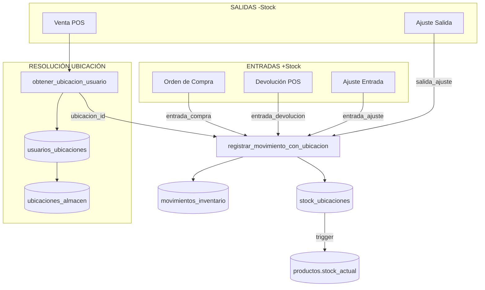

# Módulo Inventario - Consolidación de Stock

**Estado**: Operativo | **Validado E2E**: Enero 2026

---

## Arquitectura

```
stock_ubicaciones (ÚNICA FUENTE DE VERDAD)
       ↓ trigger trg_sincronizar_stock
productos.stock_actual (CALCULADO)
```

**Función central**: `registrar_movimiento_con_ubicacion()` en `sql/inventario/33-consolidacion-stock.sql`

---

## Diagrama de Flujo



---

## Flujo de Resolución de Ubicación (Ventas)

```
Usuario hace venta en POS
        ↓
obtener_ubicacion_usuario(usuario_id, sucursal_id)
        ↓
┌─────────────────────────────────────────────┐
│ 1. Busca ubicación default del usuario      │
│    (es_default=true, puede_despachar=true)  │
│              ↓ no encontrada                │
│ 2. Busca cualquier ubicación con permiso    │
│    (puede_despachar=true)                   │
│              ↓ no encontrada                │
│ 3. Fallback: ubicación DEFAULT de sucursal  │
└─────────────────────────────────────────────┘
        ↓
Descuenta de stock_ubicaciones
        ↓
Registra movimiento con ubicacion_origen_id
```

---

## Relación Usuarios-Ubicaciones

```sql
-- Tabla: usuarios_ubicaciones
usuario_id      → usuarios.id
ubicacion_id    → ubicaciones_almacen.id
es_default      -- Ubicación preferida del usuario
puede_recibir   -- Permiso para recepciones
puede_despachar -- Permiso para ventas/salidas

-- Restricción: usuario debe estar asignado a la sucursal de la ubicación
```

| Permiso | Operaciones Afectadas |
|---------|----------------------|
| `puede_recibir` | Recepciones de compra, devoluciones |
| `puede_despachar` | Ventas POS, ajustes de salida |
| `es_default` | Primera opción al resolver ubicación |

---

## Flujo de Stock por Operación

| Operación | Tipo Movimiento | Resolución Ubicación | Estado |
|-----------|-----------------|----------------------|--------|
| Venta POS | `salida_venta` | `obtener_ubicacion_usuario()` | ✅ |
| Devolución POS | `entrada_devolucion` | ⚠️ Sin ubicación (GAP) | ❌ |
| Recepción compra | `entrada_compra` | ⚠️ Usa DEFAULT hardcodeado | ❌ |
| Ajuste masivo | `entrada/salida_ajuste` | ⚠️ Sin ubicación (GAP) | ❌ |
| Mover stock | `transferencia` | Selección manual origen/destino | ✅ |
| Crear producto | `entrada_ajuste` | DEFAULT de sucursal | ✅ |

---

## GAPs Identificados (Enero 2026)

### 1. Recepción de Órdenes de Compra
- **Problema:** UI no tiene selector de ubicación
- **Backend:** `ordenes-compra.model.js:843` pasa `ubicacion_id = NULL`
- **Resultado:** Stock siempre va a ubicación DEFAULT
- **Solución:** Agregar selector filtrado por `puede_recibir=true`

### 2. Devoluciones POS
- **Problema:** Usa función antigua `registrar_movimiento_inventario`
- **Backend:** `ventas.model.js` no especifica ubicación
- **Resultado:** Stock devuelto sin trazabilidad WMS
- **Solución:** Migrar a `registrar_movimiento_con_ubicacion()`

### 3. Ajustes Masivos
- **Problema:** CSV no incluye columna de ubicación
- **Resultado:** No se puede hacer conteos físicos por ubicación
- **Solución:** Agregar columna `ubicacion_codigo` al formato CSV

---

## Índice UNIQUE para Lotes NULL

```sql
CREATE UNIQUE INDEX idx_stock_ubicaciones_unique_coalesce
ON stock_ubicaciones (ubicacion_id, producto_id, COALESCE(lote, ''));
```

La función usa `COALESCE(lote, '')` en todas las operaciones.

---

## Job de Validación (pg_cron)

**Archivo**: `sql/inventario/34-job-validacion-stock.sql`

| Componente | Descripción |
|------------|-------------|
| Job | `validar-sincronizacion-stock` - Diario 04:00 AM |
| Función | `ejecutar_validacion_stock_diaria()` |
| Auditoría | `auditoria_sincronizacion_stock` |

---

## Queries de Diagnóstico

```sql
-- Verificar sincronización
SELECT * FROM validar_sincronizacion_stock();

-- Ubicaciones de un usuario
SELECT ua.codigo, uu.es_default, uu.puede_despachar
FROM usuarios_ubicaciones uu
JOIN ubicaciones_almacen ua ON ua.id = uu.ubicacion_id
WHERE uu.usuario_id = ? AND uu.activo = true;

-- Stock por ubicación
SELECT ua.codigo, su.producto_id, su.cantidad
FROM stock_ubicaciones su
JOIN ubicaciones_almacen ua ON ua.id = su.ubicacion_id
WHERE ua.sucursal_id = ?;

-- Movimientos con ubicación origen
SELECT m.tipo_movimiento, m.cantidad, ua.codigo as ubicacion_origen
FROM movimientos_inventario m
LEFT JOIN ubicaciones_almacen ua ON ua.id = m.ubicacion_origen_id
WHERE m.producto_id = ? ORDER BY m.creado_en DESC;

-- Sincronizar manualmente (emergencia)
SELECT sincronizar_stock_producto(?);
```
