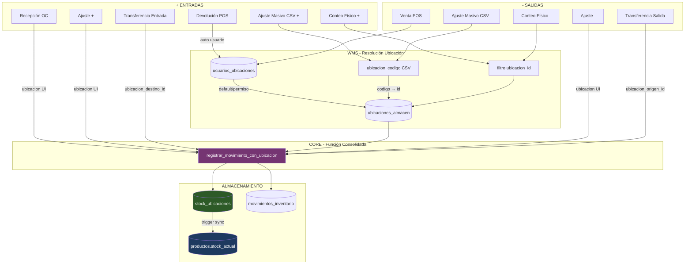

# Módulo Inventario - Consolidación de Stock

**Estado**: ✅ Completo | **Última revisión**: 29 Enero 2026

---

## Diagrama de Flujo



---

## Arquitectura

```
stock_ubicaciones (FUENTE DE VERDAD)
       ↓ trigger trg_sincronizar_stock
productos.stock_actual (CALCULADO)
```

**Función central**: `registrar_movimiento_con_ubicacion()`

---

## Resolución de Ubicación

```
obtener_ubicacion_usuario(usuario_id, sucursal_id)
        ↓
1. Ubicación default del usuario (es_default=true)
        ↓ no encontrada
2. Cualquier ubicación con permiso
        ↓ no encontrada
3. Fallback: ubicación DEFAULT de sucursal
```

| Permiso | Operaciones |
|---------|-------------|
| `puede_recibir` | Recepciones, devoluciones |
| `puede_despachar` | Ventas, salidas |
| `es_default` | Prioridad al resolver |

---

## Estado de Operaciones

| Operación | Tipo Movimiento | Ubicación | Estado |
|-----------|-----------------|-----------|--------|
| Venta POS | `salida_venta` | Auto (usuario) | ✅ |
| Recepción OC | `entrada_compra` | Selector UI | ✅ |
| Ajuste stock | `entrada/salida_ajuste` | Selector UI | ✅ |
| Mover stock | `transferencia` | Manual | ✅ |
| Transferencia inter-sucursal | `transferencia_salida/entrada` | Selector UI | ✅ |
| Devolución POS | `entrada_devolucion` | Auto (usuario) | ✅ |
| Ajuste masivo CSV | `ajuste` | Columna CSV | ✅ |
| Conteo físico | `ajuste` | Por ubicación | ✅ |

---

## Transferencias Inter-Sucursal

```
Sucursal Origen                     Sucursal Destino
[Ubicación A] ─── enviar ───>      [En Tránsito] ─── recibir ───> [Ubicación B]
```

- Items soportan `ubicacion_origen_id` y `ubicacion_destino_id`
- UI: Selector ubicación origen al agregar, destino al recibir

---

## Ajustes Masivos CSV

Plantilla con columna ubicación:
```csv
sku,codigo_barras,cantidad_ajuste,ubicacion_codigo,motivo
PROD-001,,+10,BIN-A01,Entrada por recepción
,7501234567890,-5,BIN-B02,Salida por merma
```

- Validación resuelve `ubicacion_codigo` → `ubicacion_id`
- Error si ubicación no existe en sucursal

---

## Conteos de Inventario

Tipo `por_ubicacion`:
- Selector de ubicación en modal de creación
- Items generados con `ubicacion_id` del filtro
- Ajustes aplicados a ubicación específica

---

## Queries de Diagnóstico

```sql
-- Verificar sincronización
SELECT * FROM validar_sincronizacion_stock();

-- Stock por ubicación
SELECT ua.codigo, su.producto_id, su.cantidad
FROM stock_ubicaciones su
JOIN ubicaciones_almacen ua ON ua.id = su.ubicacion_id
WHERE ua.sucursal_id = ?;

-- Ubicaciones de usuario
SELECT ua.codigo, uu.es_default, uu.puede_despachar
FROM usuarios_ubicaciones uu
JOIN ubicaciones_almacen ua ON ua.id = uu.ubicacion_id
WHERE uu.usuario_id = ? AND uu.activo = true;
```

---

## Validación pg_cron

| Job | Horario | Función |
|-----|---------|---------|
| `validar-sincronizacion-stock` | 04:00 AM | `ejecutar_validacion_stock_diaria()` |

Auditoría: `auditoria_sincronizacion_stock`

---

## Pendientes

### Pruebas E2E Frontend

| Flujo | Validación Principal |
|-------|---------------------|
| Ajuste Stock | Selector ubicación → stock en ubicación correcta |
| Recepción OC | Ubicación destino → stock_ubicaciones actualizado |
| Transferencia | Ubicación origen/destino por item funciona |
| Conteo por Ubicación | Filtro ubicación → items con ubicacion_id → ajuste aplica a ubicación |
| Ajuste Masivo CSV | Columna ubicacion_codigo → validación → movimiento con ubicación |

---

## Historial

| Fecha | Cambio |
|-------|--------|
| 29 Ene 2026 | Implementación completa: Ajustes masivos CSV con ubicación, Conteos por ubicación, Transferencias ubicacion_destino_id por item |
| 29 Ene 2026 | Validación PostgreSQL: 256 tablas, 13 jobs pg_cron, FKs verificadas |
