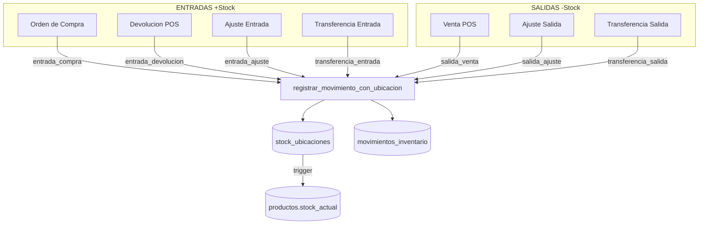

# Módulo Inventario - Consolidación de Stock

**Estado**: Operativo | **Actualizado**: Enero 2026

---

## Arquitectura

```
stock_ubicaciones (ÚNICA FUENTE DE VERDAD)
       ↓ trigger trg_sincronizar_stock
productos.stock_actual (CALCULADO)
```

**Función central**: `registrar_movimiento_con_ubicacion()` en `sql/inventario/33-consolidacion-stock.sql`

---

## Diagrama de Flujo



---

## Flujo de Stock

| Operación | Tipo Movimiento | Archivo |
|-----------|-----------------|---------|
| Crear producto | `entrada_ajuste` | `productos.model.js` |
| Ajuste manual | `entrada_ajuste` / `salida_ajuste` | `movimientos.model.js` |
| Venta POS | `salida_venta` | `pos/04-funciones.sql` |
| Devolución POS | `entrada_devolucion` | `ventas.model.js` |
| Recepción compra | `entrada_compra` | `ordenes-compra.model.js` |
| Transferencia | `transferencia_entrada/salida` | `sucursales/04-funciones.sql` |
| Conteo físico | `entrada_ajuste` / `salida_ajuste` | `conteos.model.js` |

---

## Índice UNIQUE para Lotes NULL

PostgreSQL trata cada NULL como valor distinto en UNIQUE constraints.

```sql
CREATE UNIQUE INDEX idx_stock_ubicaciones_unique_coalesce
ON stock_ubicaciones (ubicacion_id, producto_id, COALESCE(lote, ''));
```

La función usa `COALESCE(lote, '')` en todas las operaciones.

---

## Job de Validación (pg_cron)

**Archivo**: `sql/inventario/34-job-validacion-stock.sql`

| Componente | Descripción |
|------------|-------------|
| Job | `validar-sincronizacion-stock` - Diario 04:00 AM |
| Función | `ejecutar_validacion_stock_diaria()` |
| Auditoría | `auditoria_sincronizacion_stock` |

---

## Queries de Diagnóstico

```sql
-- Verificar sincronización
SELECT * FROM validar_sincronizacion_stock();

-- Estado del job
SELECT * FROM ver_estado_job_validacion_stock;

-- Resumen correcciones (30 días)
SELECT * FROM ver_resumen_correcciones_stock;

-- Kardex de producto
SELECT tipo_movimiento, cantidad, stock_antes, stock_despues, creado_en
FROM movimientos_inventario WHERE producto_id = ? ORDER BY id;

-- Sincronizar manualmente (emergencia)
SELECT sincronizar_stock_producto(?);
```
