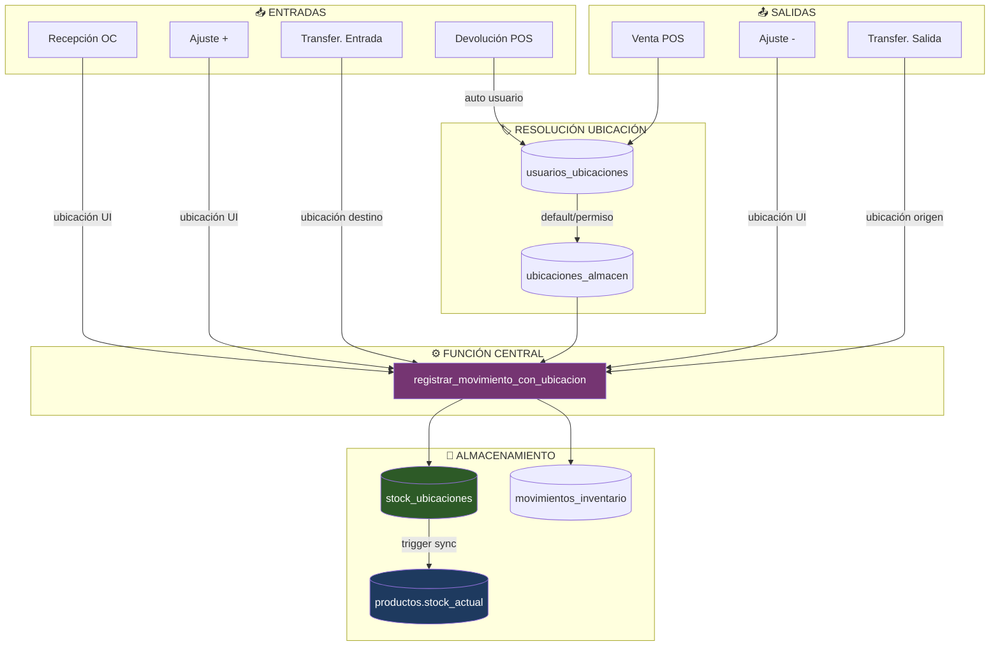

# Módulo Inventario - Consolidación de Stock

**Estado**: 🟡 En validación | **Última revisión**: 30 Enero 2026

---

## Diagrama de Flujo



---

## Arquitectura

```
stock_ubicaciones (FUENTE DE VERDAD)
       ↓ trigger trg_sincronizar_stock
productos.stock_actual (CALCULADO)
```

**Función central**: `registrar_movimiento_con_ubicacion()`

---

## Resolución de Ubicación

```
obtener_ubicacion_usuario(usuario_id, sucursal_id)
        ↓
1. Ubicación default del usuario (es_default=true)
        ↓ no encontrada
2. Cualquier ubicación con permiso
        ↓ no encontrada
3. Fallback: ubicación DEFAULT de sucursal
```

| Permiso | Operaciones |
|---------|-------------|
| `puede_recibir` | Recepciones, devoluciones |
| `puede_despachar` | Ventas, salidas |
| `es_default` | Prioridad al resolver |

---

## Operaciones y Tipos de Movimiento

| Operación | Tipo Movimiento | Ubicación |
|-----------|-----------------|-----------|
| Venta POS | `salida_venta` | Auto (usuario) |
| Recepción OC | `entrada_compra` | Selector UI |
| Ajuste stock | `entrada/salida_ajuste` | Selector UI |
| Mover stock | `transferencia` | Manual |
| Transferencia inter-sucursal | `transferencia_salida/entrada` | Selector UI |
| Devolución POS | `entrada_devolucion` | Auto (usuario) |
| Conteo físico | `ajuste` | Por ubicación |

---

## Tipos de Venta y Reservas

| Tipo Venta | Reserva | Comportamiento Stock |
|------------|---------|---------------------|
| `directa` | ❌ No | Descuento inmediato via trigger |
| `cotizacion` | ❌ No | No afecta stock |
| `apartado` | ✅ Sí | Reserva hasta confirmación/vencimiento |
| `cita` | ✅ Sí | Reserva para servicio agendado |

**Centralización**: Tipos de venta definidos en `backend/app/modules/pos/constants/pos.constants.js` y consumidos via API `/pos/config/tipos-venta`.

---

## Diagnóstico SQL

```sql
-- Verificar sincronización
SELECT * FROM validar_sincronizacion_stock();

-- Stock por ubicación
SELECT ua.codigo, su.producto_id, su.cantidad
FROM stock_ubicaciones su
JOIN ubicaciones_almacen ua ON ua.id = su.ubicacion_id
WHERE ua.sucursal_id = ?;

-- Ubicaciones de usuario
SELECT ua.codigo, uu.es_default, uu.puede_despachar
FROM usuarios_ubicaciones uu
JOIN ubicaciones_almacen ua ON ua.id = uu.ubicacion_id
WHERE uu.usuario_id = ? AND uu.activo = true;
```

---

## Jobs pg_cron

| Job | Horario | Función |
|-----|---------|---------|
| `validar-sincronizacion-stock` | 04:00 AM | `ejecutar_validacion_stock_diaria()` |
| `expirar-reservas-stock` | */30 min | Expira reservas pendientes > 30 min |

---

## Estado Actual (30 Enero 2026)

### Validación Parcial

| Operación | Estado | Notas |
|-----------|--------|-------|
| Ajuste entrada/salida | ✅ Pass | Stock actualizado correctamente |
| Venta directa POS | ✅ Pass | Sin reserva, descuento inmediato |
| Selector tipo venta POS | ✅ Pass | Centralizado backend → frontend |
| Devolución POS | ✅ Pass | Stock revertido |
| Mover stock ubicaciones | ⚠️ Bloqueado | Requiere stock en `stock_ubicaciones` |
| Transferencias | ⚠️ Bloqueado | Límite plan 1 sucursal |
| Conteos | ❌ Pendiente | Bug importación frontend |
| Recepción OC | 🔲 Pendiente | No validado |

### Bugs Conocidos

1. **Conteos de Inventario**: Error de importación `useAuthStore` en página de operaciones
2. **Mover Stock**: Productos legacy sin registro en `stock_ubicaciones`

---

## Pendientes - Validación E2E Próxima Sesión

Validación completa desde proyecto limpio:

### 1. Setup Inicial
- [ ] Levantar proyecto desde cero (docker-compose up)
- [ ] Crear organización y usuario admin
- [ ] Crear sucursal con ubicaciones de almacén

### 2. Configuración WMS
- [ ] Crear ubicaciones (DEFAULT, ALMACEN, MOSTRADOR)
- [ ] Asignar ubicaciones a usuarios con permisos

### 3. Inventario Base
- [ ] Crear categorías de productos
- [ ] Crear productos con stock inicial
- [ ] Verificar registro automático en `stock_ubicaciones`

### 4. Validación Operaciones
- [ ] **Ajustes**: Entrada y salida con selector de ubicación
- [ ] **Mover stock**: Entre ubicaciones de misma sucursal
- [ ] **Conteos**: Crear conteo por ubicación y aplicar diferencias
- [ ] **Órdenes de Compra**: Crear → Recibir → Verificar stock

### 5. Validación POS
- [ ] Venta directa (descuento inmediato)
- [ ] Cotización (sin afectar stock)
- [ ] Apartado (reserva y confirmación)
- [ ] Devolución (reversión stock)

### 6. Validación Multi-Usuario
- [ ] Usuario con ubicación MOSTRADOR solo ve/opera esa ubicación
- [ ] Usuario con ubicación ALMACEN solo ve/opera esa ubicación
- [ ] Verificar permisos `puede_recibir` y `puede_despachar`

### 7. Transferencias (si aplica)
- [ ] Ajustar límite sucursales en plan
- [ ] Crear segunda sucursal
- [ ] Flujo: Enviar → Tránsito → Recibir

### Criterios de Éxito
- `validar_sincronizacion_stock()` sin discrepancias
- Kardex refleja todos los movimientos
- Stock por ubicación coincide con total producto
