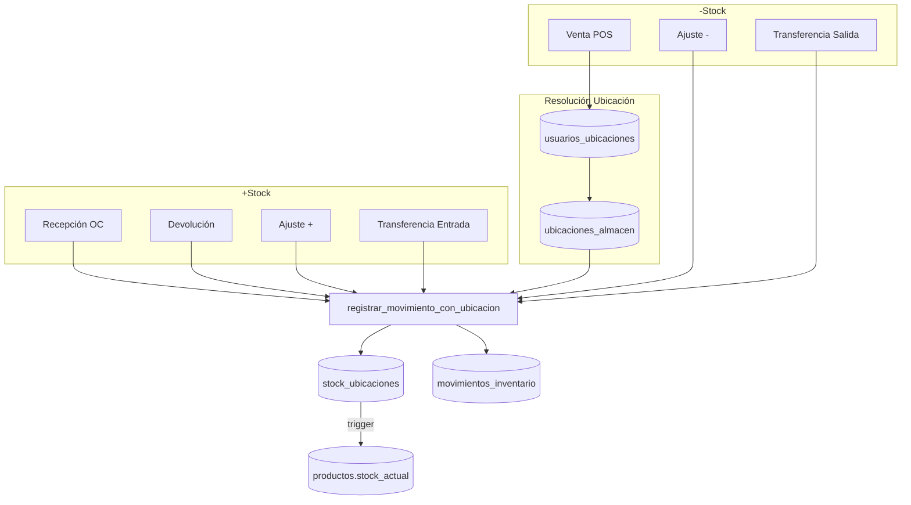

# Módulo Inventario - Consolidación de Stock

**Estado**: Operativo | **Última revisión**: 29 Enero 2026

---

## Arquitectura

```
stock_ubicaciones (FUENTE DE VERDAD)
       ↓ trigger trg_sincronizar_stock
productos.stock_actual (CALCULADO)
```

**Función central**: `registrar_movimiento_con_ubicacion()`

---

## Diagrama de Flujo



---

## Resolución de Ubicación

```
obtener_ubicacion_usuario(usuario_id, sucursal_id)
        ↓
1. Ubicación default del usuario (es_default=true, puede_despachar=true)
        ↓ no encontrada
2. Cualquier ubicación con permiso (puede_despachar=true)
        ↓ no encontrada
3. Fallback: ubicación DEFAULT de sucursal
```

| Permiso | Operaciones |
|---------|-------------|
| `puede_recibir` | Recepciones, devoluciones |
| `puede_despachar` | Ventas, salidas |
| `es_default` | Prioridad al resolver |

---

## Estado de Operaciones

| Operación | Tipo Movimiento | Ubicación | Estado |
|-----------|-----------------|-----------|--------|
| Venta POS | `salida_venta` | Auto (usuario) | ✅ |
| Recepción OC | `entrada_compra` | Selector UI | ✅ |
| Ajuste stock | `entrada/salida_ajuste` | Selector UI | ✅ |
| Mover stock | `transferencia` | Manual | ✅ |
| Transferencia inter-sucursal | `transferencia_salida/entrada` | Selector UI | ✅ |
| Devolución POS | `entrada_devolucion` | Auto (usuario) | ✅ |
| Ajuste masivo CSV | `ajuste` | Default | ⚠️ |

---

## Transferencias Inter-Sucursal (Actualizado 29 Ene 2026)

Las transferencias ahora soportan ubicaciones específicas por item:

### Flujo
```
Sucursal Origen                     Sucursal Destino
----------------                    ----------------
[Ubicación A] ─── enviar ───>      [En Tránsito]
                                         │
                                    recibir
                                         ↓
                                   [Ubicación B]
```

### Componentes Actualizados
- **Backend**: `transferencias.model.js` - soporta `ubicacion_origen_id` y `ubicacion_destino_id` por item
- **SQL**: `procesar_envio_transferencia()` y `procesar_recepcion_transferencia()` usan ubicación específica
- **Frontend**:
  - `TransferenciaItemsDrawer.jsx` - selector ubicación origen al agregar items
  - `TransferenciaDetailPage.jsx` - selector ubicación destino al recibir

### Tabla: transferencias_stock_items
Nuevas columnas:
- `ubicacion_origen_id` - FK a ubicaciones_almacen
- `ubicacion_destino_id` - FK a ubicaciones_almacen
- `lote` - trazabilidad de lotes

---

## GAPs Pendientes

### 1. Ajustes Masivos CSV
- No incluye columna de ubicación
- No permite conteos físicos por bin

---

## Validación pg_cron

| Job | Horario | Función |
|-----|---------|---------|
| `validar-sincronizacion-stock` | 04:00 AM | `ejecutar_validacion_stock_diaria()` |

Auditoría: `auditoria_sincronizacion_stock`

---

## Queries de Diagnóstico

```sql
-- Verificar sincronización
SELECT * FROM validar_sincronizacion_stock();

-- Stock por ubicación de sucursal
SELECT ua.codigo, su.producto_id, su.cantidad
FROM stock_ubicaciones su
JOIN ubicaciones_almacen ua ON ua.id = su.ubicacion_id
WHERE ua.sucursal_id = ?;

-- Ubicaciones de usuario
SELECT ua.codigo, uu.es_default, uu.puede_despachar
FROM usuarios_ubicaciones uu
JOIN ubicaciones_almacen ua ON ua.id = uu.ubicacion_id
WHERE uu.usuario_id = ? AND uu.activo = true;

-- Sincronizar manual (emergencia)
SELECT sincronizar_stock_producto(?);
```

---

## Próximo Paso: Validación E2E Frontend

### Flujos a Validar

| Flujo | Página | Validaciones |
|-------|--------|--------------|
| **Ajuste de Stock** | `ProductosPage` → AjustarStockModal | Selector ubicación visible, stock se registra en ubicación correcta |
| **Recepción OC** | `OrdenesCompraPage` → RecibirMercanciaModal | Selector ubicación funciona, stock entra a ubicación seleccionada |
| **Mover Stock** | `UbicacionesAlmacenPage` | Arrastrar producto entre bins, validar movimiento |
| **Transferencia Inter-Sucursal** | `TransferenciasPage` | Crear → Editar items → Enviar → Recibir |
| **Asignar Ubicación Usuario** | `UsuariosPage` o config | Usuario puede tener ubicación default asignada |
| **Conteo Físico** | `ConteosPage` | Crear conteo, registrar cantidades, aplicar ajuste |
| **Operaciones Almacén** | `OperacionesAlmacenPage` | Picking, putaway, QC funcionan con ubicaciones |

### Checklist por Flujo

```
□ Ajuste Stock
  □ Abrir modal desde producto
  □ Ver selector de ubicación con opciones
  □ Seleccionar ubicación y ajustar cantidad
  □ Verificar en BD: stock_ubicaciones actualizado
  □ Verificar: movimientos_inventario con ubicacion_origen_id

□ Recepción OC
  □ Crear OC con items
  □ Enviar OC
  □ Abrir modal recibir mercancía
  □ Ver selector de ubicación destino
  □ Recibir parcial/total
  □ Verificar stock en ubicación correcta

□ Transferencia Inter-Sucursal
  □ Crear transferencia (origen → destino)
  □ Agregar items con selector de ubicación origen
  □ Ver ubicación origen en lista de items
  □ Enviar (stock sale de ubicación específica o default)
  □ Recibir con selector de ubicación destino por item
  □ Verificar movimientos con ubicacion_origen_id y ubicacion_destino_id

□ Ubicaciones Usuario
  □ Asignar ubicación a usuario
  □ Marcar como default
  □ Verificar permisos puede_recibir/puede_despachar
  □ Hacer venta POS y validar que use ubicación default
```

### Resultado Esperado

Todos los flujos deben:
1. Mostrar selector de ubicación cuando aplica
2. Registrar movimiento con `ubicacion_origen_id` o `ubicacion_destino_id`
3. Actualizar `stock_ubicaciones` correctamente
4. Trigger sincroniza `productos.stock_actual`
