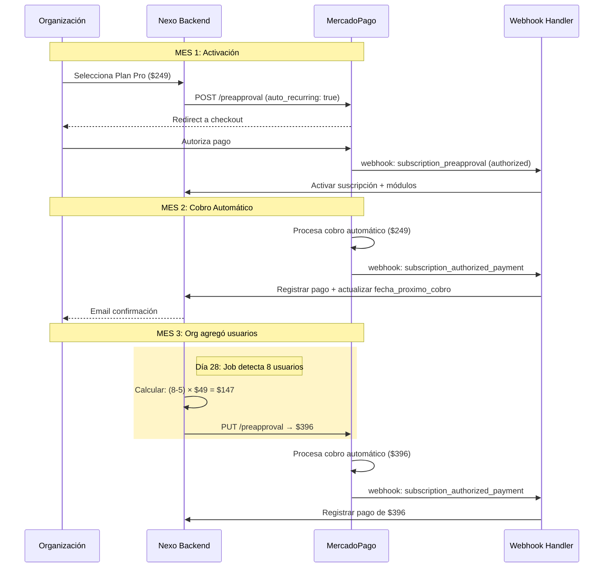
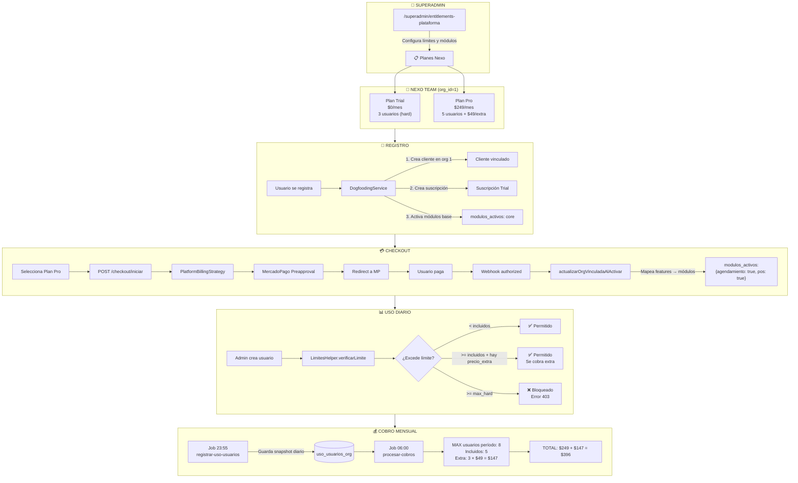
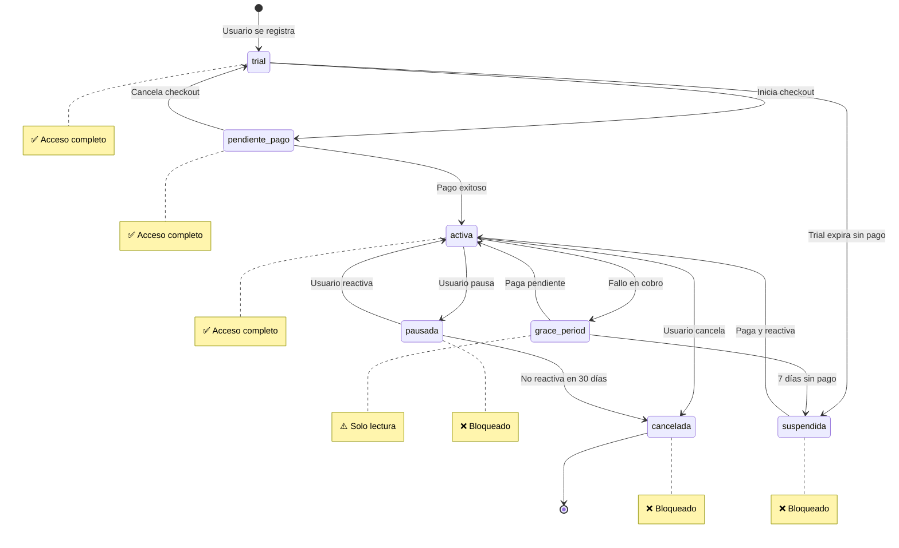
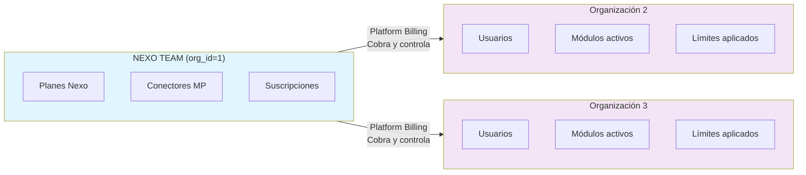
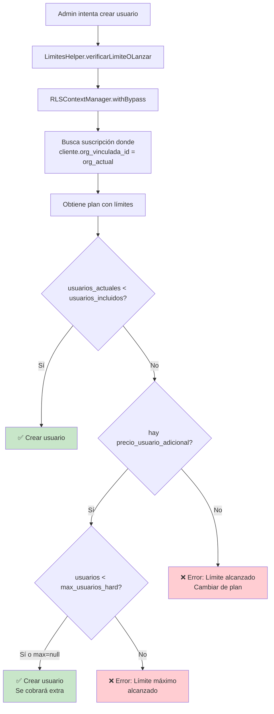
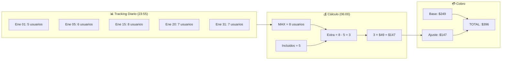
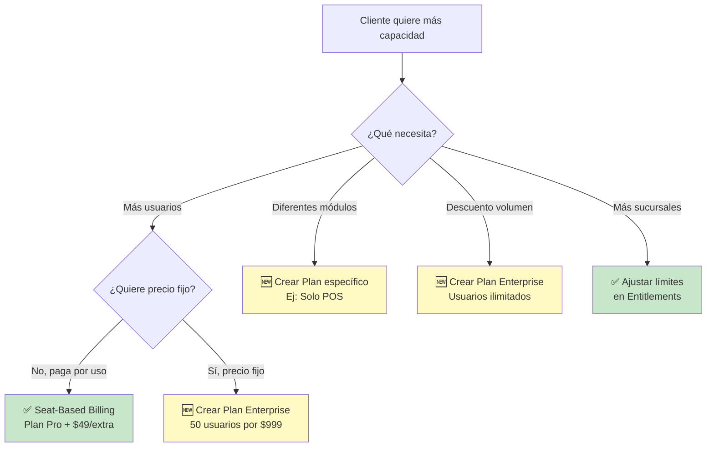
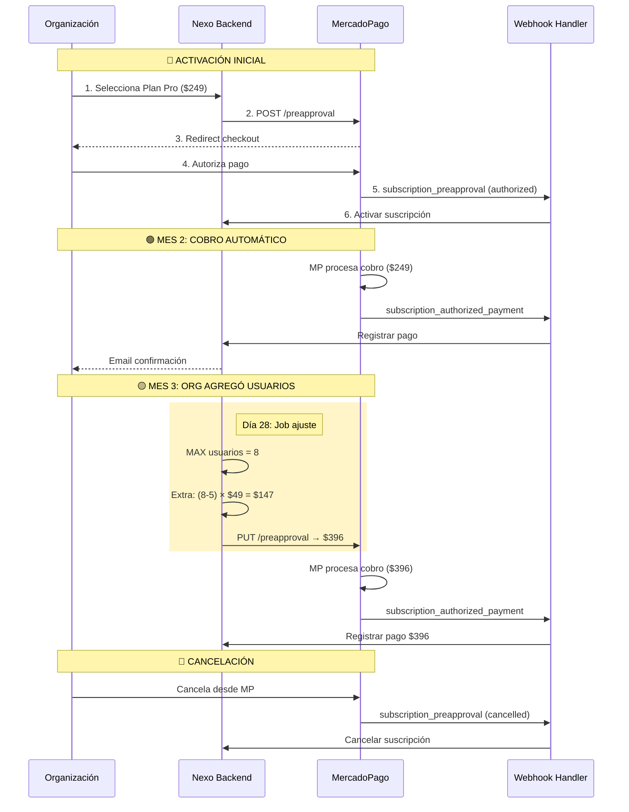
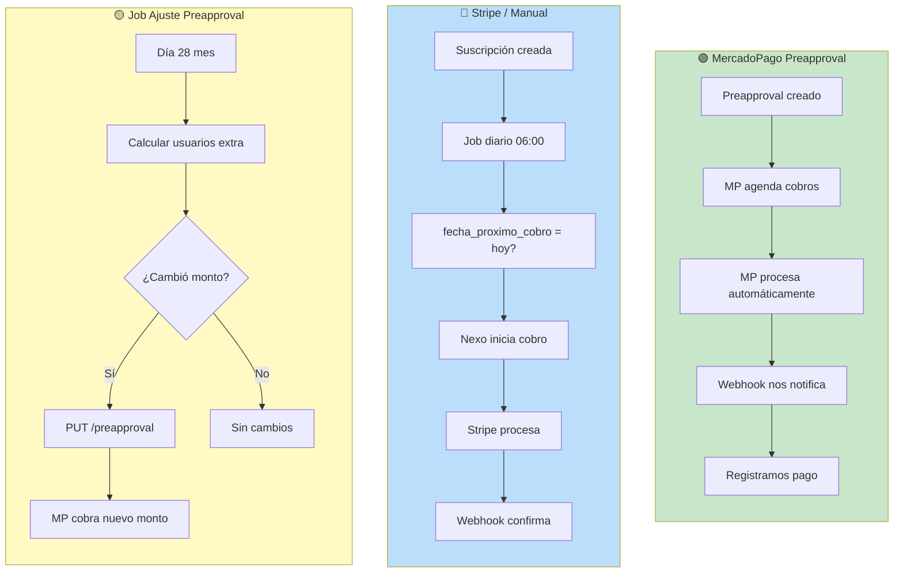

# Módulo Suscripciones Negocio

Sistema de facturación recurrente multi-propósito para Nexo ERP.

---

## Resumen Ejecutivo

| Aspecto | Valor |
|---------|-------|
| **Propósito** | Facturación recurrente con MercadoPago |
| **Modelo** | Dogfooding (Nexo lo usa + clientes lo usan) |
| **Estado** | Platform Billing ✅ | Customer Billing 🚧 | Seat-Based Billing ✅ |
| **Gateway** | MercadoPago (Preapproval API) |
| **Última revisión** | 31 Enero 2026 (precio_semestral agregado) |

---

## Arquitectura de Dogfooding

El módulo implementa **dos estrategias de facturación** en un mismo sistema:

```
┌─────────────────────────────────────────────────────────────────┐
│                    ARQUITECTURA DOGFOODING                      │
├─────────────────────────────────────────────────────────────────┤
│                                                                 │
│  ┌──────────────────┐         ┌──────────────────────────────┐ │
│  │  NEXO TEAM       │         │  CLIENTES DE NEXO            │ │
│  │  (org_id = 1)    │         │  (org_id = 2, 3, 4...)       │ │
│  │                  │         │                              │ │
│  │  • Planes Nexo   │ ──────► │  • Usan Nexo                 │ │
│  │  • Cobra a orgs  │         │  • Pagan suscripciones       │ │
│  │  • Define límites│         │  • Tienen límites aplicados  │ │
│  │  • Define features         │  • Tienen módulos activados  │ │
│  └──────────────────┘         └──────────────────────────────┘ │
│         │                                    │                  │
│         │ PLATFORM BILLING                   │ CUSTOMER BILLING │
│         │ (ACTIVO ✅)                        │ (PREPARADO 🚧)   │
│         ▼                                    ▼                  │
│  ┌──────────────────┐         ┌──────────────────────────────┐ │
│  │ Organizaciones   │         │  Clientes de las             │ │
│  │ vinculadas como  │         │  organizaciones              │ │
│  │ clientes de Nexo │         │  (tabla clientes, sin org)   │ │
│  │                  │         │                              │ │
│  │ clientes.org_    │         │  • NO son organizaciones     │ │
│  │ vinculada_id ≠ 0 │         │  • NO tienen módulos         │ │
│  └──────────────────┘         │  • NO aplican límites Nexo   │ │
│                               └──────────────────────────────┘ │
└─────────────────────────────────────────────────────────────────┘
```

### Comparativa de Estrategias

| Aspecto | Platform Billing | Customer Billing |
|---------|------------------|------------------|
| **Vendor** | Nexo Team (org 1) | La organización del usuario |
| **Comprador** | Organizaciones | Clientes del CRM |
| **Estrategia** | `PlatformBillingStrategy` | `CustomerBillingStrategy` |
| **Parámetro** | `es_venta_propia: false` | `es_venta_propia: true` |
| **Cliente** | `clientes.organizacion_vinculada_id ≠ NULL` | `clientes.organizacion_vinculada_id = NULL` |
| **Límites** | ✅ Se aplican (usuarios, sucursales) | ❌ No aplican |
| **Features → Módulos** | ✅ Se activan automáticamente | ❌ No se mapean |
| **Estado** | **ACTIVO** | **PREPARADO** |

---

## Diagrama Completo: Flujo de Suscripciones

```
┌─────────────────────────────────────────────────────────────────────────────────────┐
│                         CICLO DE VIDA DE UNA SUSCRIPCIÓN                            │
└─────────────────────────────────────────────────────────────────────────────────────┘

     SUPERADMIN                          NEXO TEAM (org_id=1)                    ORGANIZACIÓN (org 2, 3...)
    ┌──────────┐                        ┌────────────────────┐                   ┌────────────────────┐
    │          │                        │                    │                   │                    │
    │ Configura│  ─────────────────►    │  PLANES NEXO       │                   │                    │
    │ Entitle- │  1. Define planes      │                    │                   │                    │
    │ ments    │     con límites        │  ┌─────────────┐   │                   │                    │
    │          │     y módulos          │  │ Plan Trial  │   │                   │                    │
    │          │                        │  │ $0/mes      │   │                   │                    │
    └──────────┘                        │  │ 3 usuarios  │   │                   │                    │
         │                              │  │ max_hard: 3 │   │                   │                    │
         │                              │  └─────────────┘   │                   │                    │
         │                              │                    │                   │                    │
         │                              │  ┌─────────────┐   │                   │                    │
         ▼                              │  │ Plan Pro    │   │                   │                    │
    ┌──────────┐                        │  │ $249/mes    │   │                   │                    │
    │ /super-  │                        │  │ 5 usuarios  │   │                   │                    │
    │ admin/   │                        │  │ +$49/extra  │   │                   │                    │
    │ entitle- │                        │  │ max_hard: ∞ │   │                   │                    │
    │ ments    │                        │  └─────────────┘   │                   │                    │
    └──────────┘                        │                    │                   │                    │
                                        └─────────┬──────────┘                   └────────────────────┘
                                                  │
                                                  │ 2. Usuario se registra
                                                  ▼
┌─────────────────────────────────────────────────────────────────────────────────────────────────────┐
│  REGISTRO Y TRIAL AUTOMÁTICO                                                                        │
├─────────────────────────────────────────────────────────────────────────────────────────────────────┤
│                                                                                                     │
│   Usuario ──► POST /auth/registro ──► DogfoodingService.vincularOrganizacionComoCliente()          │
│                                                  │                                                  │
│                                                  ▼                                                  │
│                                        ┌─────────────────────┐                                      │
│                                        │ 1. Crea Cliente en  │                                      │
│                                        │    org 1 (Nexo)     │                                      │
│                                        │    con org_vincu-   │                                      │
│                                        │    lada_id = org_x  │                                      │
│                                        ├─────────────────────┤                                      │
│                                        │ 2. Crea Suscripción │                                      │
│                                        │    estado: 'trial'  │                                      │
│                                        │    plan: Trial      │                                      │
│                                        │    fin_trial: +14d  │                                      │
│                                        ├─────────────────────┤                                      │
│                                        │ 3. Activa módulos   │                                      │
│                                        │    base en la org   │                                      │
│                                        │    modulos_activos: │                                      │
│                                        │    { core: true }   │                                      │
│                                        └─────────────────────┘                                      │
│                                                                                                     │
└─────────────────────────────────────────────────────────────────────────────────────────────────────┘
                                                  │
                                                  │ 3. Usuario decide contratar
                                                  ▼
┌─────────────────────────────────────────────────────────────────────────────────────────────────────┐
│  CHECKOUT Y ACTIVACIÓN                                                                              │
├─────────────────────────────────────────────────────────────────────────────────────────────────────┤
│                                                                                                     │
│   Usuario ──► Selecciona Plan Pro ──► POST /checkout/iniciar                                        │
│                                                  │                                                  │
│                                        ┌────────▼────────┐                                          │
│                                        │ PlatformBilling │                                          │
│                                        │    Strategy     │                                          │
│                                        └────────┬────────┘                                          │
│                                                 │                                                   │
│                                        ┌────────▼────────┐                                          │
│                                        │  MercadoPago    │                                          │
│                                        │  Preapproval    │                                          │
│                                        │  API            │                                          │
│                                        └────────┬────────┘                                          │
│                                                 │                                                   │
│                                        ┌────────▼────────┐                                          │
│                                        │ Redirect a MP   │                                          │
│                                        │ para pago       │                                          │
│                                        └────────┬────────┘                                          │
│                                                 │                                                   │
│   Usuario completa pago en MercadoPago          │                                                   │
│                                                 ▼                                                   │
│                                        ┌─────────────────┐                                          │
│                                        │    WEBHOOK      │                                          │
│                                        │  authorized o   │                                          │
│                                        │  payment.created│                                          │
│                                        └────────┬────────┘                                          │
│                                                 │                                                   │
│                                        ┌────────▼─────────────────────┐                             │
│                                        │ actualizarOrgVinculadaAl-    │                             │
│                                        │ Activar()                    │                             │
│                                        │                              │                             │
│                                        │ 1. estado: 'activa'          │                             │
│                                        │ 2. Mapea features → módulos: │                             │
│                                        │    ['agendamiento', 'pos']   │                             │
│                                        │    →                         │                             │
│                                        │    { agendamiento: true,     │                             │
│                                        │      pos: true }             │                             │
│                                        └──────────────────────────────┘                             │
│                                                                                                     │
└─────────────────────────────────────────────────────────────────────────────────────────────────────┘
                                                  │
                                                  │ 4. Organización usa Nexo
                                                  ▼
┌─────────────────────────────────────────────────────────────────────────────────────────────────────┐
│  USO Y VERIFICACIÓN DE LÍMITES                                                                      │
├─────────────────────────────────────────────────────────────────────────────────────────────────────┤
│                                                                                                     │
│   Admin org ──► Crear Usuario ──► LimitesHelper.verificarLimiteOLanzar('usuarios')                 │
│                                                  │                                                  │
│                                        ┌────────▼────────────────────────────────┐                  │
│                                        │ RLSContextManager.withBypass()          │                  │
│                                        │                                         │                  │
│                                        │ Busca suscripción donde:                │                  │
│                                        │ cliente.organizacion_vinculada_id = X   │                  │
│                                        │                                         │                  │
│                                        │ Obtiene límites del plan:               │                  │
│                                        │ - usuarios_incluidos: 5                 │                  │
│                                        │ - precio_usuario_adicional: $49         │                  │
│                                        │ - max_usuarios_hard: NULL               │                  │
│                                        └────────┬────────────────────────────────┘                  │
│                                                 │                                                   │
│                                        ┌────────▼────────┐                                          │
│                                        │ ¿Excede límite? │                                          │
│                                        └────────┬────────┘                                          │
│                                                 │                                                   │
│                    ┌────────────────────────────┼────────────────────────────┐                      │
│                    ▼                            ▼                            ▼                      │
│           ┌───────────────┐          ┌───────────────────┐         ┌───────────────────┐            │
│           │ usuarios < 5  │          │ usuarios >= 5 y   │         │ usuarios >= max   │            │
│           │               │          │ hay precio_extra  │         │ (hard limit)      │            │
│           │ ✅ Permitido  │          │                   │         │                   │            │
│           │               │          │ ✅ Permitido      │         │ ❌ Bloqueado      │            │
│           │               │          │ Se cobra extra    │         │ Error 403         │            │
│           └───────────────┘          └───────────────────┘         └───────────────────┘            │
│                                                                                                     │
└─────────────────────────────────────────────────────────────────────────────────────────────────────┘
                                                  │
                                                  │ 5. Tracking y cobro mensual
                                                  ▼
┌─────────────────────────────────────────────────────────────────────────────────────────────────────┐
│  SEAT-BASED BILLING: COBRO POR USUARIOS ADICIONALES                                                 │
├─────────────────────────────────────────────────────────────────────────────────────────────────────┤
│                                                                                                     │
│   DIARIO (23:55)                               MENSUAL (06:00)                                      │
│   ┌──────────────────┐                         ┌─────────────────────────────────┐                  │
│   │ Job: registrar-  │                         │ Job: procesar-cobros            │                  │
│   │ uso-usuarios     │                         │                                 │                  │
│   │                  │                         │ 1. Obtener max_usuarios del     │                  │
│   │ INSERT INTO      │ ──────────────────────► │    período (de uso_usuarios)    │                  │
│   │ uso_usuarios_org │                         │                                 │                  │
│   │ (org_id, fecha,  │                         │ 2. Calcular:                    │                  │
│   │  usuarios_act)   │                         │    extras = max - incluidos     │                  │
│   └──────────────────┘                         │    ajuste = extras × $49        │                  │
│                                                │                                 │                  │
│   Ejemplo:                                     │ 3. total = $249 + ajuste        │                  │
│   ┌────────────────────┐                       │                                 │                  │
│   │ Fecha   │ Usuarios │                       │ 4. Cobrar vía MercadoPago       │                  │
│   │─────────┼──────────│                       └─────────────────────────────────┘                  │
│   │ Ene 01  │    5     │                                                                            │
│   │ Ene 05  │    6     │  ← Contrató 1 extra                                                        │
│   │ Ene 15  │    8     │  ← Contrató 2 más                                                          │
│   │ Ene 20  │    7     │  ← Desactivó 1                                                             │
│   │ Ene 31  │    7     │                                                                            │
│   └────────────────────┘                                                                            │
│                                                                                                     │
│   MAX del período = 8                                                                               │
│   Usuarios incluidos = 5                                                                            │
│   Usuarios extra = 8 - 5 = 3                                                                        │
│   Ajuste = 3 × $49 = $147                                                                           │
│   TOTAL FEBRERO = $249 + $147 = $396                                                                │
│                                                                                                     │
└─────────────────────────────────────────────────────────────────────────────────────────────────────┘
```

---

## Entitlements: Cómo Funcionan los Límites

### Configuración desde SuperAdmin

Los límites y features de cada plan se configuran desde `/superadmin/entitlements-plataforma` (solo SuperAdmin):

```
┌────────────────────────────────────────────────────────────────────────────────┐
│  Entitlements de Plataforma                                                     │
├────────────────────────────────────────────────────────────────────────────────┤
│ PLAN       │ MENSUAL  │ SEMESTRAL │ USUARIOS          │ MÓDULOS   │ ESTADO    │
│────────────┼──────────┼───────────┼───────────────────┼───────────┼───────────│
│ Plan Trial │ $0       │ -         │ 3 (máx 3)         │ 3 módulos │ Activo    │
│ Plan Pro   │ $249     │ $1,200    │ 5 (+$49.00/extra) │ 9 módulos │ Activo    │
└────────────────────────────────────────────────────────────────────────────────┘
```

### Tipos de Configuración de Usuarios

| Configuración | Ejemplo | Comportamiento |
|---------------|---------|----------------|
| **Hard Limit** | `usuarios_incluidos: 3, max_usuarios_hard: 3` | No puede agregar más de 3. Error 403. |
| **Soft Limit** | `usuarios_incluidos: 5, precio_usuario_adicional: $49` | Puede agregar ilimitados, cobra $49/extra |
| **Ilimitado** | `usuarios_incluidos: 100, max_usuarios_hard: null, precio_extra: null` | Todos incluidos sin cargo extra |

### Ejemplo: Plan Trial vs Plan Pro

```
┌─────────────────────────────────────────────────────────────────┐
│  PLAN TRIAL                                                     │
├─────────────────────────────────────────────────────────────────┤
│  usuarios_incluidos: 3                                          │
│  max_usuarios_hard: 3                                           │
│  precio_usuario_adicional: NULL                                 │
│                                                                 │
│  Resultado:                                                     │
│  - Organización puede tener MÁXIMO 3 usuarios                   │
│  - Al intentar crear el 4to: ❌ Error "Límite alcanzado"        │
│  - Solución: Cambiar a Plan Pro                                 │
└─────────────────────────────────────────────────────────────────┘

┌─────────────────────────────────────────────────────────────────┐
│  PLAN PRO                                                       │
├─────────────────────────────────────────────────────────────────┤
│  usuarios_incluidos: 5                                          │
│  max_usuarios_hard: NULL (ilimitado)                            │
│  precio_usuario_adicional: $49                                  │
│                                                                 │
│  Resultado:                                                     │
│  - Organización puede agregar ILIMITADOS usuarios               │
│  - Primeros 5 incluidos en $249                                 │
│  - Del 6 en adelante: +$49/usuario al mes                       │
│  - NO necesita cambiar de plan para crecer                      │
└─────────────────────────────────────────────────────────────────┘
```

### ¿Cuándo Crear un Plan Nuevo vs Usar Seat-Based?

| Escenario | Solución | Ejemplo |
|-----------|----------|---------|
| Cliente quiere más usuarios | **Seat-Based** (automático) | Pro: 5 incluidos + $49/extra |
| Cliente quiere precio fijo con muchos usuarios | **Nuevo Plan** | Enterprise: 50 usuarios por $999 |
| Cliente quiere diferentes módulos | **Nuevo Plan** | Plan "Solo POS" sin agendamiento |
| Cliente quiere descuento por volumen | **Nuevo Plan** | Enterprise: usuarios ilimitados |

---

## Separación: Billing vs Entitlements

### Conceptos Clave

| Concepto | Descripción | Quién lo controla |
|----------|-------------|-------------------|
| **Billing** | Cobrar dinero recurrentemente | Módulo de suscripciones |
| **Entitlements** | Qué puede hacer el cliente con lo que compró | SuperAdmin vía `/superadmin/entitlements-plataforma` |

### Aplicación en Nexo

```
┌─────────────────────────────────────────────────────────────────┐
│  NEXO (Platform Billing)                                        │
│  ├── Billing: Cobra $249/mes a organizaciones                   │
│  └── Entitlements: Nexo CONTROLA límites y módulos              │
│       └── LimitesHelper.js verifica usuarios, sucursales        │
│       └── FEATURE_TO_MODULO activa módulos                      │
│                                                                 │
│  ──────────────────────────────────────────────────────────     │
│                                                                 │
│  GIMNASIO (Customer Billing - usando módulo de Nexo)            │
│  ├── Billing: Cobra $500/mes membresías ← Nexo hace esto        │
│  └── Entitlements: ¿Acceso a piscina? ← Nexo NO hace esto       │
│       └── El gimnasio lo gestiona manualmente                   │
└─────────────────────────────────────────────────────────────────┘
```

### Campos en planes_suscripcion_org

```sql
planes_suscripcion_org:
  -- BILLING (todos los planes)
  codigo, nombre, descripcion
  precio_mensual, precio_trimestral, precio_semestral, precio_anual  -- Multi-periodo completo
  moneda, dias_trial

  -- ENTITLEMENTS (solo planes de Nexo, org_id = 1)
  limites: { usuarios: 5, sucursales: 3 }  -- Verificados por LimitesHelper
  features: ['agendamiento', 'inventario'] -- Mapeados a modulos_activos
  usuarios_incluidos: 5
  precio_usuario_adicional: 49.00
  max_usuarios_hard: NULL
```

### Precios Multi-Periodo

| Período | Campo BD | Cálculo si NULL |
|---------|----------|-----------------|
| Mensual | `precio_mensual` | Requerido (default 0) |
| Trimestral | `precio_trimestral` | `precio_mensual × 3` |
| **Semestral** | `precio_semestral` | `precio_mensual × 6` |
| Anual | `precio_anual` | `precio_mensual × 12` |

El checkout (`checkout.controller.js`) usa el precio configurado si existe, o calcula automáticamente basándose en el precio mensual.

**Nota**: Para Customer Billing, los campos de entitlements se **ignoran** o se usan como texto descriptivo en UI.

---

## Estados de Suscripción

```
                    ┌──────────┐
                    │  trial   │  Período de prueba
                    └────┬─────┘
                         │
                    ┌────▼─────────┐
                    │pendiente_pago│  Checkout iniciado
                    └────┬─────────┘
                         │
                    ┌────▼────────┐
              ┌─────│   activa    │─────┐
              │     └─────────────┘     │
              ▼                         ▼
         ┌────────┐              ┌─────────────┐
         │pausada │              │grace_period │  7 días solo lectura
         └────┬───┘              └──────┬──────┘
              │                         │
              ▼                         ▼
         ┌────────┐              ┌───────────┐
         │cancelada│             │ suspendida│  Bloqueado
         └────────┘              └───────────┘
```

### Niveles de Acceso

| Estado | Acceso | UX |
|--------|--------|-----|
| `trial`, `activa`, `pendiente_pago` | ✅ Completo | Normal |
| `grace_period`, `vencida` | ⚠️ Solo lectura | Banner urgente |
| `pausada`, `suspendida`, `cancelada` | ❌ Bloqueado | Redirect `/planes` |

### Bypasses

- `organizacion_id === 1` (Nexo Team)
- `nivel_jerarquia >= 100` (SuperAdmin)
- Rutas: `/auth/*`, `/planes/*`, `/checkout/*`, `/webhooks`

---

## Flujo Platform Billing (Nexo → Organizaciones)

### 1. Registro de Organización

```javascript
// Al crear organización, automáticamente:
DogfoodingService.vincularOrganizacionComoCliente(org)
  ├─ Crear cliente en Nexo Team (org_id=1)
  │   └─ organizacion_vinculada_id = org.id
  ├─ Crear suscripción Trial
  │   └─ estado: 'trial', es_trial: true
  └─ Activar módulos base
      └─ org.modulos_activos = { core: true }
```

### 2. Checkout y Activación

```
Usuario (org 2) ──► Selecciona plan Pro
                          │
                    POST /checkout/iniciar
                          │
                    ┌─────▼─────┐
                    │ Strategy: │
                    │ Platform  │
                    │ Billing   │
                    └─────┬─────┘
                          │
            vendorId = NEXO_TEAM_ORG_ID (1)
            clienteId = cliente vinculado a org 2
                          │
                    ┌─────▼─────┐
                    │MercadoPago│
                    │Preapproval│
                    └─────┬─────┘
                          │
                    Redirect a MP
                          │
                    Pago completado
                          │
                    Webhook ──► actualizarOrgVinculadaAlActivar()
                          │
                    ┌─────▼─────────────────┐
                    │ Mapear features →     │
                    │ modulos_activos       │
                    │                       │
                    │ ['agendamiento'] →    │
                    │ { agendamiento: true }│
                    └───────────────────────┘
```

### 3. Verificación de Límites

```javascript
// Antes de crear usuario en org 2
LimitesHelper.verificarLimiteOLanzar(orgId=2, 'usuarios', 1)
  │
  ├─ Buscar suscripción de la org
  │   └─ ¡PROBLEMA! La suscripción está en org 1 (Nexo)
  │
  └─ SOLUCIÓN: RLSContextManager.withBypass()
      └─ Busca: suscripciones_org.cliente.organizacion_vinculada_id = 2
      └─ Obtiene límites del plan
      └─ Verifica contra uso actual
```

---

## Seat-Based Billing Detallado

### Tracking Diario (23:55)

```javascript
// Job: registrar-uso-usuarios.job.js
// Guarda snapshot diario de usuarios activos por org
INSERT INTO uso_usuarios_org (organizacion_id, fecha, usuarios_activos)
SELECT organizacion_id, CURRENT_DATE, COUNT(*)
FROM usuarios WHERE activo = true
GROUP BY organizacion_id;
```

### Tipos de Límites

| Tipo | Comportamiento | Ejemplo |
|------|----------------|---------|
| **Hard Limit** | Bloquea creación | Trial: máx 3 usuarios |
| **Soft Limit** | Permite con cargo | Pro: $49/usuario extra |

### Cálculo de Cobro Mensual

```
usuarios_max_periodo = MAX(usuarios_activos) durante el período
usuarios_extra = usuarios_max_periodo - usuarios_incluidos
ajuste = usuarios_extra × precio_usuario_extra
total = precio_base + ajuste

Ejemplo con Plan Pro:
- Máximo usuarios en enero: 8
- Incluidos: 5
- Extra: 8 - 5 = 3
- Precio base: $249
- Ajuste: 3 × $49 = $147
- TOTAL: $249 + $147 = $396
```

---

## Proceso de Cobro MercadoPago (Análisis Detallado)

### Cómo Funciona MercadoPago Preapproval

Con la API de Preapproval, **MercadoPago procesa los cobros automáticamente**. Nosotros solo recibimos webhooks notificándonos de cada evento.

```
┌─────────────────────────────────────────────────────────────────────────────┐
│                     CICLO DE VIDA PREAPPROVAL                               │
├─────────────────────────────────────────────────────────────────────────────┤
│                                                                             │
│  1. CREACIÓN (Nosotros)                                                     │
│     └─> Nexo crea preapproval con: monto, frecuencia, auto_recurring: true  │
│                                                                             │
│  2. AUTORIZACIÓN (Usuario)                                                  │
│     └─> Usuario autoriza en checkout de MP                                  │
│     └─> MP envía webhook: subscription_preapproval (status: authorized)     │
│                                                                             │
│  3. COBROS AUTOMÁTICOS (MercadoPago)                                        │
│     └─> MP ejecuta cobro según frecuencia configurada                       │
│     └─> MP envía webhook: subscription_authorized_payment                   │
│     └─> Se repite cada mes/período AUTOMÁTICAMENTE                          │
│                                                                             │
│  4. CANCELACIÓN/PAUSA                                                       │
│     └─> Usuario o negocio cancela                                           │
│     └─> MP envía webhook: subscription_preapproval (status: cancelled)      │
│                                                                             │
└─────────────────────────────────────────────────────────────────────────────┘
```

### Webhooks que Procesamos

| Webhook | Trigger | Acción en Nexo |
|---------|---------|----------------|
| `subscription_preapproval` (authorized) | Usuario autoriza suscripción | Activar suscripción, mapear módulos |
| `subscription_preapproval` (cancelled) | Usuario/negocio cancela | Cancelar suscripción |
| `subscription_preapproval` (paused) | Usuario pausa | Pausar suscripción |
| `subscription_authorized_payment` | MP procesa cobro recurrente | Registrar pago, actualizar fecha_proximo_cobro |

### Rol del Job `procesar-cobros.job.js`

**IMPORTANTE**: Este job está diseñado para escenarios donde **nosotros iniciamos el cobro**, no MercadoPago:

| Gateway | ¿Usa el job? | Razón |
|---------|--------------|-------|
| MercadoPago Preapproval | ❌ **NO** | MP cobra automáticamente |
| Stripe (off_session) | ✅ **SÍ** | Debemos crear PaymentIntent |
| Manual | ✅ **SÍ** | Envía recordatorio de pago |

### Seat-Based Billing con MercadoPago Preapproval

El preapproval tiene un `transaction_amount` fijo. Para cobrar usuarios adicionales:

```
┌─────────────────────────────────────────────────────────────────────────────┐
│                  AJUSTE DINÁMICO DE MONTO EN PREAPPROVAL                    │
├─────────────────────────────────────────────────────────────────────────────┤
│                                                                             │
│  MES 1: Plan Pro con 5 usuarios incluidos                                   │
│  └─> Preapproval creado con $249/mes                                        │
│  └─> MP cobra $249 automáticamente ✅                                       │
│                                                                             │
│  MES 2: Org tiene 8 usuarios (3 extra × $49 = $147)                        │
│                                                                             │
│  ESTRATEGIA: Actualizar preapproval ANTES del cobro                        │
│  ├─> 1. Job detecta 3 usuarios extra (día 28-30)                           │
│  ├─> 2. PUT /preapproval/{id} → transaction_amount = $396                  │
│  └─> 3. (Opcional) Cobro adicional prorateado del mes actual               │
│                                                                             │
│  MES 3: MP cobra $396 automáticamente ✅                                    │
│  (Ya incluye los 3 usuarios extra)                                          │
│                                                                             │
│  MES 4: Org reduce a 6 usuarios (1 extra × $49 = $49)                      │
│  ├─> Job detecta cambio                                                     │
│  └─> PUT /preapproval/{id} → transaction_amount = $298                      │
│                                                                             │
│  MES 5: MP cobra $298 automáticamente ✅                                    │
│                                                                             │
└─────────────────────────────────────────────────────────────────────────────┘
```

### Estrategia Recomendada para Seat-Based

| Paso | Timing | Acción |
|------|--------|--------|
| 1 | Diario (23:55) | Job `registrar-uso-usuarios` guarda snapshot |
| 2 | Antes del cobro (~día 28) | Job calcula MAX usuarios del período |
| 3 | Antes del cobro | Si hay diferencia, **actualiza preapproval** con nuevo monto |
| 4 | Día de cobro | MercadoPago cobra el monto actualizado automáticamente |
| 5 | (Opcional) | Cobro adicional si el cambio fue a mitad del mes |

**Respuesta clave**: Si actualizamos el preapproval **ANTES** de que MercadoPago procese el siguiente cobro, el cobro ya vendrá con el monto ajustado.

### Diagrama: Flujo de Cobro Recurrente



### Job de Ajuste de Preapproval (✅ Implementado)

```javascript
// backend/app/modules/suscripciones-negocio/jobs/ajustar-preapproval.job.js
// Se ejecuta: Día 28 de cada mes a las 20:00 (antes del cobro de MP)

class AjustarPreapprovalJob {
    static async ejecutar() {
        // 1. Obtener suscripciones MP activas con precio_usuario_adicional
        const suscripciones = await this._obtenerSuscripcionesParaAjustar();

        for (const suscripcion of suscripciones) {
            // 2. Calcular usuarios extra usando usuarios_max_periodo
            const usuariosExtra = Math.max(0, usuariosMax - usuariosIncluidos);
            const nuevoMonto = precioMensual + (usuariosExtra * precioUsuarioExtra);

            // 3. Si el monto cambió, actualizar preapproval en MP
            if (Math.abs(montoActualMP - nuevoMonto) >= 0.01) {
                await mpService.actualizarMontoPreapproval(preapprovalId, nuevoMonto, moneda);

                // 4. Registrar ajuste en ajustes_facturacion_org
                await UsageTrackingService.registrarAjusteUsuarios({...});
            }
        }
    }
}
```

### Resumen del Proceso de Cobro

| Pregunta | Respuesta |
|----------|-----------|
| ¿MP procesa cobros automáticamente? | ✅ Sí, con preapproval `status: authorized` |
| ¿Qué webhook recibimos al cobrar? | `subscription_authorized_payment` |
| ¿Necesitamos el job diario para MP? | ❌ No para el cobro, ✅ Sí para ajustar monto |
| ¿El monto se ajusta automáticamente? | ❌ No, debemos actualizar preapproval antes del cobro |
| ¿El siguiente mes cobra ajustado? | ✅ Sí, si actualizamos el preapproval a tiempo |

---

## Sistema de Facturación por Usuarios (Seat-Based Billing) ✅

El sistema permite cobrar automáticamente por usuarios adicionales que excedan los incluidos en el plan.

### Flujo Automático Completo

```
┌─────────────────────────────────────────────────────────────────────────────────────┐
│                    SEAT-BASED BILLING - FLUJO COMPLETO                              │
├─────────────────────────────────────────────────────────────────────────────────────┤
│                                                                                     │
│  1. TRACKING DIARIO (Cron 23:55)                                                   │
│     └─> RegistrarUsoUsuariosJob                                                    │
│         • Cuenta usuarios activos por organización                                  │
│         • Actualiza suscripciones_org.usuarios_max_periodo si hay nuevo máximo     │
│                                                                                     │
│  2. AJUSTE DE PREAPPROVAL (Cron día 28, 20:00)                                     │
│     └─> AjustarPreapprovalJob                                                      │
│         • Calcula: usuariosExtra = usuarios_max_periodo - usuarios_incluidos        │
│         • Calcula: nuevoMonto = precio_mensual + (usuariosExtra × precio_adicional) │
│         • Actualiza transaction_amount en MercadoPago via API                       │
│         • Registra ajuste en ajustes_facturacion_org                               │
│                                                                                     │
│  3. COBRO AUTOMÁTICO (Próximo ciclo de MP)                                         │
│     └─> MercadoPago cobra el monto ajustado automáticamente                        │
│     └─> Webhook notifica y registramos el pago                                     │
│                                                                                     │
└─────────────────────────────────────────────────────────────────────────────────────┘
```

### Campos Relevantes en Base de Datos

| Tabla | Campo | Descripción |
|-------|-------|-------------|
| `suscripciones_org` | `usuarios_max_periodo` | Máximo de usuarios activos durante el período actual |
| `planes_suscripcion_org` | `usuarios_incluidos` | Usuarios sin costo adicional en el plan |
| `planes_suscripcion_org` | `precio_usuario_adicional` | Precio por cada usuario que exceda el límite |
| `ajustes_facturacion_org` | - | Historial de ajustes por usuarios adicionales |

### Jobs Relacionados

| Job | Archivo | Horario | Función |
|-----|---------|---------|---------|
| Registrar uso usuarios | `registrar-uso-usuarios.job.js` | 23:55 diario | Trackea usuarios activos y actualiza `usuarios_max_periodo` |
| Ajustar preapproval | `ajustar-preapproval.job.js` | Día 28, 20:00 | Actualiza `transaction_amount` en MP antes del cobro |

### Decisión de Diseño: No Cobro Inmediato

El sistema actual **no realiza cobros adicionales inmediatos** cuando se agregan usuarios a mitad de mes. En su lugar:

1. **Tracking continuo**: Se registra el máximo de usuarios durante el período
2. **Ajuste mensual**: El día 28 se actualiza el preapproval con el monto total
3. **Cobro integrado**: MercadoPago cobra el monto ajustado en el próximo ciclo

**Razón**: Simplifica la facturación y evita múltiples cobros pequeños que pueden generar fricción con el usuario.

---

## Integración MercadoPago

### Arquitectura de Cuentas de Prueba

```
CUENTA REAL (principal)
  └── Panel Developers → Test Users
          │
          ├──► CUENTA VENDEDOR (Test User)
          │    • Recibe pagos
          │    • Access Token: APP_USR-xxx
          │
          └──► CUENTA COMPRADOR (Test User)
               • Realiza pagos
               • Email: test_user_xxx@testuser.com
```

### Configuración del Conector

| Campo | Sandbox | Production |
|-------|---------|------------|
| `entorno` | `sandbox` | `production` |
| `access_token` | De cuenta vendedor prueba | De cuenta real |
| `test_payer_email` | **Requerido** | No se usa |
| `webhook_secret` | Secret del webhook | Secret del webhook |

### Tarjetas de Prueba

| Tarjeta | Número | CVV | Vencimiento |
|---------|--------|-----|-------------|
| Mastercard | 5474 9254 3267 0366 | 123 | 11/27 |
| Visa | 4509 9535 6623 3704 | 123 | 11/27 |
| Amex | 3711 803032 57522 | 1234 | 11/27 |

---

## Jobs Programados

| Hora | Job | Función |
|------|-----|---------|
| 06:00 | `procesar-cobros` | Cobros automáticos |
| 07:00 | `verificar-trials` | Expira trials vencidos |
| 08:00 | `procesar-dunning` | Grace period → Suspensión |
| 20:00 día 28 | `ajustar-preapproval` | Actualiza monto MP para usuarios extra |
| 23:55 | `registrar-uso-usuarios` | Snapshot usuarios activos |
| */5min | `polling-suscripciones` | Fallback si webhooks fallan |
| */hora :30 | `monitorear-webhooks` | Alertas de webhooks fallidos |

---

## Endpoints Principales

```bash
# Suscripciones
GET    /suscripciones/mi-suscripcion              # Ver plan actual
GET    /suscripciones/mi-suscripcion/calcular-prorrateo?nuevo_plan_id=X
POST   /suscripciones/mi-plan/cambiar             # Cambiar plan
PATCH  /suscripciones/:id/pausar
POST   /suscripciones/:id/cancelar

# Checkout
POST   /checkout/iniciar                           # Platform Billing
POST   /checkout/publico/crear-suscripcion         # Checkout sin auth
GET    /checkout/link/:token

# Uso (Seat-based)
GET    /uso/resumen
GET    /uso/proyeccion
GET    /uso/verificar-limite

# Entitlements (SuperAdmin)
GET    /entitlements/planes                        # Lista planes Nexo con entitlements
PUT    /entitlements/planes/:id                    # Actualiza entitlements de un plan

# Métricas
GET    /metricas/dashboard
GET    /metricas/mrr
GET    /metricas/churn
```

---

## Tablas Principales

| Tabla | Propósito | Multi-tenant |
|-------|-----------|--------------|
| `planes_suscripcion_org` | Catálogo de planes (precios mensual/trimestral/semestral/anual) | ✅ Por org |
| `suscripciones_org` | Suscripciones activas | ✅ Por org |
| `pagos_suscripcion` | Historial de pagos | ✅ Por org |
| `uso_usuarios_org` | Tracking diario | ✅ Por org |
| `conectores_pago_org` | Gateways de pago | ✅ Por org |
| `cupones_suscripcion` | Códigos de descuento | ✅ Por org |
| `webhooks_suscripcion` | Log de webhooks | ✅ Por org |
| `ajustes_facturacion_org` | Log de ajustes seat-based | ✅ Por org |

---

## Archivos Clave

```
backend/app/modules/suscripciones-negocio/
├── strategies/
│   ├── BillingStrategy.js           # Interfaz base
│   ├── PlatformBillingStrategy.js   # Nexo → Orgs (ACTIVO)
│   └── CustomerBillingStrategy.js   # Org → Clientes (PREPARADO)
├── controllers/
│   ├── checkout.controller.js       # Flujo de pago
│   ├── suscripciones.controller.js  # CRUD suscripciones
│   ├── entitlements.controller.js   # ✅ NUEVO - Gestión entitlements
│   └── webhooks.controller.js       # Procesamiento webhooks
├── routes/
│   ├── entitlements.routes.js       # ✅ NUEVO - Rutas SuperAdmin
│   └── ...
├── schemas/
│   ├── entitlements.schemas.js      # ✅ NUEVO - Validación Joi
│   └── ...
├── models/
│   ├── suscripciones.model.js       # Lógica de negocio
│   └── planes.model.js              # Gestión de planes
├── services/
│   ├── mercadopago.service.js       # Wrapper MP multi-tenant
│   ├── usage-tracking.service.js    # Seat-based billing
│   └── cobro.service.js             # Procesamiento de cobros
└── jobs/
    ├── procesar-cobros.job.js       # 06:00 diario
    ├── verificar-trials.job.js      # 07:00 diario
    ├── ajustar-preapproval.job.js   # ✅ Día 28, 20:00 - Seat-based billing
    ├── registrar-uso-usuarios.job.js # 23:55 diario
    └── polling-suscripciones.job.js # Cada 5 min

backend/app/
├── utils/helpers/LimitesHelper.js   # Verificación de límites
├── config/constants.js              # FEATURE_TO_MODULO, estados
├── services/dogfoodingService.js    # Vinculación org → cliente
└── middleware/suscripcionActiva.js  # Guard de acceso

frontend/src/
├── pages/superadmin/
│   └── EntitlementsPlataforma.jsx   # ✅ NUEVO - Página principal
├── components/superadmin/
│   └── EntitlementsFormDrawer.jsx   # ✅ NUEVO - Drawer edición
└── hooks/superadmin/
    └── useEntitlements.js           # ✅ NUEVO - React Query hooks
```

---

## Mejoras Implementadas

### Soporte Precio Semestral (31 Enero 2026)

Se agregó soporte completo para `precio_semestral` en todo el stack:

| Capa | Cambio |
|------|--------|
| **BD** | Columna `precio_semestral NUMERIC(10,2)` + constraint |
| **Modelo** | SELECT, INSERT, UPDATE incluyen el campo |
| **Schema Joi** | Validación en `crearPlan` y `actualizarPlan` |
| **Checkout** | Usa precio configurado o calcula `precio_mensual × 6` |
| **Frontend** | Campo ya existía, ahora persiste correctamente |

**Estado actual Plan Pro**: $249/mes, **$1,200/semestral** (configurado manualmente)

### Pantalla Entitlements de Plataforma (31 Enero 2026)

```
Ruta:   /superadmin/entitlements-plataforma
Acceso: nivel >= 100 (SuperAdmin)

Funcionalidades:
- Lista planes de Nexo Team con sus entitlements
- Edita límites de usuarios (incluidos, extras, hard limit)
- Edita límites de recursos (citas, profesionales, sucursales, etc.)
- Activa/desactiva módulos por plan

Beneficios:
1. Formulario de planes limpio (Customer Billing no ve campos de entitlements)
2. Control centralizado para SuperAdmin
3. Escalable: agregar límites no afecta otros formularios
```

### Circuit Breaker para MercadoPago

```javascript
// backend/app/utils/circuitBreaker.js
// Protege contra fallos en cascada
Estados: CLOSED → OPEN → HALF_OPEN → CLOSED
maxFailures: 5 errores consecutivos
resetTimeout: 60 segundos
```

### Retry con Backoff Exponencial

```javascript
// backend/app/utils/retryWithBackoff.js
maxRetries: 3
baseDelay: 2000ms
maxDelay: 30000ms
factor: 2 (exponencial)
```

### Prorrateo de Cambio de Plan

```
factor = días_restantes / días_período
crédito = precio_actual × factor
cargo = precio_nuevo × factor
diferencia = cargo - crédito

diferencia > 0 → cobrar inmediato (upgrade)
diferencia < 0 → acumular crédito (downgrade)
```

---

## Flujo Customer Billing (Preparado, No Activo)

### Caso de Uso: Gimnasio vende membresías

```
Gimnasio (org 5) ──► Crea planes propios
                          │
                    planes_suscripcion_org (org_id=5)
                    ├─ "Premium": $500/mes
                    ├─ "VIP": $1000/mes
                    └─ limites: ???  ← No aplican (Customer Billing)
                          │
                    ──────────────────────────
                          │
Cliente del gimnasio ──► POST /checkout/iniciar
                          │  es_venta_propia: true
                          │  cliente_id: 100
                          │
                    ┌─────▼─────┐
                    │ Strategy: │
                    │ Customer  │
                    │ Billing   │
                    └─────┬─────┘
                          │
            vendorId = 5 (el gimnasio)
            clienteId = 100 (cliente del gimnasio)
                          │
                    ┌─────▼─────┐
                    │MercadoPago│
                    │ (conector │
                    │ del gym)  │
                    └─────┬─────┘
                          │
                    Pago completado
                          │
                    ¿Qué pasa con features/limites?
                    └─► NADA (no hay código para esto)
```

### Lo que Falta para Customer Billing

1. **Schema de límites de servicio**
2. **UI para definir beneficios** (no módulos)
3. **Verificación de límites del negocio** (ej: visitas/mes)
4. **Acceso del cliente** a beneficios (portal de cliente)

---

## Pendientes

### Alta Prioridad

| Feature | Estado | Descripción |
|---------|--------|-------------|
| ~~Pantalla Entitlements SuperAdmin~~ | **✅ COMPLETADO** | UI para gestionar límites/features |
| ~~Job ajustar-preapproval~~ | **✅ COMPLETADO** | Actualizar monto en MP antes del cobro para seat-based billing |
| Pruebas E2E desde frontend | **PENDIENTE** | Validar flujos completos en navegador |

### Media Prioridad

| Feature | Estado | Descripción |
|---------|--------|-------------|
| Customer Billing activo | Arquitectura lista | Endpoint público para orgs que venden |
| Notificaciones email | Por implementar | Recibos, alertas de vencimiento |
| Stripe como gateway | Service preparado | Alternativa a MercadoPago |
| Cobro adicional prorateado | Por implementar | Cobrar diferencia cuando agregan usuarios a mitad de mes |

### Baja Prioridad

| Feature | Descripción |
|---------|-------------|
| Separar tabla entitlements | Mover `limites`/`features` a tabla dedicada |
| Portal de cliente | UI para clientes de Customer Billing |
| Webhooks salientes | Notificar a orgs sobre eventos de suscripción |

---

## Diagramas Mermaid

### Ciclo de Vida de una Suscripción



### Estados de Suscripción



### Arquitectura Dogfooding



### Flujo de Verificación de Límites



### Seat-Based Billing: Cálculo Mensual



### Cuándo Crear Plan Nuevo vs Seat-Based



### Flujo de Cobro MercadoPago (Preapproval)



### Comparativa: Quién Procesa el Cobro



---

## Credenciales de Prueba

```
# Cuenta Comprador MercadoPago (Sandbox)
Email: test_user_2716725750605322996@testuser.com
Password: UCgyF4L44D

# Usuario Admin Org 2
Email: arellanestorillo@gmail.com
Password: Enrique23

# SuperAdmin
Email: arellanestorillo@yahoo.com
Password: Enrique23
```

---

**Estado**: Platform Billing ✅ Funcional | Customer Billing 🚧 Preparado | Entitlements UI ✅ Implementado | Seat-Based Billing ✅ Funcional | Multi-Periodo (mensual/trim/semestral/anual) ✅
