# Módulo Suscripciones Negocio - Nexo ERP

Sistema de facturación recurrente con MercadoPago. Soporta Platform Billing (Nexo → Orgs) y Customer Billing (Org → Clientes).

---

## Arquitectura

```mermaid
flowchart TB
    subgraph FRONTEND["🖥️ FRONTEND"]
        MP[MiPlanPage]
        SP[SuscripcionesListPage]
        PP[PlanesPage]
        CP[CuponesPage]
        ME[MetricasPage]
    end

    subgraph BACKEND["⚙️ BACKEND"]
        subgraph ROUTES["Routes (70+ endpoints)"]
            R1[/planes]
            R2[/suscripciones]
            R3[/pagos]
            R4[/cupones]
            R5[/metricas]
            R6[/uso]
            R7[/webhooks]
            R8[/checkout]
        end

        subgraph SERVICES["Services"]
            S1[MercadoPagoService]
            S2[CobroService]
            S3[UsageTrackingService]
            S4[ProrrateoService]
            S5[NotificacionesService]
        end

        subgraph JOBS["Cron Jobs"]
            J1[06:00 Cobros]
            J2[07:00 Trials]
            J3[08:00 Dunning]
            J4[23:55 Uso usuarios]
            J5[*/5min Polling MP]
        end
    end

    subgraph GATEWAY["💳 GATEWAY"]
        MP_API[MercadoPago API]
        WH[Webhooks]
    end

    subgraph DB["💾 DATABASE"]
        T1[(planes_suscripcion_org)]
        T2[(suscripciones_org)]
        T3[(pagos_suscripcion)]
        T4[(cupones_org)]
        T5[(uso_usuarios_org)]
        T6[(ajustes_facturacion_org)]
    end

    FRONTEND --> ROUTES
    ROUTES --> SERVICES
    SERVICES --> DB
    SERVICES <--> MP_API
    WH --> R7
    JOBS --> SERVICES
```

---

## Estados de Suscripción


### Acceso por Estado

| Estado | Acceso | UX |
|--------|--------|-----|
| `trial`, `activa`, `pendiente_pago` | ✅ Completo | Normal |
| `grace_period` | ⚠️ Solo lectura | Banner urgente |
| `pausada`, `suspendida`, `cancelada` | ❌ Bloqueado | Redirect `/planes` |

---

## Seat-Based Billing

Facturación por cantidad de usuarios activos.

```mermaid
flowchart LR
    subgraph TRACKING["📊 TRACKING DIARIO"]
        JOB[Job 23:55] --> COUNT[Contar usuarios activos]
        COUNT --> SAVE[(uso_usuarios_org)]
        COUNT --> MAX[Actualizar usuarios_max_periodo]
    end

    subgraph COBRO["💰 COBRO MENSUAL"]
        C1[Obtener usuarios_max_periodo]
        C2[Comparar vs usuarios_incluidos]
        C3{¿Excede?}
        C4[Calcular ajuste]
        C5[Cobrar base + ajuste]

        C1 --> C2 --> C3
        C3 -->|Sí| C4 --> C5
        C3 -->|No| C5
    end

    subgraph UI["🖥️ UI"]
        IND[UsageIndicator]
        IND --> |Verde| N[<80%]
        IND --> |Amarillo| W[80-100%]
        IND --> |Rojo| E[>100%]
    end

    TRACKING --> COBRO
```



### Configuración por Plan

| Plan | Usuarios Incluidos | Precio Extra | Límite |
|------|-------------------|--------------|--------|
| Trial | 3 | N/A | Hard (bloquea) |
| Pro | 5 | $49/mes | Soft (cobra) |

---

## Flujo de Cobro


---

## Flujo de Checkout (Platform Billing)

```mermaid
sequenceDiagram
    participant U as Usuario
    participant FE as Frontend
    participant BE as Backend
    participant MP as MercadoPago

    U->>FE: Selecciona plan
    FE->>BE: POST /checkout/iniciar
    BE->>MP: Crear preferencia
    MP-->>BE: init_point URL
    BE-->>FE: { checkoutUrl }
    FE->>U: Redirect a MP

    U->>MP: Completa pago
    MP->>BE: Webhook payment.created
    BE->>BE: Crear/actualizar suscripción
    BE->>BE: Registrar pago

    MP->>U: Redirect back_url
    U->>FE: Página de éxito
```



---

## Prorrateo en Cambio de Plan

```mermaid
flowchart TB
    subgraph CALCULO["🧮 CÁLCULO"]
        D1[Días usados en período actual]
        D2[Días restantes]
        F[Factor = restantes / total]

        CR[Crédito = precio_actual × factor]
        CA[Cargo = precio_nuevo × factor]
        DIF[Diferencia = cargo - crédito]
    end

    subgraph ACCION["⚡ ACCIÓN"]
        UP{¿Upgrade?}
        CB[Cobrar diferencia inmediato]
        CD[Acumular crédito]
    end

    D1 --> F
    D2 --> F
    F --> CR
    F --> CA
    CR --> DIF
    CA --> DIF
    DIF --> UP
    UP -->|Diferencia > 0| CB
    UP -->|Diferencia < 0| CD
```



### Ejemplo

- Plan actual: Pro $599/mes, día 15 del período
- Plan nuevo: Premium $999/mes
- Factor: 15/30 = 0.5
- Crédito: $599 × 0.5 = $299.50
- Cargo: $999 × 0.5 = $499.50
- **Cobro inmediato**: $200

---

## Endpoints Principales

### Suscripciones
```
GET    /suscripciones              # Listar con filtros
GET    /suscripciones/:id          # Detalle
GET    /suscripciones/mi-suscripcion # Suscripción del usuario actual
POST   /suscripciones/cambiar-plan # Cambiar plan (admin)
POST   /suscripciones/mi-plan/cambiar # Cambiar mi plan
PATCH  /suscripciones/:id/pausar   # Pausar
PATCH  /suscripciones/:id/reactivar # Reactivar
POST   /suscripciones/:id/cancelar # Cancelar
```

### Uso de Usuarios
```
GET    /uso/resumen                # Resumen actual
GET    /uso/historial              # Historial diario
GET    /uso/proyeccion             # Proyección próximo cobro
GET    /uso/verificar-limite       # Verificar antes de crear usuario
```

### Checkout Público (sin auth)
```
GET    /checkout/link/:token       # Obtener datos checkout
POST   /checkout/link/:token/pago  # Iniciar pago
```

---

## Tablas Principales

| Tabla | Propósito |
|-------|-----------|
| `planes_suscripcion_org` | Catálogo de planes por organización |
| `suscripciones_org` | Suscripciones activas |
| `pagos_suscripcion` | Historial de pagos |
| `cupones_org` | Cupones de descuento |
| `checkout_tokens` | Tokens para checkout público |
| `uso_usuarios_org` | Tracking diario de usuarios |
| `ajustes_facturacion_org` | Log de ajustes (usuarios extra, prorrateo) |
| `conectores_pasarela_pago` | Configuración de gateways |

---

## Métricas Disponibles

| Métrica | Endpoint |
|---------|----------|
| MRR (Ingreso Mensual Recurrente) | `/metricas/mrr` |
| ARR (Ingreso Anual Recurrente) | `/metricas/arr` |
| Churn Rate | `/metricas/churn` |
| LTV (Lifetime Value) | `/metricas/ltv` |
| Suscriptores Activos | `/metricas/suscriptores-activos` |
| Distribución por Estado | `/metricas/distribucion-estado` |
| Top Planes | `/metricas/top-planes` |
| Evolución MRR/Churn/Suscriptores | `/metricas/evolucion-*` |

---

## Estrategias de Billing

```mermaid
classDiagram
    class BillingStrategy {
        <<interface>>
        +crearCheckout()
        +procesarWebhook()
        +cancelarSuscripcion()
    }

    class PlatformBillingStrategy {
        Nexo Team → Organizaciones
        org_vendedora_id = 1
    }

    class CustomerBillingStrategy {
        Organización → Sus Clientes
        es_venta_propia = true
    }

    BillingStrategy <|-- PlatformBillingStrategy
    BillingStrategy <|-- CustomerBillingStrategy
```



**Platform Billing**: Nexo Team (org_id=1) vende a otras organizaciones.
**Customer Billing**: Una organización vende suscripciones a sus propios clientes.

---

## Jobs Programados

| Hora | Job | Función |
|------|-----|---------|
| 06:00 | `procesar-cobros` | Procesa cobros automáticos |
| 07:00 | `verificar-trials` | Expira trials vencidos |
| 08:00 | `procesar-dunning` | Transiciones: pendiente → grace → suspendida |
| 23:55 | `registrar-uso-usuarios` | Guarda usuarios activos diarios |
| */5min | `polling-suscripciones` | Fallback si webhooks fallan |

---

**Estado**: ✅ Completo | **Última revisión**: 30 Enero 2026
