# Plan de Pruebas Integral - Nexo ERP

**Objetivo:** Validar cada módulo a profundidad con flujos de negocio reales, evaluar UX contra estándares de ERPs como Odoo, e identificar mejoras críticas.

**Fecha:** 20 Enero 2026
**Versión:** 1.1 - Actualizado tras pruebas módulo Clientes

### Credenciales de Prueba

| Campo | Valor |
|-------|-------|
| **URL** | http://localhost:8080 |
| **Email** | arellanestorillo@gmail.com |
| **Contraseña** | Enrique23 |
| **Usuario** | enrique |
| **Rol** | super_admin |

---

## Tabla de Contenidos

### Infraestructura y Seguridad
1. [Metodología de Pruebas](#1-metodología-de-pruebas)
2. [Criterios de Evaluación UX](#2-criterios-de-evaluación-ux)
3. [Módulo: Configuración General](#3-módulo-configuración-general)
4. [Módulo: Usuarios y Permisos (RBAC)](#4-módulo-usuarios-y-permisos-rbac)
5. [Módulo: Aprobaciones y Workflows](#5-módulo-aprobaciones-y-workflows)

### Módulos de Negocio
6. [Módulo: Clientes (CRM)](#6-módulo-clientes-crm)
7. [Módulo: Agendamiento/Citas](#7-módulo-agendamientocitas)
8. [Módulo: Servicios](#8-módulo-servicios)
9. [Módulo: Profesionales](#9-módulo-profesionales)
10. [Módulo: Inventario](#10-módulo-inventario)
11. [Módulo: Punto de Venta (POS)](#11-módulo-punto-de-venta-pos)
12. [Módulo: Contabilidad](#12-módulo-contabilidad)
13. [Módulo: Comisiones](#13-módulo-comisiones)
14. [Módulo: Sucursales](#14-módulo-sucursales)
15. [Módulo: Ausencias](#15-módulo-ausencias)
16. [Módulo: Chatbots IA](#16-módulo-chatbots-ia)

### Análisis y Cierre
17. [Bugs y Mejoras Identificados](#17-bugs-y-mejoras-identificados)
18. [Matriz de Priorización](#18-matriz-de-priorización)
19. [Comparativa vs Odoo](#19-comparativa-vs-odoo)

### Documentación Técnica
20. [Diagramas de Arquitectura y Flujos](#20-diagramas-de-arquitectura-y-flujos)
    - 20.1 Arquitectura General del Sistema
    - 20.2 Cadena de Middlewares (Seguridad)
    - 20.3 Mapa de Dependencias entre Módulos
    - 20.4 Flujo de Negocio Principal
    - 20.5 Flujo de Permisos y RBAC
    - 20.6 Flujo de Aprobaciones
    - 20.7 Flujo de Inventario
    - 20.8 Flujo de Contabilidad
    - 20.9 Flujo de Citas (Estados)
    - 20.10 Flujo de Venta POS
    - 20.11 Flujo de Workflows (n8n)
    - 20.12 Modelo de Datos (ERD)
21. [Matriz de Trazabilidad](#21-matriz-de-trazabilidad)
22. [Historial de Ejecución de Pruebas](#22-historial-de-ejecución-de-pruebas)

---

## 1. Metodología de Pruebas

### 1.1 Tipos de Pruebas

| Tipo | Descripción | Criterio de Éxito |
|------|-------------|-------------------|
| **Funcional** | CRUD completo, validaciones, flujos de negocio | 100% operaciones exitosas |
| **UX/UI** | Consistencia visual, información duplicada, navegación | 0 redundancias, navegación < 3 clics |
| **Integración** | Flujos entre módulos (Cita → Venta → Comisión) | Datos sincronizados correctamente |
| **Edge Cases** | Casos límite, datos vacíos, errores | Mensajes claros, sin crashes |
| **Performance** | Tiempos de carga, paginación | < 2s carga inicial, < 500ms paginación |

### 1.2 Escenario de Negocio Base

Simular un **salón de belleza** con:
- 1 sucursal (Principal)
- 2 profesionales (estilistas)
- 5 servicios (corte, tinte, tratamiento, manicure, pedicure)
- 10 productos (shampoos, tintes, esmaltes)
- 5 clientes con historial variado

### 1.3 Flujo de Negocio Completo a Probar

```
Cliente nuevo → Agenda cita → Asiste → Se atiende →
Venta POS (servicio + productos) → Factura →
Comisión al profesional → Registro contable
```

---

## 2. Criterios de Evaluación UX

### 2.1 Principios (Comparación con Odoo)

| Principio | Descripción | Odoo Referencia |
|-----------|-------------|-----------------|
| **Sin redundancia** | Información mostrada solo una vez | Kanban cards con info única |
| **Jerarquía visual** | Lo importante resalta primero | Headers con stats, contenido secundario |
| **Acciones contextuales** | Botones donde se necesitan | Smart buttons en formularios |
| **Navegación intuitiva** | Breadcrumbs, volver, shortcuts | Menú lateral + breadcrumbs |
| **Feedback inmediato** | Toasts, estados, indicadores | Notificaciones no intrusivas |
| **Consistencia** | Mismos patrones en todos los módulos | Formularios y listados uniformes |

### 2.2 Checklist UX por Página

```
[ ] No hay información duplicada en la misma vista
[ ] Los labels son consistentes (no "Total Gastado" vs "Total Invertido")
[ ] Las acciones principales están visibles sin scroll
[ ] Los estados vacíos tienen call-to-action claro
[ ] Los errores son descriptivos y accionables
[ ] La navegación tiene máximo 3 niveles de profundidad
[ ] Los formularios tienen validación en tiempo real
[ ] Los modales se pueden cerrar con ESC
[ ] Los listados tienen búsqueda y filtros funcionales
[ ] La paginación mantiene filtros activos
```

---

## 3. Módulo: Configuración General

### 3.1 Configuración de la Organización

```
[ ] Ver/editar datos de la empresa (nombre, RFC, logo)
[ ] Configurar dirección fiscal
[ ] Configurar zona horaria
[ ] Configurar moneda principal y secundarias
[ ] Configurar formato de fechas
[ ] Configurar idioma del sistema
```

### 3.2 Módulos Habilitados

```
[ ] Ver lista de módulos disponibles
[ ] Habilitar/deshabilitar módulos
[ ] Verificar que módulos deshabilitados no aparecen en menú
[ ] Verificar que rutas de módulos deshabilitados retornan 404/403
```

### 3.3 Configuración por Módulo

#### 3.3.1 Agendamiento
```
[ ] Horario de atención de la sucursal
[ ] Duración mínima de slots
[ ] Tiempo entre citas (buffer global)
[ ] Permitir citas sin cliente (walk-in)
[ ] Permitir citas con múltiples servicios
[ ] Recordatorios automáticos (activar/configurar tiempos)
[ ] Canales de recordatorio (Email, SMS, WhatsApp)
```

#### 3.3.2 Inventario
```
[ ] Método de costeo (PEPS, UEPS, Promedio)
[ ] Alertas de stock mínimo (activar/umbral)
[ ] Permitir stock negativo
[ ] Código de barras automático
[ ] Prefijo de SKU
```

#### 3.3.3 POS
```
[ ] Métodos de pago habilitados
[ ] Impuestos por defecto (IVA 16%)
[ ] Formato de ticket
[ ] Impresora térmica configurada
[ ] Requiere abrir caja para vender
[ ] Permitir descuentos (límite %)
[ ] Requiere autorización para descuentos > X%
```

#### 3.3.4 Contabilidad
```
[ ] Período fiscal activo
[ ] Cuentas por defecto (ventas, compras, bancos)
[ ] Generar asientos automáticos
[ ] Formato de póliza
```

#### 3.3.5 Notificaciones
```
[ ] Configurar plantillas de email
[ ] Configurar plantillas de WhatsApp
[ ] Configurar webhooks para eventos
[ ] Ver historial de notificaciones enviadas
```

### 3.4 Integraciones Externas

```
[ ] Configurar conexión con n8n (webhooks)
[ ] Configurar API keys para terceros
[ ] Ver logs de integraciones
[ ] Test de conexión con servicios externos
```

### 3.5 Respaldos y Datos

```
[ ] Exportar datos completos (backup)
[ ] Importar datos (restore)
[ ] Ver historial de cambios (audit log)
[ ] Política de retención de datos
```

---

## 4. Módulo: Usuarios y Permisos (RBAC)

### 4.1 Gestión de Usuarios

```
[ ] Invitar nuevo usuario por email
[ ] Ver lista de usuarios (activos/inactivos)
[ ] Editar datos de usuario
[ ] Cambiar contraseña de usuario
[ ] Desactivar usuario (sin eliminar)
[ ] Reactivar usuario
[ ] Ver último acceso del usuario
[ ] Ver dispositivos/sesiones activas
[ ] Cerrar sesión remota
```

### 4.2 Roles del Sistema

#### 4.2.1 Roles Predefinidos
```
[ ] super_admin: Acceso total, bypass RLS
[ ] propietario: CRUD completo en su organización
[ ] admin: Gestión de usuarios y configuración
[ ] gerente: Reportes y aprobaciones
[ ] empleado: Operaciones del día a día
[ ] profesional: Solo su agenda y comisiones
[ ] cajero: Solo POS
[ ] contador: Solo contabilidad (lectura)
```

#### 4.2.2 CRUD de Roles
```
[ ] Crear rol personalizado
[ ] Clonar rol existente
[ ] Editar permisos de rol
[ ] Eliminar rol (validar no tiene usuarios)
[ ] Ver usuarios asignados a un rol
```

### 4.3 Matriz de Permisos

#### 4.3.1 Por Módulo
```
[ ] Permisos CRUD por módulo (Clientes, Inventario, etc.)
[ ] Permisos especiales (ver reportes, exportar, eliminar masivo)
[ ] Permisos de configuración por módulo
```

#### 4.3.2 Por Acción
| Permiso | Descripción | Roles por defecto |
|---------|-------------|-------------------|
| `clientes.ver` | Ver listado de clientes | Todos |
| `clientes.crear` | Crear nuevos clientes | empleado+ |
| `clientes.editar` | Editar clientes existentes | empleado+ |
| `clientes.eliminar` | Eliminar clientes | admin+ |
| `clientes.exportar` | Exportar a CSV | gerente+ |
| `pos.vender` | Realizar ventas | cajero+ |
| `pos.descuento` | Aplicar descuentos | empleado+ |
| `pos.descuento_alto` | Descuentos > 20% | gerente+ |
| `pos.anular` | Anular ventas | admin+ |
| `reportes.ver` | Ver reportes | gerente+ |
| `reportes.financieros` | Reportes financieros | contador+ |
| `config.editar` | Editar configuración | admin+ |
| `usuarios.gestionar` | Gestionar usuarios | admin+ |

### 4.4 Permisos por Sucursal

```
[ ] Asignar usuario a sucursal(es) específica(s)
[ ] Usuario solo ve datos de sus sucursales
[ ] Usuario con acceso a todas las sucursales
[ ] Verificar RLS filtra correctamente por sucursal
```

### 4.5 Pruebas de Seguridad

```
[ ] Usuario sin permiso no ve opción en menú
[ ] Usuario sin permiso recibe 403 en API
[ ] Usuario sin permiso no ve botones de acción
[ ] Usuario de sucursal A no ve datos de sucursal B
[ ] Empleado no puede escalar a admin
[ ] Tokens expiran correctamente
[ ] Refresh token funciona
[ ] Logout invalida tokens
```

### 4.6 Auditoría

```
[ ] Log de login/logout
[ ] Log de cambios en permisos
[ ] Log de acciones críticas (eliminar, exportar)
[ ] Filtrar logs por usuario/fecha/acción
[ ] Exportar logs de auditoría
```

---

## 5. Módulo: Aprobaciones y Workflows

### 5.1 Tipos de Aprobación

#### 5.1.1 Vacaciones/Ausencias
```
[ ] Empleado solicita vacaciones
[ ] Notificación a aprobador
[ ] Aprobador ve solicitudes pendientes
[ ] Aprobar con comentario
[ ] Rechazar con motivo
[ ] Notificación al solicitante
[ ] Vacaciones aparecen en calendario
[ ] Disponibilidad bloqueada automáticamente
```

#### 5.1.2 Descuentos Especiales
```
[ ] Cajero solicita descuento > límite
[ ] Gerente recibe solicitud en tiempo real
[ ] Aprobar/rechazar desde móvil
[ ] Venta queda en espera hasta aprobación
[ ] Timeout configurable (auto-rechazo)
```

#### 5.1.3 Órdenes de Compra
```
[ ] Crear orden de compra
[ ] Requiere aprobación si monto > X
[ ] Flujo de aprobación multinivel
[ ] Notificaciones a cada nivel
[ ] Historial de aprobaciones
```

#### 5.1.4 Ajustes de Inventario
```
[ ] Ajuste de stock requiere aprobación
[ ] Justificación obligatoria
[ ] Aprobador ve fotos/evidencia
[ ] Log de ajustes aprobados/rechazados
```

#### 5.1.5 Notas de Crédito / Devoluciones
```
[ ] Devolución requiere autorización
[ ] Límite de monto sin autorización
[ ] Motivo de devolución obligatorio
```

### 5.2 Configuración de Workflows

```
[ ] Definir niveles de aprobación
[ ] Asignar aprobadores por tipo
[ ] Aprobadores de respaldo (si principal no está)
[ ] Escalamiento automático por tiempo
[ ] Notificaciones por canal (email, push, WhatsApp)
```

### 5.3 Panel de Aprobaciones

```
[ ] Ver todas las solicitudes pendientes
[ ] Filtrar por tipo/fecha/solicitante
[ ] Aprobar/rechazar en lote
[ ] Ver historial de mis decisiones
[ ] Ver solicitudes que envié
[ ] Estadísticas (tiempo promedio de aprobación)
```

### 5.4 Workflows Automatizados (n8n)

```
[ ] Trigger: Nueva cita agendada → Enviar confirmación
[ ] Trigger: Cita en 24h → Enviar recordatorio
[ ] Trigger: Venta completada → Enviar encuesta NPS
[ ] Trigger: Stock bajo → Notificar a compras
[ ] Trigger: Cliente inactivo 30 días → Enviar promoción
[ ] Trigger: Cumpleaños cliente → Enviar felicitación
[ ] Ver workflows activos
[ ] Pausar/activar workflows
[ ] Ver historial de ejecuciones
[ ] Ver errores de workflows
```

### 5.5 Reglas de Negocio Automáticas

```
[ ] Si cliente gasta > $5,000 → Asignar etiqueta "VIP"
[ ] Si cliente tiene 3 no-shows → Requiere anticipo
[ ] Si profesional cumple meta → Notificar bonus
[ ] Si cita se cancela → Liberar slot inmediatamente
[ ] Si stock = 0 → Marcar producto como no disponible en POS
```

---

## 6. Módulo: Clientes (CRM)

**Estado:** ✅ Probado - 19 Enero 2026
**Resultado:** 3 bugs encontrados y corregidos

### 6.1 Flujos a Probar

#### 6.1.1 Crear Cliente Completo
```
[x] Crear cliente persona física con todos los campos
[x] Crear cliente empresa (B2B) con RFC y razón social
[x] Validar formato de teléfono (10 dígitos México)
[x] Validar formato de email
[x] Validar RFC (formato SAT)
[ ] Subir foto de cliente (pendiente)
[x] Asignar múltiples etiquetas
[x] Verificar que aparece en listado inmediatamente
```

#### 6.1.2 Editar Cliente
```
[x] Modificar datos básicos
[x] Cambiar tipo (persona ↔ empresa)
[x] Agregar/quitar etiquetas inline (desde detalle)
[x] Desactivar cliente y verificar filtros
```

#### 6.1.3 Buscar y Filtrar
```
[x] Búsqueda por nombre parcial
[x] Búsqueda por teléfono
[x] Búsqueda por email
[x] Filtro por estado (activo/inactivo)
[x] Filtro por tipo (persona/empresa)
[x] Filtro por etiquetas (múltiples)
[x] Filtro por marketing permitido
[x] Combinación de múltiples filtros
[x] Limpiar filtros funciona correctamente
```

#### 6.1.4 Vista Detalle
```
[x] Ver historial de citas
[x] Ver historial de compras POS
[x] Ver documentos adjuntos (tab existe)
[x] Ver oportunidades de venta (tab existe)
[x] Agendar cita desde detalle (SmartButton)
[x] Iniciar venta desde detalle (SmartButton)
```

#### 6.1.5 Importar/Exportar
```
[x] Exportar CSV con filtros aplicados
[ ] Importar CSV con validación de errores (pendiente)
[ ] Walk-in: crear cliente + cita en un paso (pendiente)
```

#### 6.1.6 Vistas Alternativas
```
[x] Vista tabla funcional
[x] Vista tarjetas funcional
[x] Cambio entre vistas mantiene filtros
```

### 6.2 Bugs UX Identificados y Corregidos

| ID | Descripción | Severidad | Estado | Fecha |
|----|-------------|-----------|--------|-------|
| CRM-001 | **Información duplicada en detalle:** Stats del header se repetían en SmartButtons | Alta | ✅ Corregido | 19-Ene-2026 |
| CRM-002 | **Inconsistencia de nomenclatura:** "Total Invertido" vs "Total Gastado", "Compras" vs "Ventas POS" | Media | ✅ Corregido | 19-Ene-2026 |
| CRM-003 | **Etiquetas no actualizan UI:** Al agregar etiqueta, mostraba "Sin etiquetas" hasta refrescar | Alta | ✅ Corregido | 19-Ene-2026 |

### 6.3 Correcciones Aplicadas

**CRM-001 + CRM-002 - Stats duplicados y nomenclatura:**
- Archivo: `frontend/src/pages/clientes/ClienteDetailPage.jsx`
- Cambio: Eliminado `StatCardGrid` del header, stats ahora solo en SmartButtons del tab General
- Nomenclatura unificada: "Total Gastado", "Ventas POS"

**CRM-003 - Cache de etiquetas:**
- Archivo: `frontend/src/hooks/personas/useEtiquetasClientes.js`
- Cambio: Invalidación de queries con ambos tipos (string y number) para `clienteId`
- Causa raíz: `useParams()` retorna string, pero `ClienteEtiquetasEditor` pasaba number

### 6.4 Mejoras Propuestas (Futuro)

1. ~~Eliminar stats duplicados~~ ✅ Implementado
2. ~~Unificar nomenclatura~~ ✅ Implementado
3. **Agregar timeline visual:** Como Odoo, mostrar historial de interacciones en línea de tiempo
4. **Subir foto de cliente:** Funcionalidad no implementada aún

---

## 7. Módulo: Agendamiento/Citas

**Estado:** ✅ Probado - 19 Enero 2026
**Resultado:** 5 bugs encontrados y corregidos

### 7.1 Flujos a Probar

#### 7.1.1 Crear Cita Completa
```
[x] Seleccionar cliente existente
[ ] Crear cliente nuevo durante agendamiento
[x] Seleccionar servicio(s) - múltiples
[x] Seleccionar profesional disponible
[x] Seleccionar fecha y hora disponible
[x] Ver duración calculada automáticamente
[x] Agregar notas/observaciones
[x] Confirmar y ver código de cita generado
```

#### 7.1.2 Vista de Calendario
```
[x] Vista día con slots de tiempo
[x] Vista semana con todos los profesionales
[x] Vista mes con resumen de citas
[x] Filtrar por profesional
[ ] Filtrar por servicio
[ ] Drag & drop para reagendar (si aplica)
[ ] Click en slot vacío para crear cita
```

#### 7.1.3 Gestión de Citas
```
[x] Confirmar cita pendiente
[x] Iniciar atención (Confirmada → En curso)
[x] Finalizar atención con notas y calificación (En curso → Completada)
[x] Cancelar cita con motivo
[x] Reagendar cita (Editar)
[x] No-show: marcar como inasistencia
```
**Nota:** El flujo omite el estado "En Espera" (cliente llegó). Va directo de Confirmada a En curso.

#### 7.1.4 Bloqueos de Horario (Otros Bloqueos)
```
[x] Crear bloqueo para profesional específico
[x] Crear bloqueo para toda la sucursal (organizacional)
[ ] Bloqueo recurrente (vacaciones)
[x] Verificar que slots bloqueados no aparecen disponibles
```

### 7.2 Bugs UX Identificados y Corregidos

| ID | Descripción | Severidad | Estado | Fecha |
|----|-------------|-----------|--------|-------|
| CITA-001 | **limpiarServicios no memoizado:** Causaba re-renders infinitos en CitaFormDrawer | Alta | ✅ Corregido | 19-Ene-2026 |
| CITA-002 | **Duración sin valor numérico:** Modal detalle mostraba "minutos" sin el número | Media | ✅ Corregido | 19-Ene-2026 |
| CITA-003 | **Fecha incorrecta en header:** Mostraba día anterior por problema de timezone UTC | Alta | ✅ Corregido | 19-Ene-2026 |
| CITA-004 | **Modal completar muestra "Sin servicio":** Debería mostrar el servicio de la cita | Media | ✅ Corregido | 19-Ene-2026 |
| CITA-005 | **Botón "Ver Detalles" sin función:** En cita completada, el botón no navega a ningún lado | Baja | ✅ Corregido | 19-Ene-2026 |
| UI-007 | **SearchInput altura inconsistente:** En CitaFilters, SearchInput (42px) no alinea con Select/Button (50px) | Baja | ✅ Corregido | 20-Ene-2026 |
| AUS-003 | **Tab "Configuración de Ausencias" con error:** `nivelesArray.map is not a function` - estructura de respuesta incorrecta | Media | ✅ Corregido | 19-Ene-2026 |
| AUS-001 | **diasDisponibles no pasado al modal:** Solicitud vacaciones siempre mostraba 0 disponibles | Alta | ✅ Corregido | 19-Ene-2026 |
| AUS-002 | **Tipos de bloqueo no aparecían:** Selector vacío por estructura de respuesta API incorrecta | Alta | ✅ Corregido | 19-Ene-2026 |
| CITA-006 | **Endpoints no-show y cancelar no existían (404):** Backend faltaba schema, model, controller y route | Crítica | ✅ Corregido | 19-Ene-2026 |
| CITA-007 | **Frontend usaba PUT en lugar de POST:** Frontend enviaba PUT a cancelar/no-show, backend esperaba POST | Alta | ✅ Corregido | 19-Ene-2026 |

### 7.3 Correcciones Aplicadas

**CITA-001 - limpiarServicios no memoizado:**
- Archivo: `frontend/src/hooks/agendamiento/citas/useProfesionalServices.js`
- Cambio: Envuelto `limpiarServicios` en `useCallback` para evitar re-renders

**CITA-002 - Duración sin valor numérico:**
- Archivo: `frontend/src/components/citas/CitaDetailModal.jsx`
- Cambio: `cita.duracion_minutos` → `cita.duracion_total_minutos || 0`

**CITA-003 - Fecha incorrecta por timezone:**
- Archivo: `frontend/src/utils/dateHelpers.js`
- Cambio: En `formatearFechaHora`, extraer parte de fecha antes de `parseISO` para evitar shift de zona horaria

**AUS-001 - diasDisponibles no pasado:**
- Archivo: `frontend/src/pages/ausencias/tabs/MisAusenciasTab.jsx`
- Cambio: Agregado prop `diasDisponibles={dashboard?.diasVacacionesDisponibles || 0}` a SolicitudVacacionesModal

**AUS-002 - Tipos de bloqueo vacíos:**
- Archivo: `frontend/src/hooks/agendamiento/useTiposBloqueo.js`
- Cambio: Hook ahora devuelve `{ tipos: response.data.data, total, filtros_aplicados }` en lugar de solo el array

#### 7.1.5 Recordatorios
```
[ ] Configurar recordatorio automático (24h antes)
[ ] Enviar recordatorio manual
[ ] Ver historial de recordatorios enviados
[ ] Configurar canal (SMS, WhatsApp, Email)
```

### 7.2 Integraciones a Validar

```
[ ] Al completar cita → Opción de ir a POS
[ ] Cita aparece en historial del cliente
[ ] Disponibilidad considera ausencias del profesional
[ ] Notificación a profesional de nueva cita
```

### 7.3 Edge Cases

```
[ ] Cita sin cliente (walk-in)
[ ] Cita con múltiples servicios de diferentes duraciones
[ ] Intentar agendar en horario bloqueado
[ ] Intentar agendar con profesional en vacaciones
[ ] Solapamiento de citas del mismo profesional
[ ] Cliente con cita pendiente intenta agendar otra
```

---

## 8. Módulo: Servicios

### 8.1 Flujos a Probar

#### 8.1.1 CRUD de Servicios
```
[ ] Crear servicio con todos los campos
[ ] Nombre, descripción, categoría
[ ] Duración (minutos)
[ ] Tiempo buffer (preparación + limpieza)
[ ] Precio base
[ ] Precios multi-moneda (USD, EUR)
[ ] Asignar profesionales que lo ofrecen
[ ] Subir imagen del servicio
[ ] Activar/desactivar servicio
```

#### 8.1.2 Categorías de Servicios
```
[ ] Crear categoría
[ ] Asignar icono y color
[ ] Crear subcategorías (jerarquía)
[ ] Ordenar categorías
[ ] Ver servicios por categoría
```

#### 8.1.3 Asignación de Profesionales
```
[ ] Asignar desde servicio
[ ] Asignar desde profesional
[ ] Precio diferenciado por profesional (senior vs junior)
[ ] Duración diferenciada por profesional
```

### 8.2 Validaciones

```
[ ] Duración mínima: 15 minutos
[ ] Precio >= 0
[ ] Nombre único por organización
[ ] No eliminar servicio con citas futuras
```

---

## 9. Módulo: Profesionales

### 9.1 Flujos a Probar

#### 9.1.1 CRUD de Profesionales
```
[ ] Crear profesional (usuario existente)
[ ] Invitar nuevo usuario como profesional
[ ] Asignar a sucursal(es)
[ ] Configurar horario de trabajo
[ ] Asignar servicios que ofrece
[ ] Configurar comisiones (% por servicio, % por producto)
[ ] Subir foto de perfil
[ ] Agregar especialidades/habilidades
```

#### 9.1.2 Horarios de Trabajo
```
[ ] Configurar horario semanal (L-V 9:00-18:00)
[ ] Horarios diferentes por día
[ ] Horario especial para días festivos
[ ] Tiempo de descanso/comida
[ ] Ver disponibilidad en calendario
```

#### 9.1.3 Vista de Agenda
```
[ ] Ver citas del día
[ ] Ver citas de la semana
[ ] Ver estadísticas (citas atendidas, canceladas)
[ ] Ver comisiones acumuladas del período
```

### 9.2 Integraciones

```
[ ] Ausencias bloquean disponibilidad
[ ] Comisiones se calculan al cerrar venta
[ ] Aparece en selector de citas solo si ofrece el servicio
```

---

## 10. Módulo: Inventario

### 10.1 Flujos a Probar

#### 10.1.1 Productos
```
[ ] Crear producto con SKU y código de barras
[ ] Asignar categoría
[ ] Configurar stock mínimo y máximo
[ ] Precio de compra y venta
[ ] Múltiples precios (menudeo, mayoreo)
[ ] Precios multi-moneda
[ ] Asignar proveedor
[ ] Subir imágenes (múltiples)
[ ] Variantes (talla, color)
[ ] Producto como servicio (no maneja stock)
```

#### 10.1.2 Categorías de Productos
```
[ ] Crear categoría con icono
[ ] Jerarquía (categoría padre)
[ ] Ordenar categorías
```

#### 10.1.3 Proveedores
```
[ ] CRUD completo
[ ] RFC y datos fiscales
[ ] Condiciones de crédito (días)
[ ] Contacto y dirección
[ ] Ver productos del proveedor
[ ] Ver órdenes de compra
```

#### 10.1.4 Movimientos de Stock
```
[ ] Entrada por compra
[ ] Salida por venta
[ ] Ajuste manual (merma, robo, error)
[ ] Transferencia entre sucursales
[ ] Ver kardex del producto
```

#### 10.1.5 Alertas de Stock
```
[ ] Alerta cuando stock < mínimo
[ ] Sugerencia de reorden
[ ] Generar orden de compra desde alerta
```

#### 10.1.6 Combos/Kits
```
[ ] Crear combo de productos
[ ] Precio especial de combo
[ ] Descuento automático vs precio fijo
[ ] Stock se descuenta de componentes
```

### 10.2 Reportes

```
[ ] Inventario valorizado
[ ] Productos más vendidos
[ ] Productos sin movimiento (30, 60, 90 días)
[ ] Rotación de inventario
[ ] Análisis ABC
```

---

## 11. Módulo: Punto de Venta (POS)

### 11.1 Flujos a Probar

#### 11.1.1 Venta Básica
```
[ ] Abrir caja del día
[ ] Seleccionar/crear cliente
[ ] Agregar servicios (desde cita o manual)
[ ] Agregar productos (búsqueda, escáner)
[ ] Aplicar descuento (% o monto fijo)
[ ] Aplicar cupón de descuento
[ ] Ver subtotal, impuestos, total
[ ] Seleccionar método de pago
[ ] Pago mixto (efectivo + tarjeta)
[ ] Generar ticket/factura
[ ] Imprimir ticket térmico
```

#### 11.1.2 Desde Cita
```
[ ] Finalizar cita → Ir a POS
[ ] Servicios pre-cargados de la cita
[ ] Profesional pre-seleccionado
[ ] Agregar productos adicionales
[ ] Comisión se calcula correctamente
```

#### 11.1.3 Cupones y Promociones
```
[ ] Crear cupón con código
[ ] Cupón de % descuento
[ ] Cupón de monto fijo
[ ] Cupón para cliente específico
[ ] Cupón con fecha de expiración
[ ] Cupón de uso único vs múltiple
[ ] Aplicar cupón en venta
[ ] Validar cupón expirado/usado
```

```
[ ] Crear promoción (2x1, 3x2)
[ ] Promoción por categoría
[ ] Promoción con fecha de vigencia
[ ] Aplicación automática en venta
```

#### 11.1.4 Caja
```
[ ] Apertura de caja con fondo inicial
[ ] Retiro parcial de efectivo
[ ] Cierre de caja
[ ] Cuadre de caja (efectivo esperado vs real)
[ ] Reporte de ventas del día
[ ] Desglose por método de pago
```

#### 11.1.5 Devoluciones y Notas de Crédito
```
[ ] Devolución total
[ ] Devolución parcial
[ ] Generar nota de crédito
[ ] Aplicar nota de crédito en nueva venta
```

### 11.2 Integraciones

```
[ ] Venta descuenta stock
[ ] Comisión se registra al profesional
[ ] Cliente acumula en historial
[ ] Asiento contable se genera (si está configurado)
```

---

## 12. Módulo: Contabilidad

### 12.1 Flujos a Probar

#### 12.1.1 Catálogo de Cuentas
```
[ ] Inicializar catálogo SAT
[ ] Ver estructura de cuentas (árbol)
[ ] Crear cuenta nueva
[ ] Asignar código agrupador SAT
[ ] Marcar cuenta como afectable/no afectable
[ ] Activar/desactivar cuenta
```

#### 12.1.2 Asientos Contables
```
[ ] Crear asiento manual
[ ] Partida doble (debe = haber)
[ ] Validación de cuadre
[ ] Asiento de apertura
[ ] Asiento de cierre
[ ] Publicar borrador
[ ] Revertir asiento publicado
```

#### 12.1.3 Períodos Contables
```
[ ] Crear período (mes, trimestre, año)
[ ] Cerrar período
[ ] No permitir asientos en período cerrado
```

#### 12.1.4 Reportes
```
[ ] Balanza de comprobación
[ ] Estado de resultados
[ ] Balance general
[ ] Libro diario
[ ] Libro mayor por cuenta
[ ] Exportar a XML (contabilidad electrónica SAT)
```

### 12.2 Integraciones

```
[ ] Venta POS genera asiento automático
[ ] Compra genera asiento automático
[ ] Pago de nómina genera asiento
```

---

## 13. Módulo: Comisiones

### 13.1 Flujos a Probar

#### 13.1.1 Configuración
```
[ ] Comisión por servicio (% del precio)
[ ] Comisión por producto (% del precio)
[ ] Comisión fija por servicio
[ ] Comisión diferenciada por profesional
[ ] Comisión por meta alcanzada (bonus)
```

#### 13.1.2 Cálculo
```
[ ] Ver comisiones acumuladas del período
[ ] Desglose por venta
[ ] Desglose por servicio vs producto
[ ] Ajustar comisión manualmente
```

#### 13.1.3 Pago
```
[ ] Generar recibo de comisiones
[ ] Marcar como pagado
[ ] Historial de pagos
[ ] Integración con nómina (si aplica)
```

---

## 14. Módulo: Sucursales

### 14.1 Flujos a Probar

```
[ ] Crear nueva sucursal
[ ] Configurar dirección y contacto
[ ] Asignar usuarios a sucursal
[ ] Asignar profesionales a sucursal
[ ] Configurar horarios de la sucursal
[ ] Transferir inventario entre sucursales
[ ] Dashboard con métricas por sucursal
[ ] Comparativa entre sucursales
```

---

## 15. Módulo: Ausencias

### 15.1 Flujos a Probar

#### 15.1.1 Vacaciones
```
[ ] Solicitar vacaciones (período)
[ ] Flujo de aprobación
[ ] Ver días disponibles
[ ] Calendario de vacaciones del equipo
[ ] Impacto en disponibilidad de citas
```

#### 15.1.2 Incapacidades
```
[ ] Registrar incapacidad
[ ] Adjuntar documento médico
[ ] Tipo (enfermedad, maternidad, accidente)
[ ] Días de incapacidad
```

---

## 16. Módulo: Chatbots IA

### 16.1 Flujos a Probar

```
[ ] Configurar bot de Telegram
[ ] Configurar bot de WhatsApp
[ ] Entrenar con FAQs del negocio
[ ] Cliente agenda cita por chat
[ ] Cliente consulta disponibilidad
[ ] Cliente cancela/reagenda cita
[ ] Notificaciones automáticas
[ ] Historial de conversaciones
```

---

## 17. Bugs y Mejoras Identificados

### 17.1 Bugs Críticos

| ID | Módulo | Descripción | Impacto | Estado |
|----|--------|-------------|---------|--------|
| BUG-001 | Clientes | `TypeError: etiquetas.map is not a function` al crear cliente | Bloqueante | ✅ Corregido |
| BUG-002 | Clientes | Stats duplicados en vista detalle (CRM-001) | UX | ✅ Corregido (19-Ene-2026) |
| BUG-003 | Clientes | Nomenclatura inconsistente (CRM-002) | UX | ✅ Corregido (19-Ene-2026) |
| BUG-004 | Clientes | Etiquetas no actualizan UI sin refresh (CRM-003) | UX | ✅ Corregido (19-Ene-2026) |
| BUG-005 | Citas | limpiarServicios no memoizado causaba re-renders (CITA-001) | Bloqueante | ✅ Corregido (19-Ene-2026) |
| BUG-006 | Citas | Duración mostraba "minutos" sin valor numérico (CITA-002) | UX | ✅ Corregido (19-Ene-2026) |
| BUG-007 | Citas | Fecha incorrecta por timezone UTC (CITA-003) | Alto | ✅ Corregido (19-Ene-2026) |
| BUG-008 | Ausencias | diasDisponibles=0 en solicitud vacaciones (AUS-001) | Alto | ✅ Corregido (19-Ene-2026) |
| BUG-009 | Ausencias | Tipos de bloqueo no aparecían en selector (AUS-002) | Bloqueante | ✅ Corregido (19-Ene-2026) |
| BUG-010 | Citas | Endpoints no-show y cancelar 404 (CITA-006) | Bloqueante | ✅ Corregido (19-Ene-2026) |
| BUG-011 | Citas | Frontend PUT vs Backend POST en cancelar/no-show (CITA-007) | Alto | ✅ Corregido (19-Ene-2026) |
| BUG-012 | Ausencias | Tab Configuración crashea: nivelesArray.map (AUS-003) | Bloqueante | ✅ Corregido (19-Ene-2026) |

### 17.2 Mejoras UX Prioritarias

| ID | Módulo | Descripción | Prioridad | Estado |
|----|--------|-------------|-----------|--------|
| UX-001 | Clientes | Eliminar redundancia de stats (header vs content) | Alta | ✅ Implementado |
| UX-002 | Clientes | Unificar nomenclatura "Total Invertido" → "Total Gastado" | Alta | ✅ Implementado |
| UX-003 | General | Agregar breadcrumbs en todas las páginas | Media | Pendiente |
| UX-004 | General | Shortcuts de teclado (N=nuevo, E=editar, ESC=cerrar) | Media | Pendiente |
| UX-005 | POS | Modo pantalla completa para tablets | Media | Pendiente |
| UX-006 | Citas | Botón "Ir a Cobrar" tras completar cita para flujo continuo a POS | Alta | ✅ Implementado |
| UX-007 | UI Base | Estandarizar alturas de componentes (Input, Select, Button, SearchInput) para alineación automática | Alta | Pendiente |

### 17.3 Features Faltantes vs Odoo

| Feature | Odoo | Nexo | Prioridad |
|---------|------|------|-----------|
| Actividades/Tareas en CRM | Sí | No | Alta |
| Pipeline visual (Kanban) | Sí | Solo listado | Alta |
| Firma electrónica en documentos | Sí | No | Media |
| Portal de clientes | Sí | Marketplace | Media |
| Automatizaciones (workflows) | Sí | n8n externo | Baja |

---

## 18. Matriz de Priorización

### 18.1 Por Impacto en Usuario

```
CRÍTICO (Bloquea uso):
- [x] BUG-001: Error etiquetas.map ✅ Corregido

ALTO (Afecta experiencia):
- [x] UX-001: Stats duplicados ✅ Corregido (19-Ene-2026)
- [x] UX-002: Nomenclatura inconsistente ✅ Corregido (19-Ene-2026)
- [x] BUG-004: Etiquetas no actualizan sin refresh ✅ Corregido (19-Ene-2026)
- [ ] Flujo completo de cita no probado

MEDIO (Mejora experiencia):
- [ ] UX-003: Breadcrumbs
- [ ] UX-004: Shortcuts

BAJO (Nice to have):
- [ ] UX-005: Modo tablet POS
```

### 18.2 Orden de Pruebas Recomendado

| Semana | Módulos | Estado |
|--------|---------|--------|
| **Semana 1** | Clientes + Agendamiento/Citas (flujo core) | ✅ Completado |
| **Semana 2** | Servicios + Profesionales + POS | Pendiente |
| **Semana 3** | Inventario + Comisiones | Pendiente |
| **Semana 4** | Contabilidad + Sucursales + Ausencias | Pendiente |
| **Semana 5** | Chatbots IA + Integraciones end-to-end | Pendiente |
| **Semana 6** | Configuración + Permisos (RBAC) + Aprobaciones/Workflows | Pendiente |

---

## 19. Comparativa vs Odoo

### 19.1 Fortalezas de Nexo

| Área | Ventaja | Detalle |
|------|---------|---------|
| **Especialización** | Enfoque en servicios de belleza/salud | Flujos optimizados para citas, profesionales y comisiones |
| **IA Integrada** | Chatbots nativos | Telegram/WhatsApp con contexto del negocio |
| **Multi-tenancy** | RLS nativo en PostgreSQL | Aislamiento seguro sin middleware adicional |
| **Simpleza** | Curva de aprendizaje baja | UI limpia sin sobrecarga de opciones |
| **México** | Cumplimiento SAT nativo | Catálogo de cuentas Anexo 24, RFC, CFDI ready |

### 19.2 Áreas de Mejora (vs Odoo)

| Área | Odoo | Nexo Actual | Prioridad para igualar |
|------|------|-------------|------------------------|
| **Kanban CRM** | Pipelines visuales | Solo listados | Alta |
| **Actividades/Tareas** | Planificador integrado | No disponible | Alta |
| **Workflows visuales** | Editor drag-drop | Solo n8n externo | Media |
| **Portal de clientes** | Self-service completo | Marketplace parcial | Media |
| **Reportes avanzados** | Builder dinámico | Reportes fijos | Media |
| **Multi-moneda** | Conversión automática | Manual parcial | Baja |
| **Firma electrónica** | Integrado | No disponible | Baja |

### 19.3 Criterios UX Odoo que Aplicaremos

1. **Smart Buttons**: Acciones contextuales en headers (✅ ya implementado parcialmente)
2. **Chatter**: Historial de comunicaciones por registro (pendiente)
3. **Filtros guardados**: Guardar búsquedas frecuentes (pendiente)
4. **Acciones en lote**: Selección múltiple para operaciones masivas (pendiente)
5. **Vistas alternativas**: Kanban/Lista/Calendar en un click (parcial con ViewModes)

---

## Apéndice: Scripts de Datos de Prueba

### Crear datos base para pruebas

```sql
-- Ejecutar después de tener el sistema limpio
-- Script en: /scripts/seed-test-data.sql
```

### Escenario de prueba end-to-end

```markdown
1. Crear cliente "Ana Martínez"
2. Crear profesional "Carlos Estilista"
3. Crear servicio "Corte + Tinte" (combo)
4. Agendar cita para Ana con Carlos
5. Registrar llegada de Ana
6. Completar cita
7. Generar venta en POS
8. Verificar comisión de Carlos
9. Verificar historial de Ana
10. Generar reporte del día
```

---

## 20. Diagramas de Arquitectura y Flujos

### 20.1 Arquitectura General del Sistema

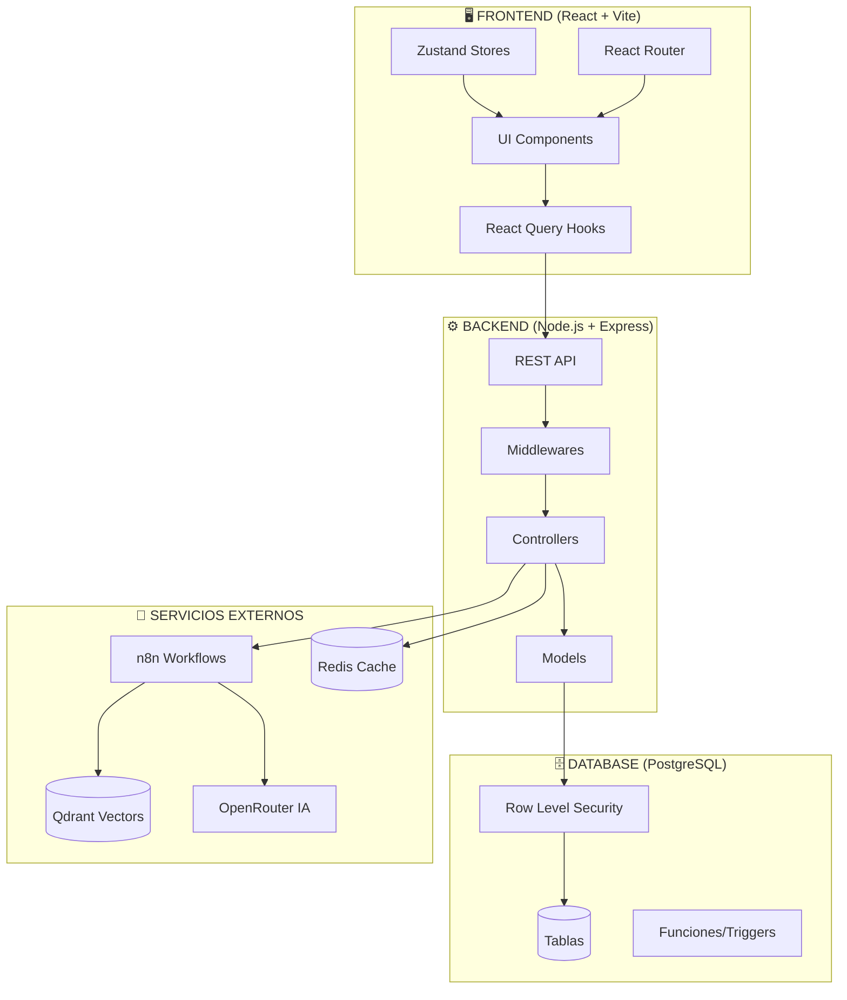

### 20.2 Cadena de Middlewares (Seguridad)

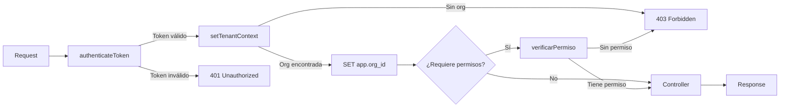

### 20.3 Mapa de Dependencias entre Módulos

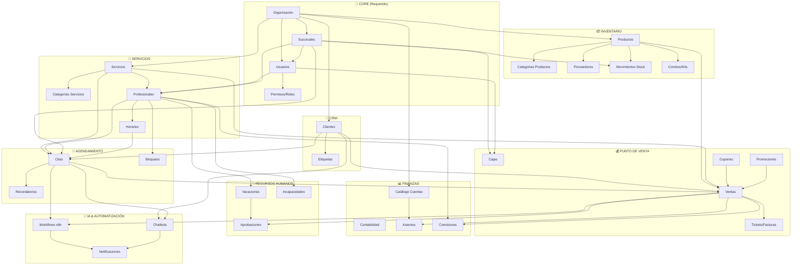

### 20.4 Flujo de Negocio Principal (Core Business Flow)

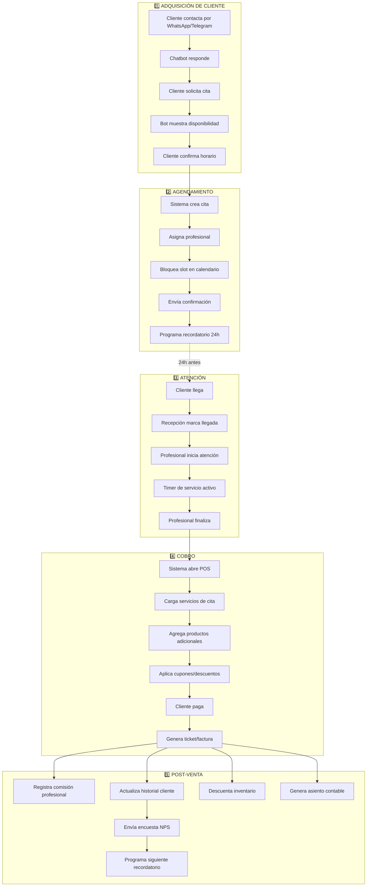

### 20.5 Flujo de Permisos y RBAC

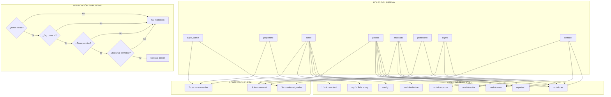

### 20.6 Flujo de Aprobaciones

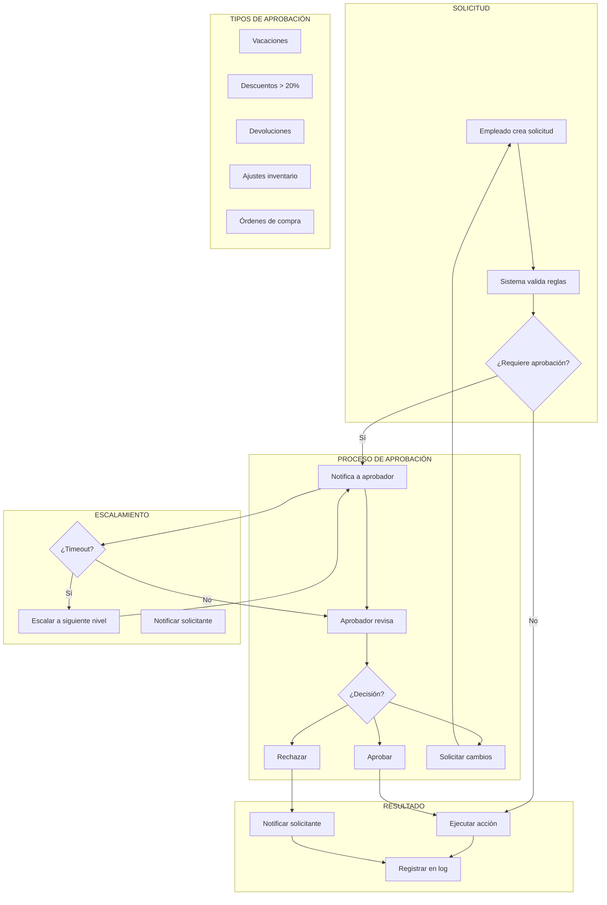

### 20.7 Flujo de Inventario

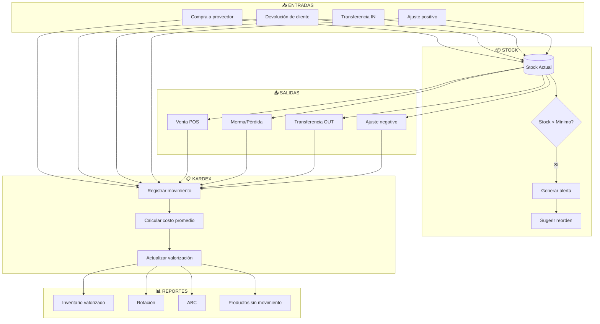

### 20.8 Flujo de Contabilidad

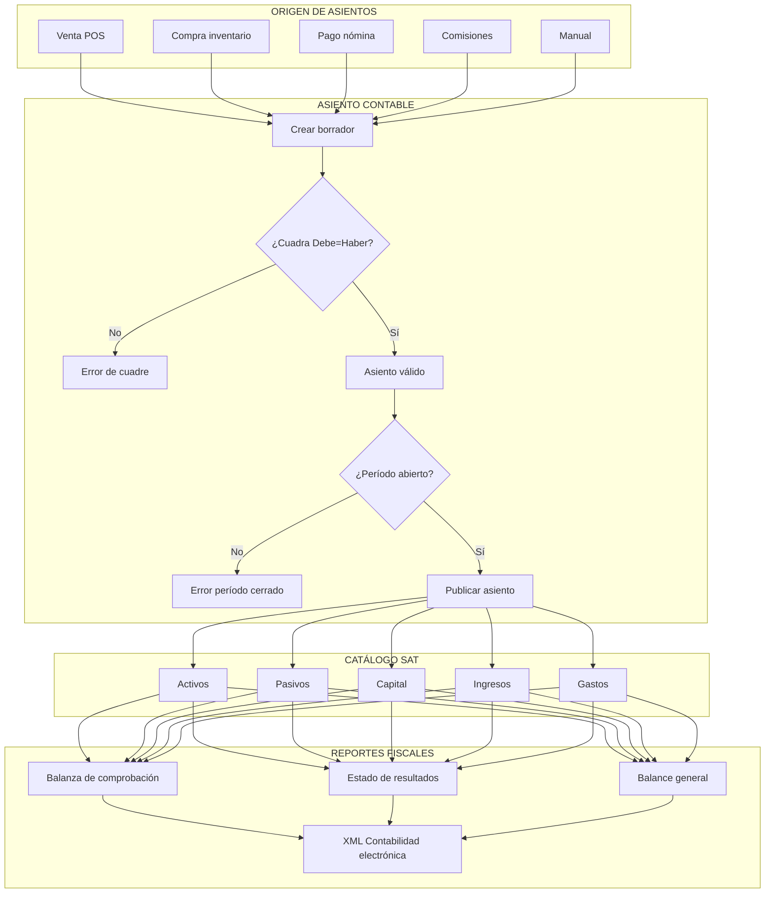

### 20.9 Flujo de Citas (Detalle)

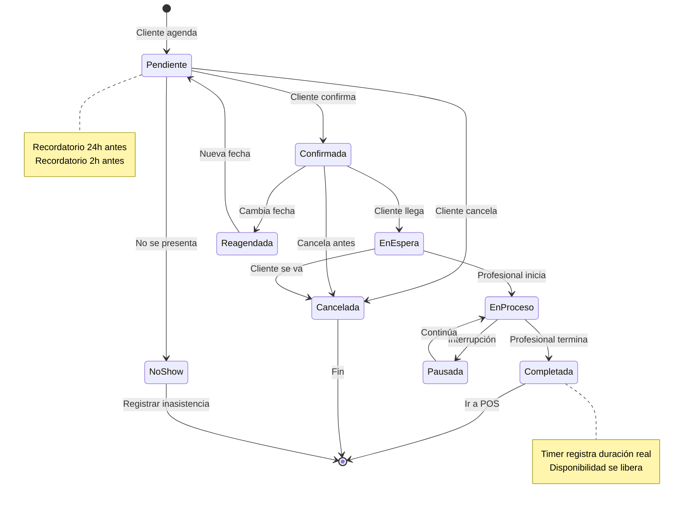

### 20.10 Flujo de Venta POS (Detalle)

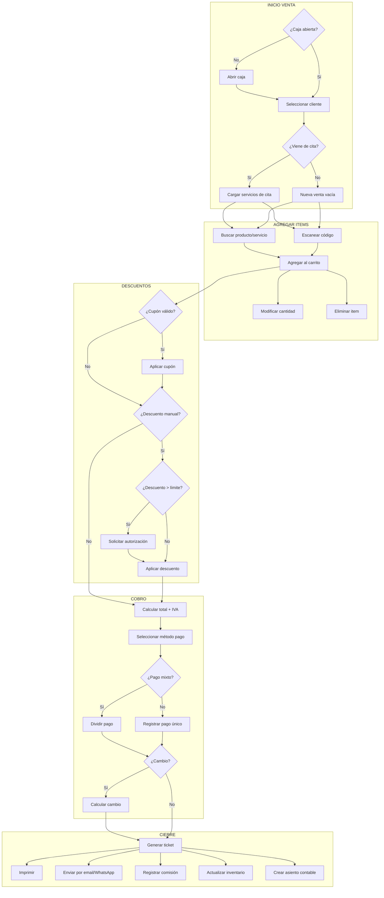

### 20.11 Flujo de Workflows Automáticos (n8n)

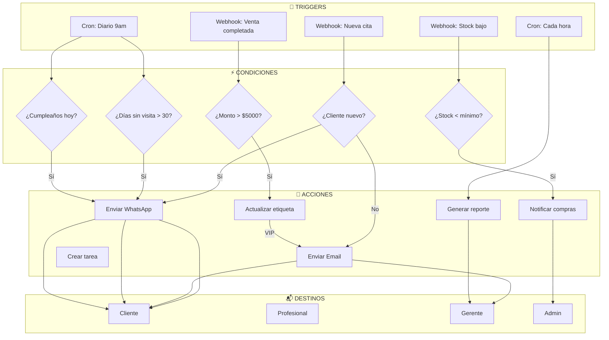

### 20.12 Modelo de Datos Simplificado (ERD)

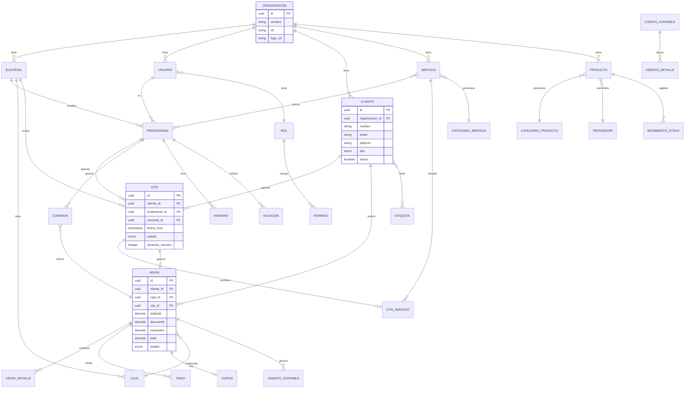

---

## 21. Matriz de Trazabilidad

### 21.1 Módulo → Tablas de BD

| Módulo | Tablas Principales | Tablas Relacionadas |
|--------|-------------------|---------------------|
| **Clientes** | `clientes` | `etiquetas_clientes`, `clientes_etiquetas` |
| **Citas** | `citas`, `citas_servicios` | `clientes`, `profesionales`, `servicios`, `sucursales` |
| **Servicios** | `servicios`, `categorias_servicios` | `profesionales_servicios` |
| **Profesionales** | `profesionales`, `horarios_profesionales` | `usuarios`, `sucursales` |
| **Inventario** | `productos`, `movimientos_stock` | `categorias_productos`, `proveedores`, `combos` |
| **POS** | `ventas`, `ventas_detalle`, `pagos` | `cajas`, `cupones`, `promociones` |
| **Contabilidad** | `cuentas_contables`, `asientos`, `asientos_detalle` | `periodos_contables` |
| **Comisiones** | `comisiones` | `ventas`, `profesionales` |
| **Ausencias** | `vacaciones`, `incapacidades` | `profesionales`, `aprobaciones` |
| **Permisos** | `roles`, `permisos`, `usuarios_roles` | `usuarios`, `organizaciones` |

### 21.2 Endpoint → Controller → Model

| Endpoint | Controller | Model | Middleware |
|----------|------------|-------|------------|
| `GET /api/clientes` | `ClientesController.listar` | `ClienteModel.listar` | `auth`, `tenant` |
| `POST /api/citas` | `CitasController.crear` | `CitaModel.crear` | `auth`, `tenant`, `permiso:citas.crear` |
| `POST /api/pos/ventas` | `VentasController.crear` | `VentaModel.crear` | `auth`, `tenant`, `permiso:pos.vender` |
| `GET /api/reportes/ventas` | `ReportesController.ventas` | `ReporteModel.ventas` | `auth`, `tenant`, `permiso:reportes.ver` |

### 21.3 Hook → API → Endpoint

| Hook Frontend | Método API | Endpoint Backend |
|---------------|------------|------------------|
| `useClientes` | `clientesApi.listar` | `GET /api/clientes` |
| `useCrearCliente` | `clientesApi.crear` | `POST /api/clientes` |
| `useCitas` | `citasApi.listar` | `GET /api/citas` |
| `useCrearVenta` | `posApi.crearVenta` | `POST /api/pos/ventas` |
| `useEtiquetas` | `clientesApi.listarEtiquetas` | `GET /api/clientes/etiquetas` |

---

---

## 22. Historial de Ejecución de Pruebas

### 22.1 Sesión 19 Enero 2026

**Módulo probado:** Clientes (CRM)

**Pruebas ejecutadas:**
- CRUD completo de clientes (persona y empresa)
- Sistema de etiquetas (crear, asignar, quitar)
- Búsqueda y filtros combinados
- Vistas alternativas (tabla/tarjetas)
- Exportación CSV
- Vista detalle con tabs (General, Historial, Documentos, Oportunidades)

**Bugs encontrados y corregidos:**
1. CRM-001: Stats duplicados en header → Eliminado StatCardGrid del header
2. CRM-002: Nomenclatura inconsistente → Unificado a "Total Gastado", "Ventas POS"
3. CRM-003: Etiquetas no actualizaban UI → Fix invalidación cache con tipos string/number

**Archivos modificados:**
- `frontend/src/pages/clientes/ClienteDetailPage.jsx`
- `frontend/src/hooks/personas/useEtiquetasClientes.js`

---

### 22.2 Sesión 19 Enero 2026 (Continuación)

**Módulos probados:** Agendamiento/Citas, Ausencias (Otros Bloqueos)

**Pruebas ejecutadas:**
- Creación de cita completa con cliente, servicio y profesional
- Vista de calendario (día, semana, mes)
- Transiciones de estado de cita (Pendiente → Confirmada)
- Modal de detalle de cita
- Solicitud de vacaciones (Mis Ausencias)
- Creación de bloqueo organizacional (Otros Bloqueos)

**Bugs encontrados y corregidos:**
1. CITA-001: limpiarServicios no memoizado → Agregado useCallback
2. CITA-002: Duración sin valor numérico → Cambio a duracion_total_minutos
3. CITA-003: Fecha incorrecta por timezone → Extraer fecha antes de parseISO
4. AUS-001: diasDisponibles no pasado → Agregado prop al modal
5. AUS-002: Tipos de bloqueo vacíos → Fix estructura de respuesta del hook

**Archivos modificados:**
- `frontend/src/hooks/agendamiento/citas/useProfesionalServices.js`
- `frontend/src/components/citas/CitaDetailModal.jsx`
- `frontend/src/utils/dateHelpers.js`
- `frontend/src/pages/ausencias/tabs/MisAusenciasTab.jsx`
- `frontend/src/hooks/agendamiento/useTiposBloqueo.js`

**Datos de prueba insertados:**
- Horarios para profesional "enrique" (Lunes-Viernes 9:00-18:00)
- Cita de prueba: ORG001-20260120-001 (Ana Martínez, Tratamiento Hidratante)
- Solicitud vacaciones: 23-25 Enero 2026 (pendiente aprobación)
- Bloqueo: Mantenimiento preventivo consultorio (25 Enero 2026)

---

---

### 22.3 Sesión 19 Enero 2026 (Noche)

**Módulos probados:** Agendamiento/Citas (UX), Filtros UI

**Pruebas ejecutadas:**
- Modal de completar cita
- Botón "Ver Detalles" en citas completadas
- Alineación visual de filtros en CitaFilters
- Refactorización a componentes reutilizables

**Bugs encontrados y corregidos:**
1. CITA-004: Modal completar mostraba "Sin servicio" → Fix: usar datos del array servicios de cita
2. CITA-005: Botón "Ver Detalles" sin función → Fix: agregar acción onCobrar para ir a POS

**Refactorización realizada:**
- `CitaFilters.jsx` refactorizado para usar componentes reutilizables:
  - `SearchInput` en lugar de `<input type="search">`
  - `FormGroup` para todas las etiquetas
  - `Select` (ya estaba)
  - `Button` con altura fija `h-[50px]` para alinear con Select

**Archivos modificados:**
- `frontend/src/components/citas/CitaFilters.jsx` (refactorizado completo)
- `frontend/src/pages/citas/CitasPage.jsx` (agregado handleCobrar)
- `frontend/src/utils/citaValidators.js` (acción "cobrar" para citas completadas)

**Pendientes para próxima sesión:**
1. **Integración Cita → POS:** Flujo de cobro desde cita completada - análisis detallado pendiente
2. Continuar pruebas de módulo Ausencias con datos reales

**Deuda técnica identificada:**
- **UI-008: ✅ RESUELTO** - Alturas de componentes UI estandarizadas en sesión 22.6

---

### 22.4 Sesión 19 Enero 2026 (Continuación - Endpoints)

**Módulos probados:** Agendamiento/Citas (flujo Cancelar y No-Show)

**Pruebas ejecutadas:**
- Crear cita de prueba (ORG001-20260123-001)
- Confirmar cita
- Probar flujo No-Show desde UI
- Probar flujo Cancelar desde UI

**Bugs encontrados y corregidos:**

1. **CITA-006: Endpoints no-show y cancelar no existían (404)**
   - **Error:** `Ruta /api/v1/citas/2/no-show no encontrada`
   - **Causa raíz:** Backend no tenía implementados los endpoints para las acciones operacionales de cancelar y no-show
   - **Archivos creados/modificados:**
     - `backend/app/modules/agendamiento/schemas/cita.schemas.js` - Agregados schemas `noShow` y `cancelar`
     - `backend/app/modules/agendamiento/models/citas/cita.operacional.model.js` - Agregados métodos `noShow()` y `cancelar()`
     - `backend/app/modules/agendamiento/controllers/citas/cita.operacional.controller.js` - Agregados controllers con validación de estado
     - `backend/app/modules/agendamiento/controllers/citas/index.js` - Agregados métodos proxy
     - `backend/app/modules/agendamiento/routes/citas.js` - Agregadas rutas `POST /:id/no-show` y `POST /:id/cancelar`
     - `backend/app/modules/agendamiento/models/citas/index.js` - Agregados métodos proxy al modelo principal

2. **CITA-007: Frontend usaba PUT en lugar de POST**
   - **Error:** Tras corregir backend, frontend seguía fallando
   - **Causa raíz:** Frontend enviaba PUT a `/citas/:id/cancelar` y `/citas/:id/no-show`, backend esperaba POST. También el campo se llamaba `motivo` en frontend y `motivo_no_show` en backend.
   - **Archivos modificados:**
     - `frontend/src/services/api/modules/citas.api.js` - Cambiado de `apiClient.put` a `apiClient.post`
     - `frontend/src/hooks/agendamiento/citas/useMutacionesCitas.js` - Mapeo `motivo` → `motivo_no_show`

**Verificación:**
- ✅ Endpoints probados con curl exitosamente
- ✅ Flujo No-Show verificado desde UI del navegador
- ✅ Estado de cita cambió correctamente a "no_asistio"

**Datos de prueba creados:**
- Cita: ORG001-20260123-001 (Ana Martínez, 23 Ene 2026, 10:00, Tratamiento Hidratante)
- Estado final: no_asistio (tras prueba exitosa)

---

### 22.5 Sesión 19 Enero 2026 (Continuación - Reagendar y AUS-003)

**Módulos probados:** Agendamiento/Citas (Reagendar), Ausencias (Configuración)

**Pruebas ejecutadas:**
- Crear nueva cita para prueba de reagendar
- Validación correcta de días no laborables (sábado rechazado)
- Reagendar cita: cambio de fecha y hora
- Verificar tab "Configuración de Ausencias"

**Bugs encontrados y corregidos:**

1. **AUS-003: Tab Configuración crashea con `nivelesArray.map is not a function`**
   - **Error:** TypeError al cargar la pestaña de Configuración de Ausencias
   - **Causa raíz:** El hook `useNivelesVacaciones` retorna `{data: [...], total}` pero el componente esperaba un array directo
   - **Archivo modificado:** `frontend/src/pages/ausencias/tabs/ConfiguracionAusenciasTab.jsx`
   - **Fix:** Cambiar `const nivelesArray = niveles || []` a `const nivelesArray = niveles?.data || niveles || []`

**Funcionalidades verificadas OK:**
- ✅ Reagendar cita (cambiar fecha y hora)
- ✅ Validación de días laborables del profesional
- ✅ Tab Configuración de Ausencias (tras fix)
- ✅ Política de Vacaciones visible
- ✅ EmptyState de Niveles por Antigüedad

**Datos de prueba:**
- Cita ORG001-20260127-001 reagendada de 27/01 11:00 → 28/01 14:00

---

### 22.6 Sesión 20 Enero 2026 (Homologación UI: Alturas y Anchos)

**Módulos afectados:** Sistema de diseño UI, Formulario de Citas

**Cambios realizados:**

1. **Estandarización de alturas** - Constante `FORM_ELEMENT_HEIGHTS` en `sizes.js`:
   - `sm: h-9 (36px)`, `md: h-10 (40px)`, `lg: h-12 (48px)`, `xl: h-14 (56px)`
   - Aplicado a: Button, Input, Select, SearchInput, MultiSelect

2. **Corrección de anchos en CitaFormDrawer** - Select/MultiSelect no expandían:
   - Causa: Controller de React Hook Form no propaga `flex-1`
   - Fix: Envolver cada Controller en `<div className="flex-1">`

**Archivos modificados:**
- `frontend/src/lib/uiConstants/sizes.js` - `FORM_ELEMENT_HEIGHTS`, `BUTTON_SIZES`, `INPUT_SIZES`
- `frontend/src/components/ui/atoms/{Input,Select}.jsx` - Altura `h-10`
- `frontend/src/components/ui/molecules/SearchInput.jsx` - Altura `h-10`
- `frontend/src/components/ui/organisms/MultiSelect.jsx` - `min-h-10`
- `frontend/src/components/citas/CitaFormDrawer.jsx` - Layout flex con `flex-1`
- `frontend/src/components/citas/CitaFilters.jsx` - Removidos overrides `h-[50px]`
- `frontend/src/components/citas/cita-form/ServicesPriceSection.jsx` - Altura `h-10`

---

**Próximos pasos:**
1. Probar módulo POS con integración de citas
2. Probar flujo completo: Cita → POS → Comisión

---

*Última actualización: 20 Enero 2026*
